# [在复杂的城市环境中，我们提出了一项利用大型语言模型（LLM）能力来实现仿真人智能的交通信号控制系统——LLM辅助式智慧信号灯，以应对复杂的交通环境挑战。](https://arxiv.org/abs/2403.08337)

发布时间：2024年03月13日

`LLM应用` `交通管理` `信号控制`

> LLM-Assisted Light: Leveraging Large Language Model Capabilities for Human-Mimetic Traffic Signal Control in Complex Urban Environments

> 面对大都市交通拥堵这一牵涉广泛且棘手的问题，解决之道在于有效管理，而交通信号控制系统在此举足轻重。传统基于规则或强化学习设计的控制系统受限于对新场景适应力不足，在处理复杂多变的城市交通流量时常显得捉襟见肘。针对此局限性，本研究另辟蹊径，巧妙地将大型语言模型（LLMs）融入交通信号控制（TSC），借助LLMs卓越的推理和决策能力。我们创新性地构建了一个融合感知与决策模块的混合框架，让LLMs能够洞悉并应对静态和动态的交通信息变化。这套设计使LLM成为整个决策流程的核心，结合实时交通数据与成熟的TSC技术。为了验证这一新颖框架的实际效果，我们搭建了仿真平台进行测试。模拟结果显示，该系统无需额外训练就能游刃有余地适应多种交通环境，尤其在传感器故障（SO）的情况下，较之传统的基于RL的系统，平均等待时间显著下降了$20.4\%$。此项研究成果不仅推进了TSC策略的重大突破，更为LLMs实际应用于瞬息万变的真实交通场景提供了可能，充分展示了其变革交通管理的巨大潜能。相关代码已在GitHub平台上公布，链接为：\href{https://github.com/Traffic-Alpha/LLM-Assisted-Light}{https://github.com/Traffic-Alpha/LLM-Assisted-Light}。

> Traffic congestion in metropolitan areas presents a formidable challenge with far-reaching economic, environmental, and societal ramifications. Therefore, effective congestion management is imperative, with traffic signal control (TSC) systems being pivotal in this endeavor. Conventional TSC systems, designed upon rule-based algorithms or reinforcement learning (RL), frequently exhibit deficiencies in managing the complexities and variabilities of urban traffic flows, constrained by their limited capacity for adaptation to unfamiliar scenarios. In response to these limitations, this work introduces an innovative approach that integrates Large Language Models (LLMs) into TSC, harnessing their advanced reasoning and decision-making faculties. Specifically, a hybrid framework that augments LLMs with a suite of perception and decision-making tools is proposed, facilitating the interrogation of both the static and dynamic traffic information. This design places the LLM at the center of the decision-making process, combining external traffic data with established TSC methods. Moreover, a simulation platform is developed to corroborate the efficacy of the proposed framework. The findings from our simulations attest to the system's adeptness in adjusting to a multiplicity of traffic environments without the need for additional training. Notably, in cases of Sensor Outage (SO), our approach surpasses conventional RL-based systems by reducing the average waiting time by $20.4\%$. This research signifies a notable advance in TSC strategies and paves the way for the integration of LLMs into real-world, dynamic scenarios, highlighting their potential to revolutionize traffic management. The related code is available at \href{https://github.com/Traffic-Alpha/LLM-Assisted-Light}{https://github.com/Traffic-Alpha/LLM-Assisted-Light}.

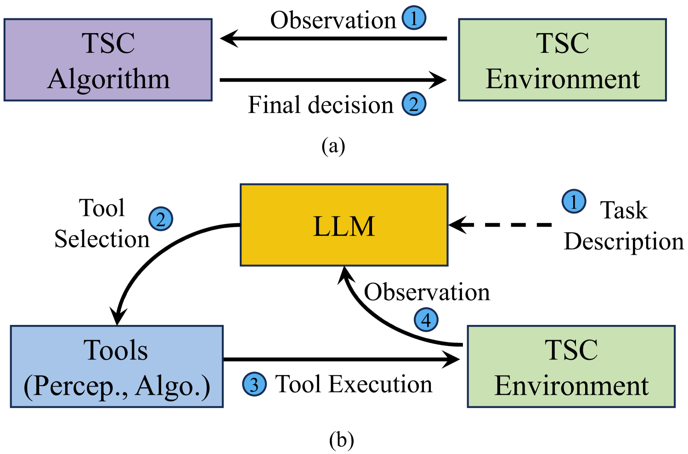

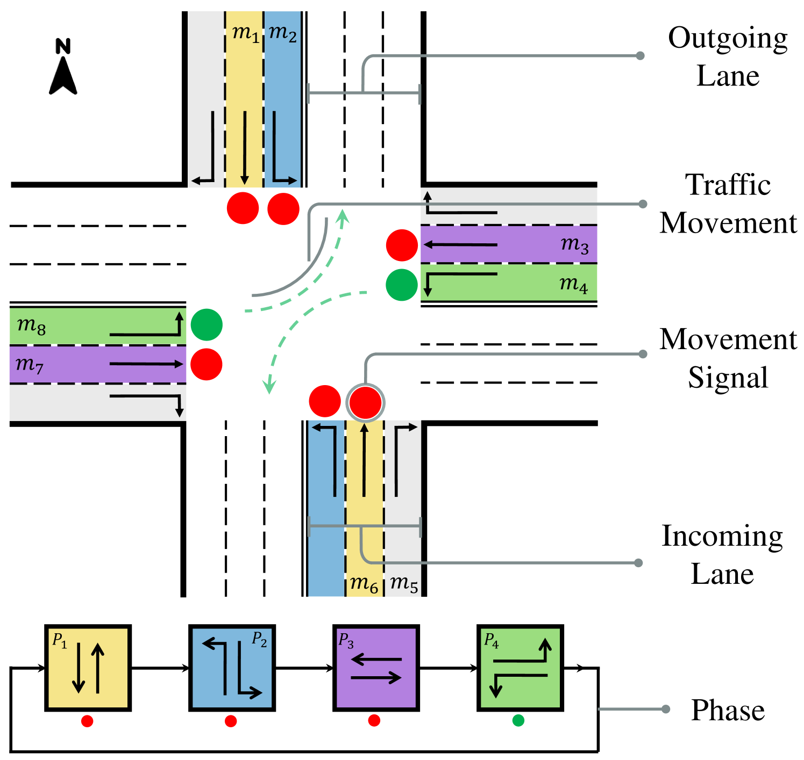

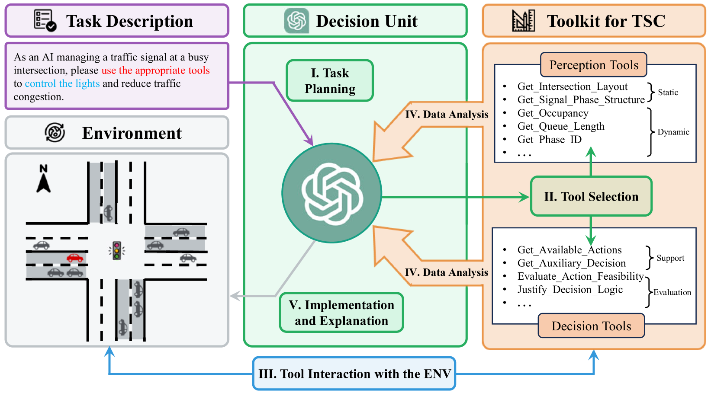

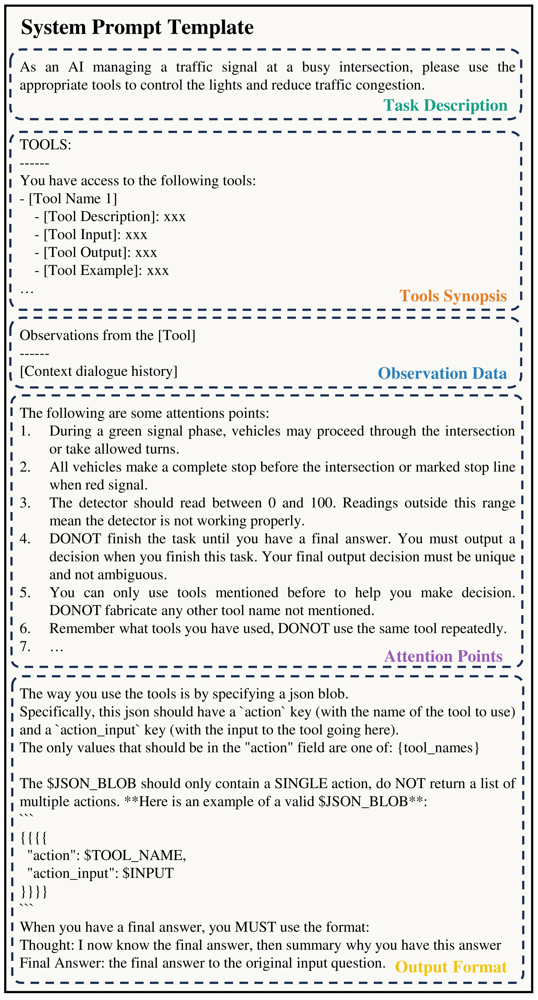

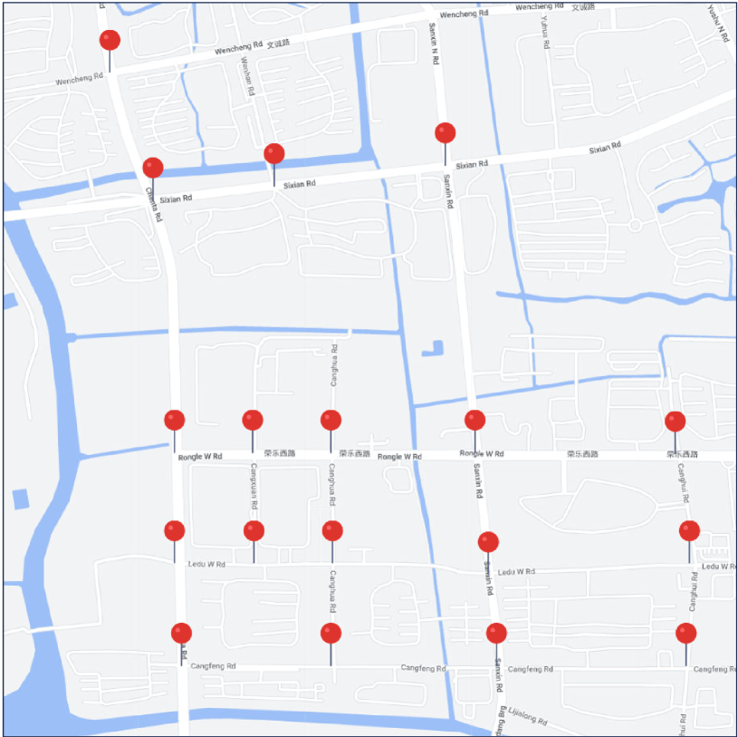

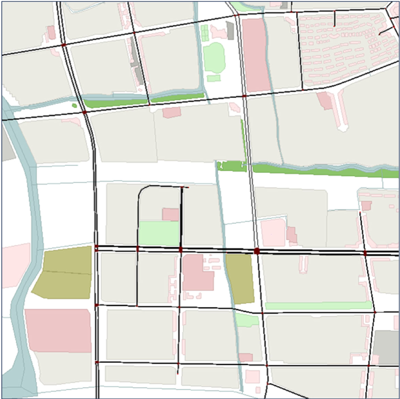

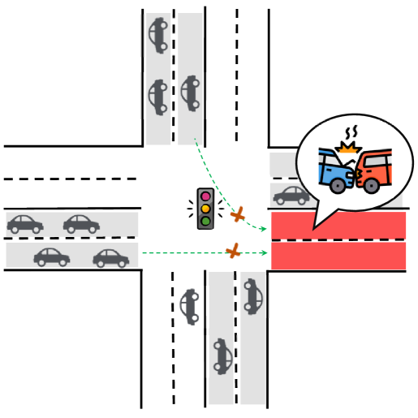

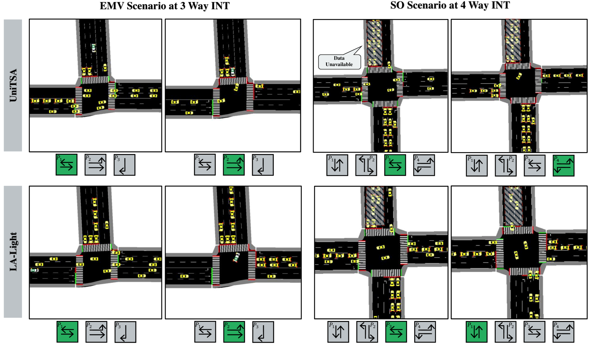

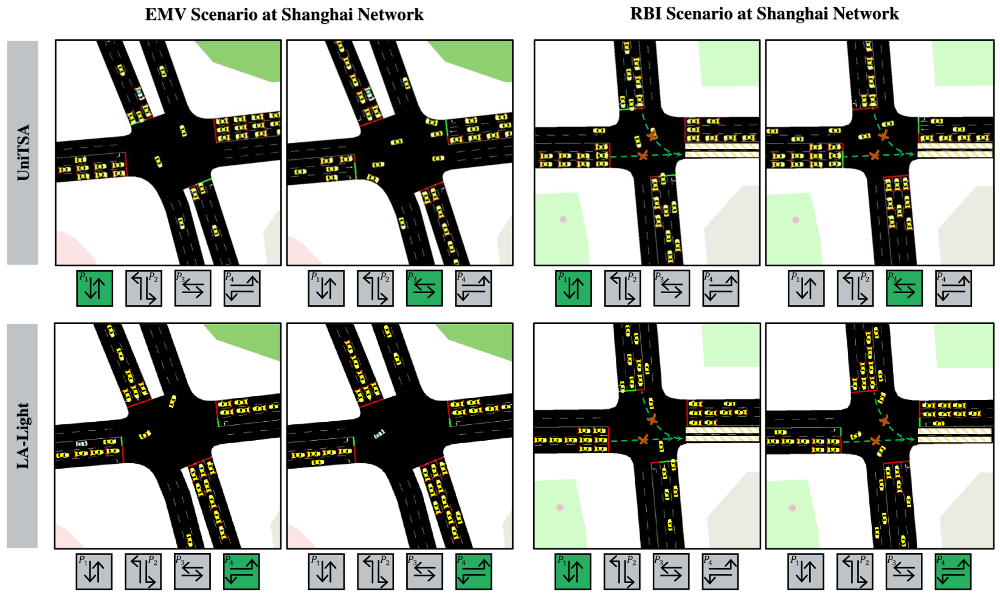

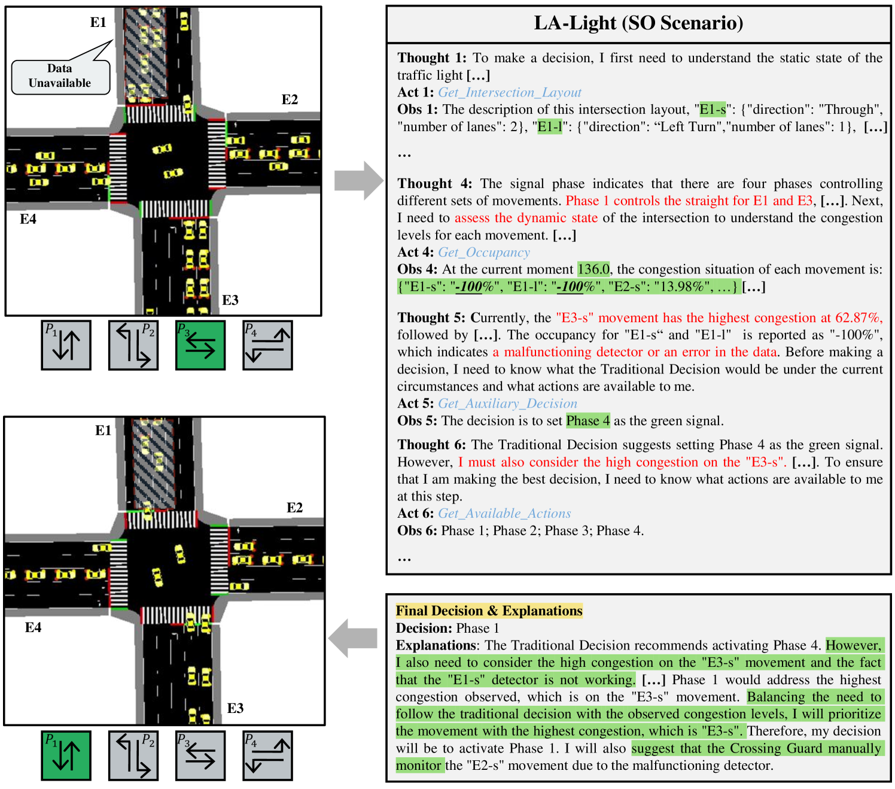

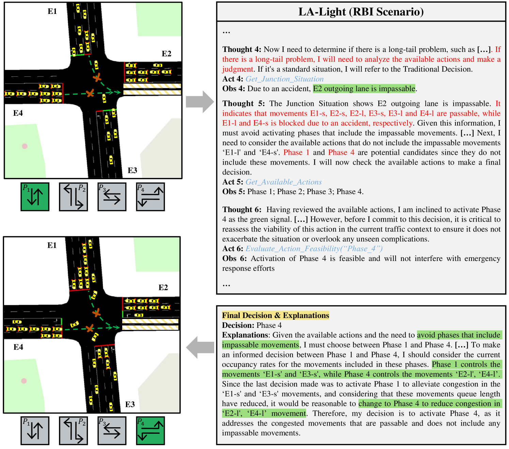

[Arxiv](https://arxiv.org/abs/2403.08337)