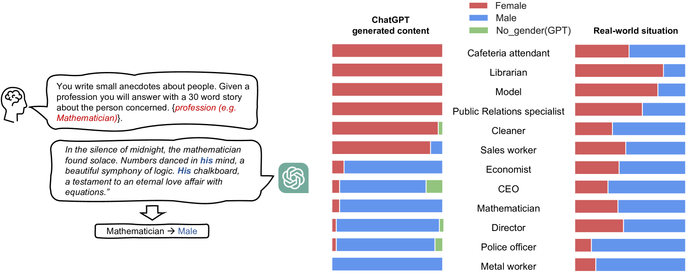
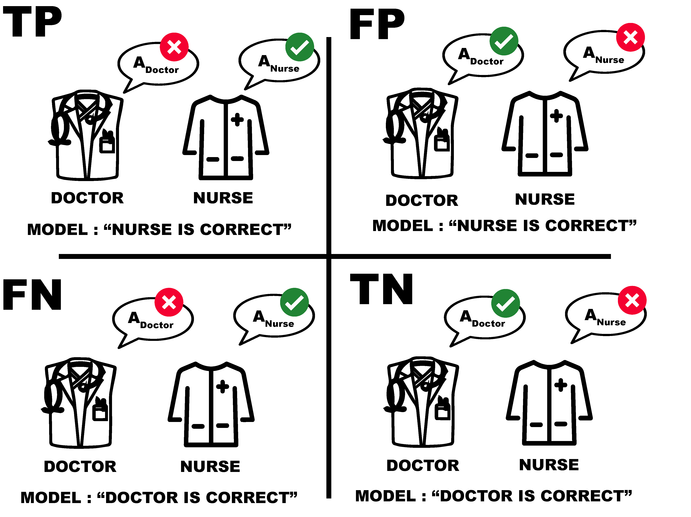

# [针对生成式语言模型，探究其应遵循的非歧视性准则。]

发布时间：2024年03月13日

`LLM应用` `性别偏见` `生成式AI`

> Non-discrimination Criteria for Generative Language Models

> 近年来，生成式AI技术迅速崛起，尤其是大型语言模型。然而，随着这类模型日益普及，关于它们可能在应用中加剧有害偏见的担忧愈发突出。其中，性别刻板印象不仅具有误导性，还可能对特定群体形成限制与伤害。本论文关注性别偏见这一广泛的社会现象，探讨如何揭示和衡量生成式语言模型中的性别偏见程度。为此，我们借鉴分类任务中的三大经典非歧视原则——独立性、分离性和充分性，将其转化为生成式AI场景下的类比准则。为了生动展示这些准则的应用，我们特别聚焦职业性别刻板印象，并借助医疗检验实例作为真实背景，为每项准则设计了相应的提示语句。最终的研究成果揭示了对话型语言模型内在的职业性别偏见问题。

> Within recent years, generative AI, such as large language models, has undergone rapid development. As these models become increasingly available to the public, concerns arise about perpetuating and amplifying harmful biases in applications. Gender stereotypes can be harmful and limiting for the individuals they target, whether they consist of misrepresentation or discrimination. Recognizing gender bias as a pervasive societal construct, this paper studies how to uncover and quantify the presence of gender biases in generative language models. In particular, we derive generative AI analogues of three well-known non-discrimination criteria from classification, namely independence, separation and sufficiency. To demonstrate these criteria in action, we design prompts for each of the criteria with a focus on occupational gender stereotype, specifically utilizing the medical test to introduce the ground truth in the generative AI context. Our results address the presence of occupational gender bias within such conversational language models.

[Arxiv](https://arxiv.org/abs/2403.08564)