# SoK（系统化知识）：致力于降低微调语言模型遭受成员推断攻击的风险步骤 1 翻译：SoK（Systematization of Knowledge）探究了如何减少微调语言模型在面对成员推断攻击时所表现出的脆弱性问题。步骤 2 翻译优化：本文为 SoK（系统化知识）研究，专注于解决微调语言模型对成员推断攻击的易感性问题，旨在提出有效方法以降低此类模型在此类安全威胁下的风险。

发布时间：2024年03月13日

`LLM应用` `隐私保护`

> SoK: Reducing the Vulnerability of Fine-tuned Language Models to Membership Inference Attacks

> 近年来，自然语言处理模型蓬勃发展，大量应用依托其建立，并常需根据特定私有数据集对通用模型进行微调。然而，微调过程中很可能涉及个人敏感信息，使得隐私风险陡增。成员推断攻击是最常见的用于评估机器学习模型隐私泄露的方法，但关于语言模型对此类攻击的易感因素及其防御策略在语言领域的适用性研究尚不充分。本研究首次系统梳理了微调后的大型语言模型面对成员推断攻击的脆弱性、多种影响因素，以及各类防御策略的效果。研究结果显示，某些训练方法能够有效降低隐私风险，尤其是结合差分隐私与低秩适配器的方法，在抵御此类攻击时能实现最优的隐私防护。

> Natural language processing models have experienced a significant upsurge in recent years, with numerous applications being built upon them. Many of these applications require fine-tuning generic base models on customized, proprietary datasets. This fine-tuning data is especially likely to contain personal or sensitive information about individuals, resulting in increased privacy risk. Membership inference attacks are the most commonly employed attack to assess the privacy leakage of a machine learning model. However, limited research is available on the factors that affect the vulnerability of language models to this kind of attack, or on the applicability of different defense strategies in the language domain. We provide the first systematic review of the vulnerability of fine-tuned large language models to membership inference attacks, the various factors that come into play, and the effectiveness of different defense strategies. We find that some training methods provide significantly reduced privacy risk, with the combination of differential privacy and low-rank adaptors achieving the best privacy protection against these attacks.

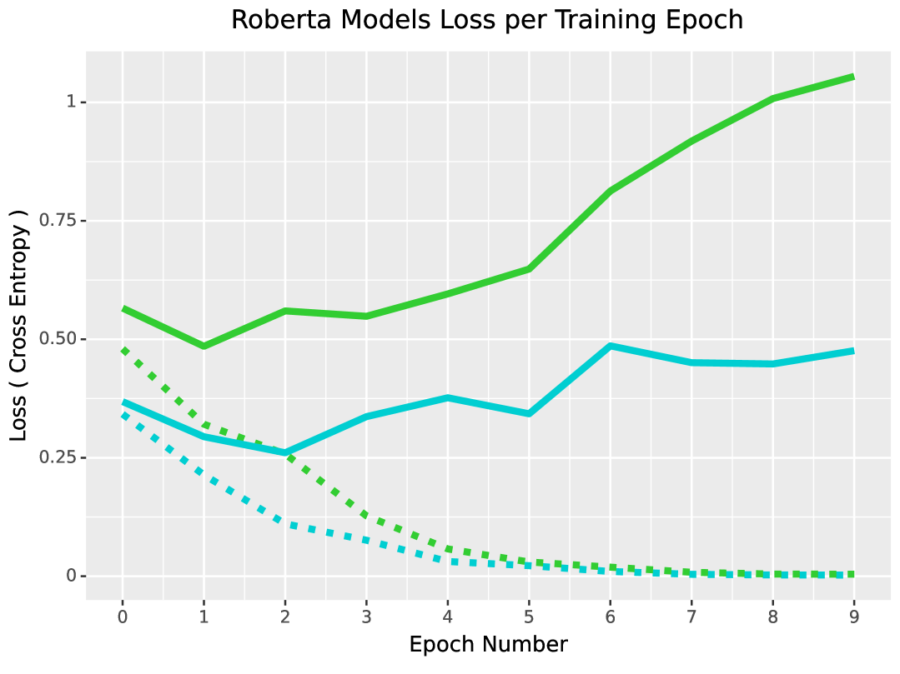

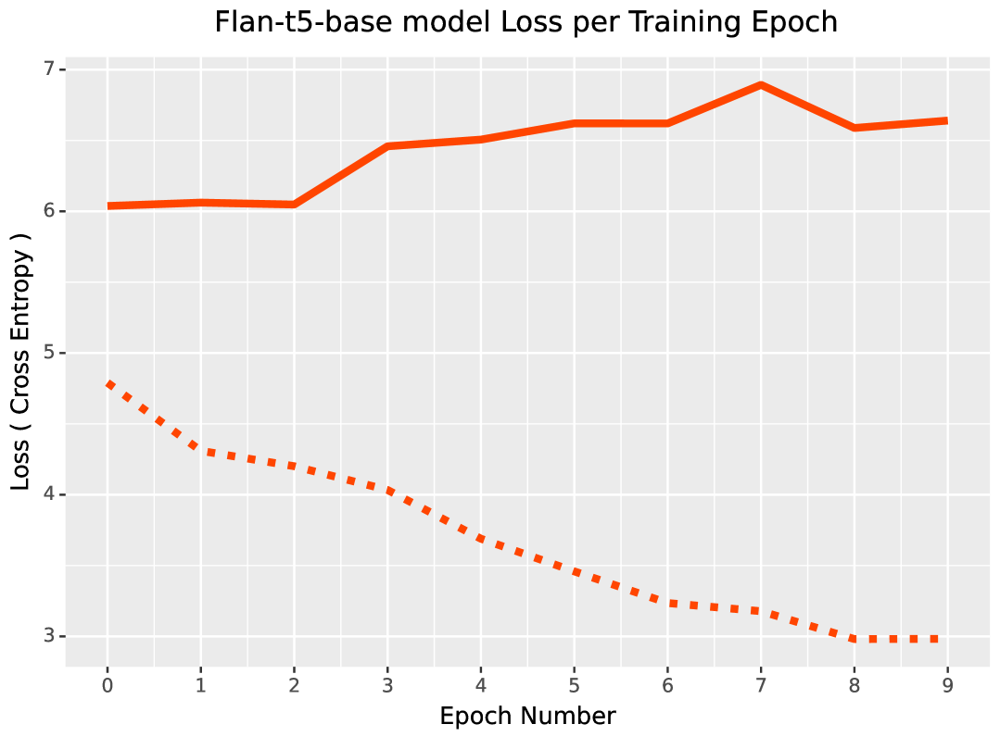

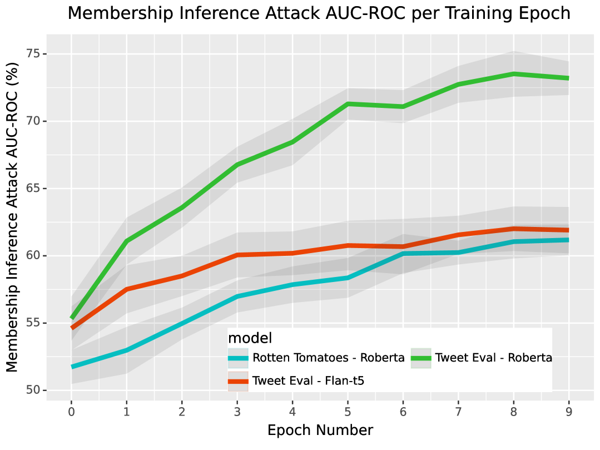

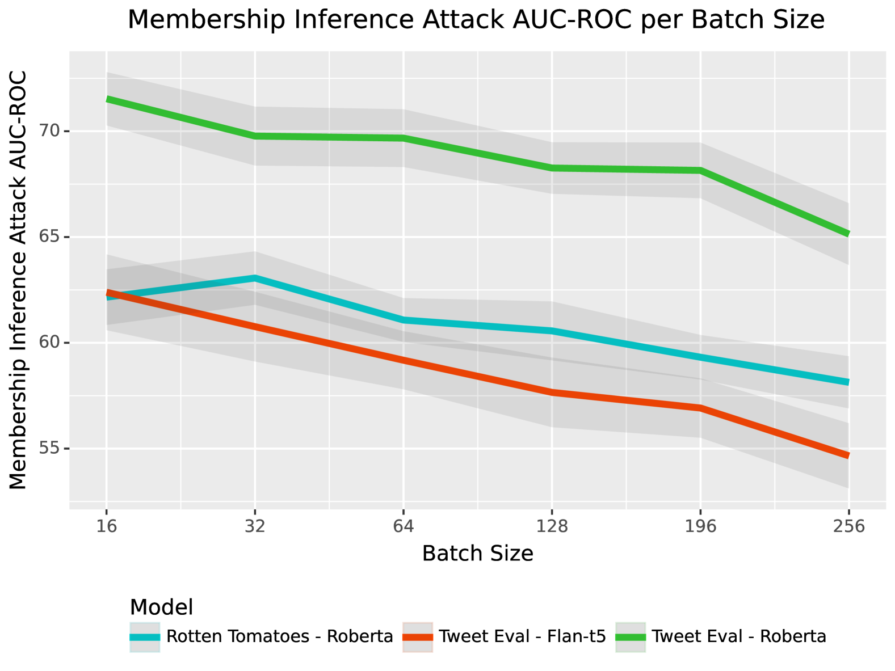

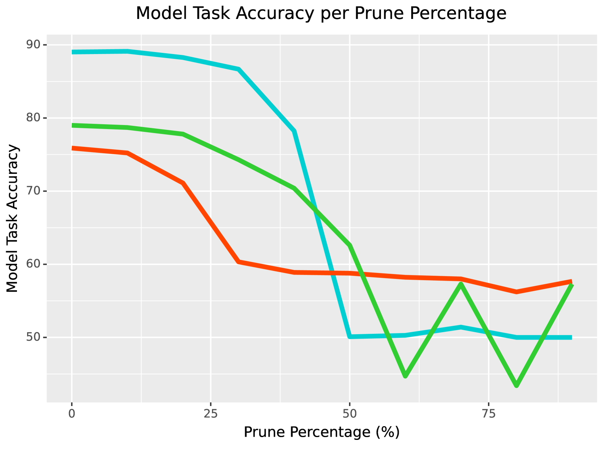

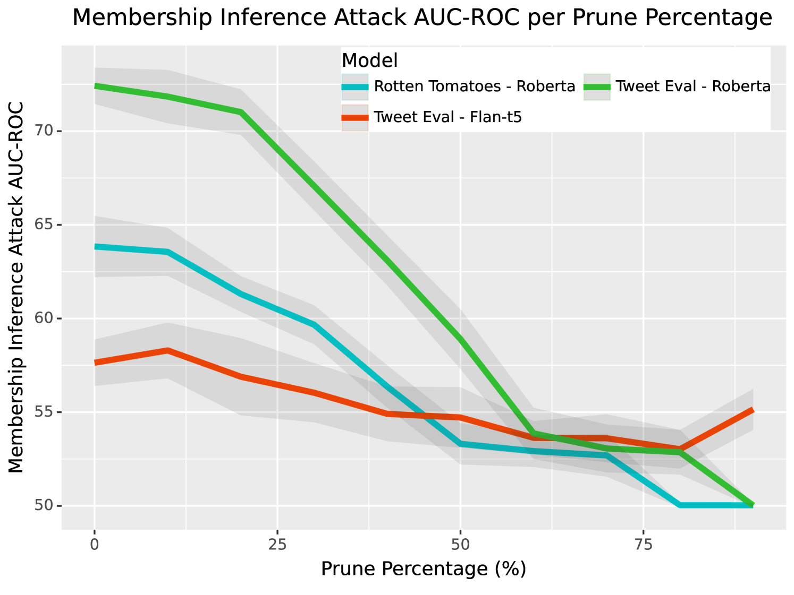

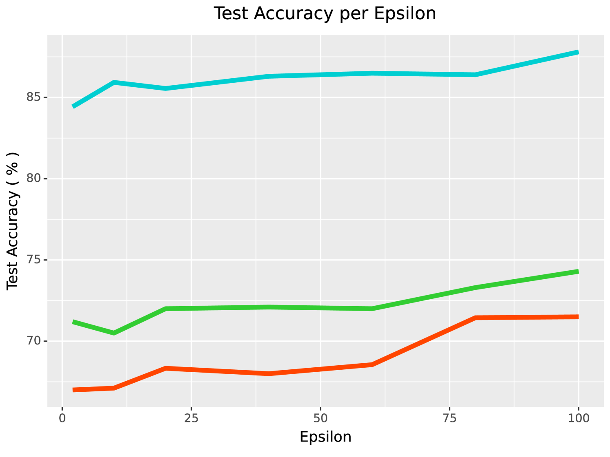

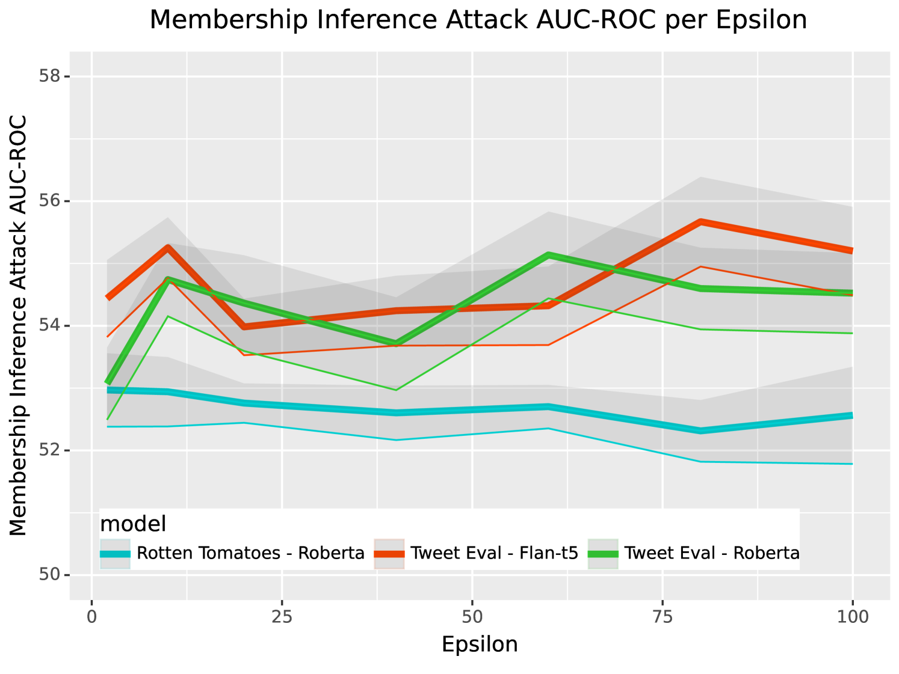

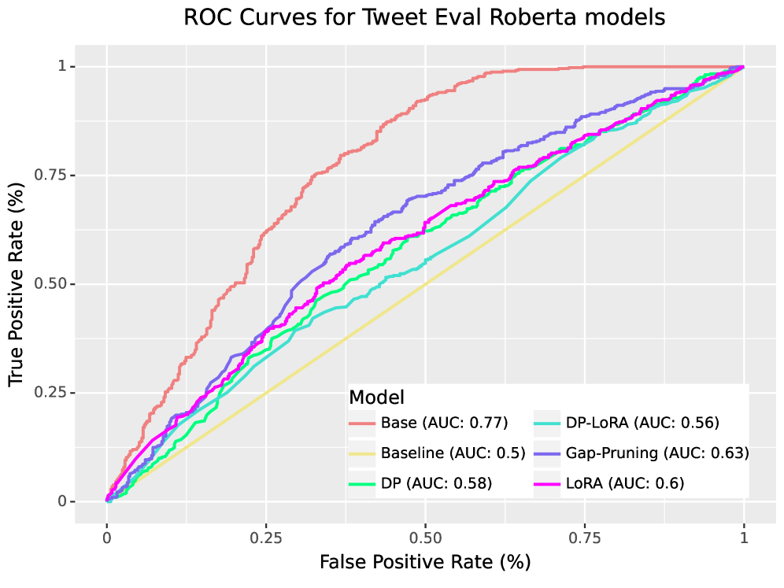

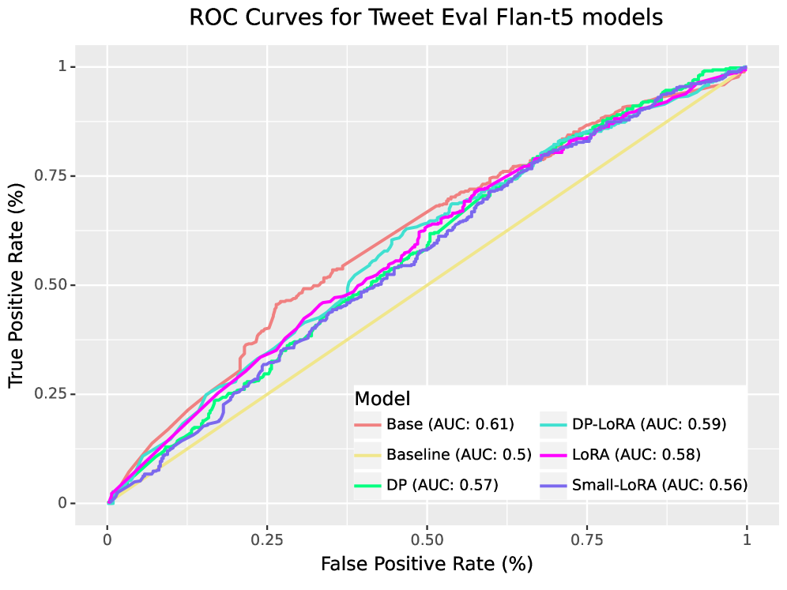

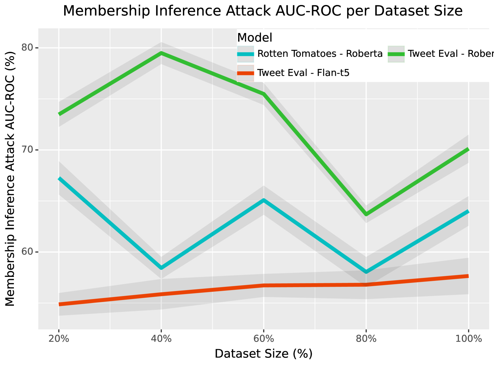

[Arxiv](https://arxiv.org/abs/2403.08481)