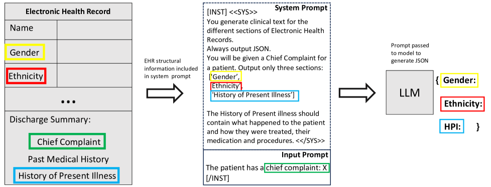

# [针对人工临床记录，我们探讨了零样本与少量样本生成策略，旨在实现更高效、精准的模拟数据生成。](https://arxiv.org/abs/2403.08664)

发布时间：2024年03月13日

`LLM应用`

``

`数据隐私`

> Zero-shot and Few-shot Generation Strategies for Artificial Clinical Records

> 面对保护患者隐私法规的同时获取历史病历数据以供临床研究的挑战，医学界正积极探索创新方案。其中一项关键突破在于运用合成医疗记录模拟真实数据，有效保障个体隐私。本研究关注于如何在未使用真实患者数据训练大型语言模型（LLMs）的情况下，创造高质量的合成数据集。具体而言，我们检验了Llama 2 LLM能否通过零样本和少量样本提示策略生成逼真的医疗记录，并将其与依赖敏感患者数据训练的精细调整模型进行对照。实验选取MIMIC-IV数据集中当前疾病史部分的真实数据作为参照，创新地采用链式思维引导技术优化LLM，在未经微调的前提下生成更为精确且符合上下文情境的医疗叙事。研究表明，采用该链式思维提示方法的零样本模型，在Rouge评价指标下，其表现已可媲美经过精细调整的模型。

> The challenge of accessing historical patient data for clinical research, while adhering to privacy regulations, is a significant obstacle in medical science. An innovative approach to circumvent this issue involves utilising synthetic medical records that mirror real patient data without compromising individual privacy. The creation of these synthetic datasets, particularly without using actual patient data to train Large Language Models (LLMs), presents a novel solution as gaining access to sensitive patient information to train models is also a challenge. This study assesses the capability of the Llama 2 LLM to create synthetic medical records that accurately reflect real patient information, employing zero-shot and few-shot prompting strategies for comparison against fine-tuned methodologies that do require sensitive patient data during training. We focus on generating synthetic narratives for the History of Present Illness section, utilising data from the MIMIC-IV dataset for comparison. In this work introduce a novel prompting technique that leverages a chain-of-thought approach, enhancing the model's ability to generate more accurate and contextually relevant medical narratives without prior fine-tuning. Our findings suggest that this chain-of-thought prompted approach allows the zero-shot model to achieve results on par with those of fine-tuned models, based on Rouge metrics evaluation.

