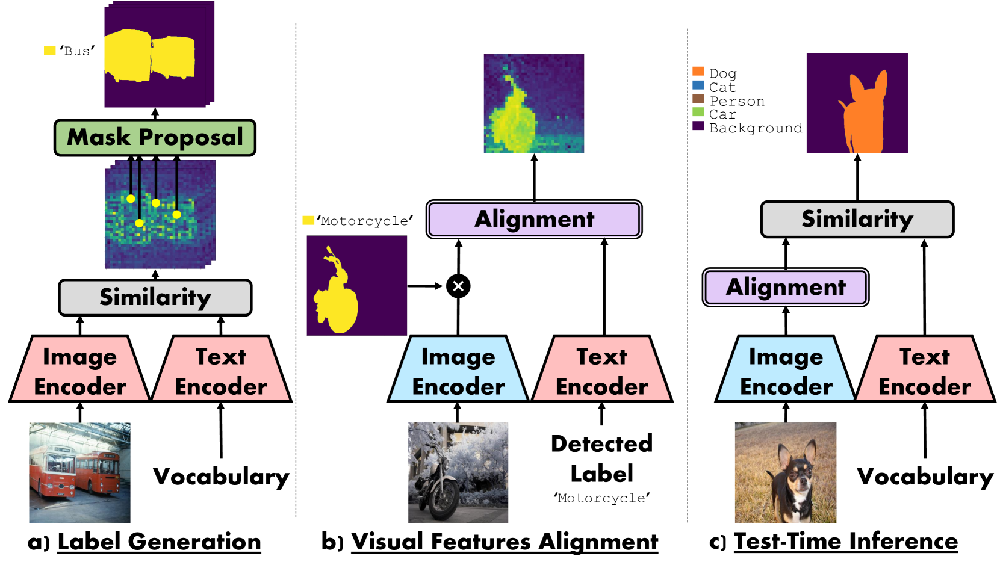

# [利用视觉基础模型实现无需标注的语义分割](https://arxiv.org/abs/2403.09307)

发布时间：2024年03月14日

`Agent`

`计算机视觉`

``

> Annotation Free Semantic Segmentation with Vision Foundation Models

> 语义分割是一项极具挑战性的视觉任务，传统上依赖大量精细标注的训练数据。然而，近期研究借助基础模型特别是视觉-语言模型的优势，力求在无需大量训练或附加标注的情况下实现零样本语义分割。本文提出的方法，在自监督预训练的视觉编码器基础上构建了一种轻量级模块，通过与预训练文本编码器进行特征对齐，巧妙地利用现有基础模型（如CLIP和SAM）为任意语义分割数据集生成免费且高质量的标注信息。这样一来，我们只需微调即可让任何预训练视觉编码器具备基于语言的语义理解能力。此模块设计精巧、仅依赖基础模型作为监督来源，且能在极少带标注训练数据下展现出卓越的泛化性能。

> Semantic Segmentation is one of the most challenging vision tasks, usually requiring large amounts of training data with expensive pixel-level annotations. With the success of foundation models and especially vision-language models, recent works attempt to achieve zero-shot semantic segmentation while requiring either large scale training or additional image/pixel-level annotations. In this work, we build a lightweight module on top of a self-supervised pretrained vision encoder to align patch features with a pre-trained text encoder. Importantly, we generate free annotations for any semantic segmentation dataset using existing foundation models and train our alignment module cost free. We use CLIP to detect objects and SAM to generate high quality object masks. Our approach can bring language-based semantics to any pre-trained vision encoder with minimal training. Our module is lightweight, uses foundation models as a sole source of supervision and shows impressive generalization capability from little training data with no annotation.

