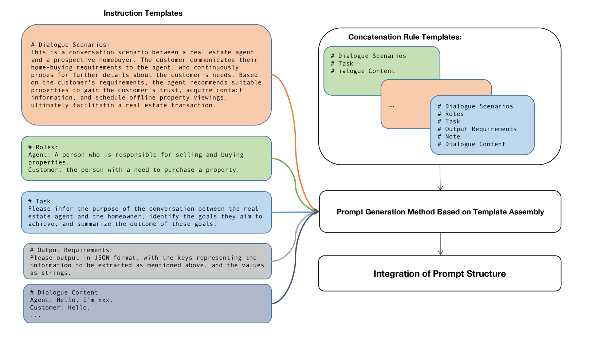

# [Dial-insight 方法通过运用高质量的特定领域数据对大型语言模型进行精调，有效防止模型能力下降。](https://arxiv.org/abs/2403.09167)

发布时间：2024年03月14日

`LLM应用`

`房地产`

``

> Dial-insight: Fine-tuning Large Language Models with High-Quality Domain-Specific Data Preventing Capability Collapse

> LLMs 的威力与底层数据质量紧密挂钩，尤其在专业领域表现突出。然而，在针对特定领域对 LLMs 进行微调时，往往会面临模型泛化能力下降的问题。为此，我们创新提出一种两步走策略，专门设计出能够产出优质数据的生产型提示方案。此方法的核心在于生成大量多样化的提示，涵盖多种任务类型且表达形式丰富。同时，我们引入一套经济高效、多维度的数据标注质量评估体系，确保生成数据的准确可靠。通过运用包含房地产行业服务商与客户互动实例的真实数据集实验，我们揭示了数据质量与模型效能之间的正向关联。尤为值得一提的是，研究结果显示，采用我们提出的这种方法所产生的数据对通用 LLMs 进行微调，可以在不损害模型总体泛化性能的前提下，显著提升其在特定领域的专业表现，即便仅采用特定领域数据进行微调亦是如此。

> The efficacy of large language models (LLMs) is heavily dependent on the quality of the underlying data, particularly within specialized domains. A common challenge when fine-tuning LLMs for domain-specific applications is the potential degradation of the model's generalization capabilities. To address these issues, we propose a two-stage approach for the construction of production prompts designed to yield high-quality data. This method involves the generation of a diverse array of prompts that encompass a broad spectrum of tasks and exhibit a rich variety of expressions. Furthermore, we introduce a cost-effective, multi-dimensional quality assessment framework to ensure the integrity of the generated labeling data. Utilizing a dataset comprised of service provider and customer interactions from the real estate sector, we demonstrate a positive correlation between data quality and model performance. Notably, our findings indicate that the domain-specific proficiency of general LLMs can be enhanced through fine-tuning with data produced via our proposed method, without compromising their overall generalization abilities, even when exclusively domain-specific data is employed for fine-tuning.

