# [动态内存压缩技术应用于LLMs，旨在实现快速推理优化。这项技术是对大型语言模型进行改造升级，以适应更高效的推理需求。]

发布时间：2024年03月14日

`LLM应用` `计算机硬件（GPU）`

> Dynamic Memory Compression: Retrofitting LLMs for Accelerated Inference

> Transformer 已成为 LLM 的支柱，但受限于需存储随输入序列长度和批次大小线性增长的过往令牌键值缓存，生成效率不理想。为此，我们创新提出了一种名为“动态内存压缩”（DMC）的技术，它能在推理过程中实时压缩键值缓存。更重要的是，DMC 让模型学会在不同的头部和层级应用差异化的压缩比率。我们成功地将包括 Llama 2（7B、13B 和 70B）在内的预训练 LLM 迁移到 DMC Transformer，并在 NVIDIA H100 GPU 上使自回归推理速度提升了高达约 3.7 倍。DMC 仅需对原始数据的一小部分进行持续预训练，无需新增任何参数。实验结果显示，DMC 能在最高达 4 倍的缓存压缩下保持原有的下游任务性能，优于经优化升级的分组查询注意力（GQA）。值得一提的是，GQA 与 DMC 结合使用能产生叠加优势，使得 DMC 能在既定内存预算内轻松处理更长的文本上下文和更大的批次数据。

> Transformers have emerged as the backbone of large language models (LLMs). However, generation remains inefficient due to the need to store in memory a cache of key-value representations for past tokens, whose size scales linearly with the input sequence length and batch size. As a solution, we propose Dynamic Memory Compression (DMC), a method for on-line key-value cache compression at inference time. Most importantly, the model learns to apply different compression rates in different heads and layers. We retrofit pre-trained LLMs such as Llama 2 (7B, 13B and 70B) into DMC Transformers, achieving up to ~3.7x throughput increase in auto-regressive inference on a NVIDIA H100 GPU. DMC is applied via continued pre-training on a negligible percentage of the original data without adding any extra parameters. We find that DMC preserves the original downstream performance with up to 4x cache compression, outperforming up-trained grouped-query attention (GQA). GQA and DMC can be even combined to obtain compounded gains. As a result DMC fits longer contexts and larger batches within any given memory budget.

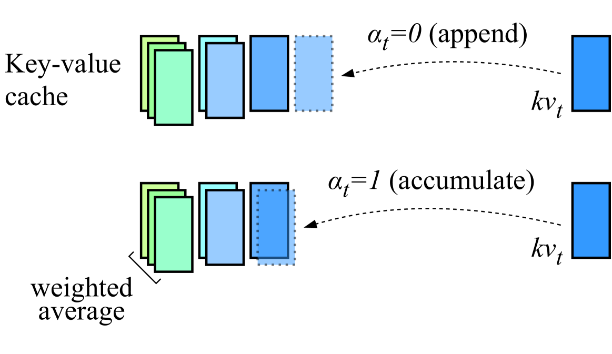

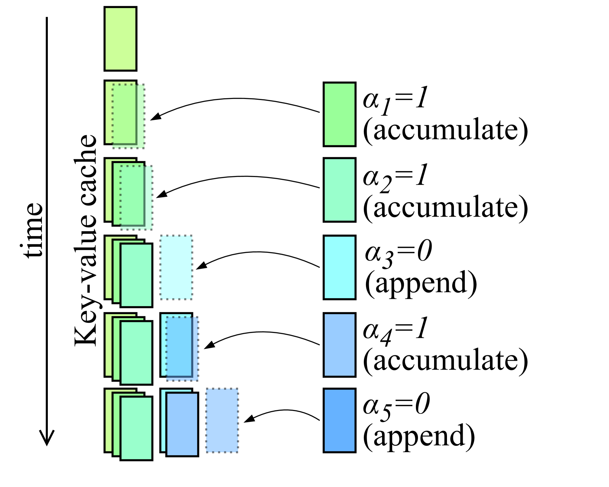

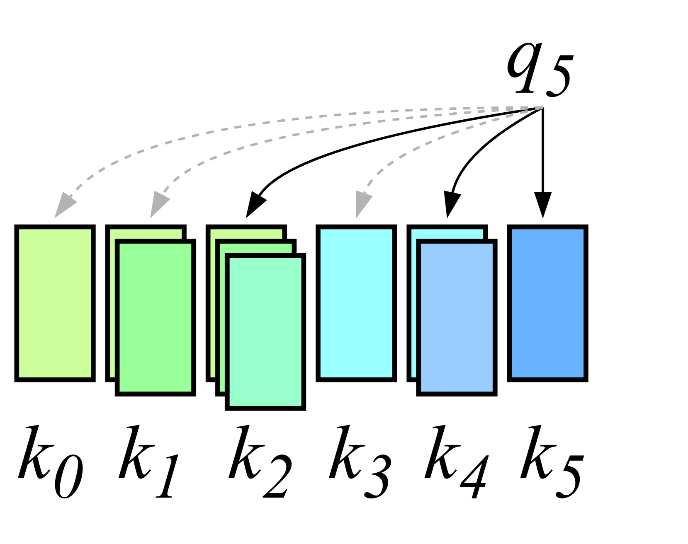

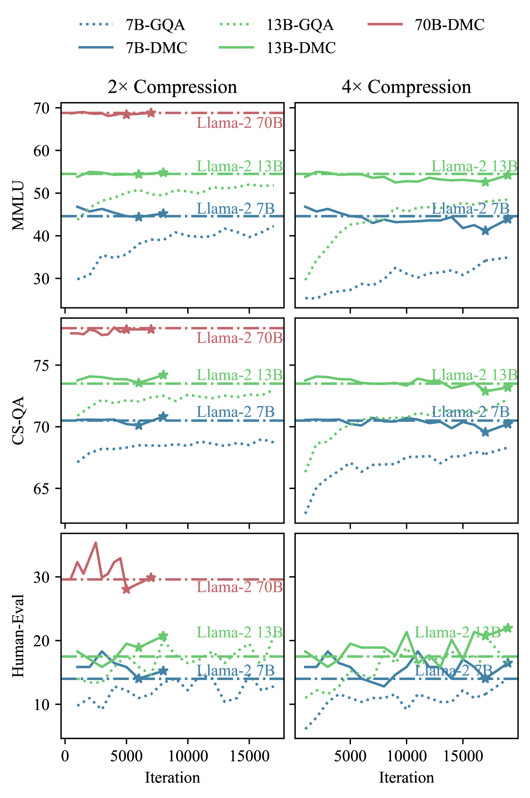

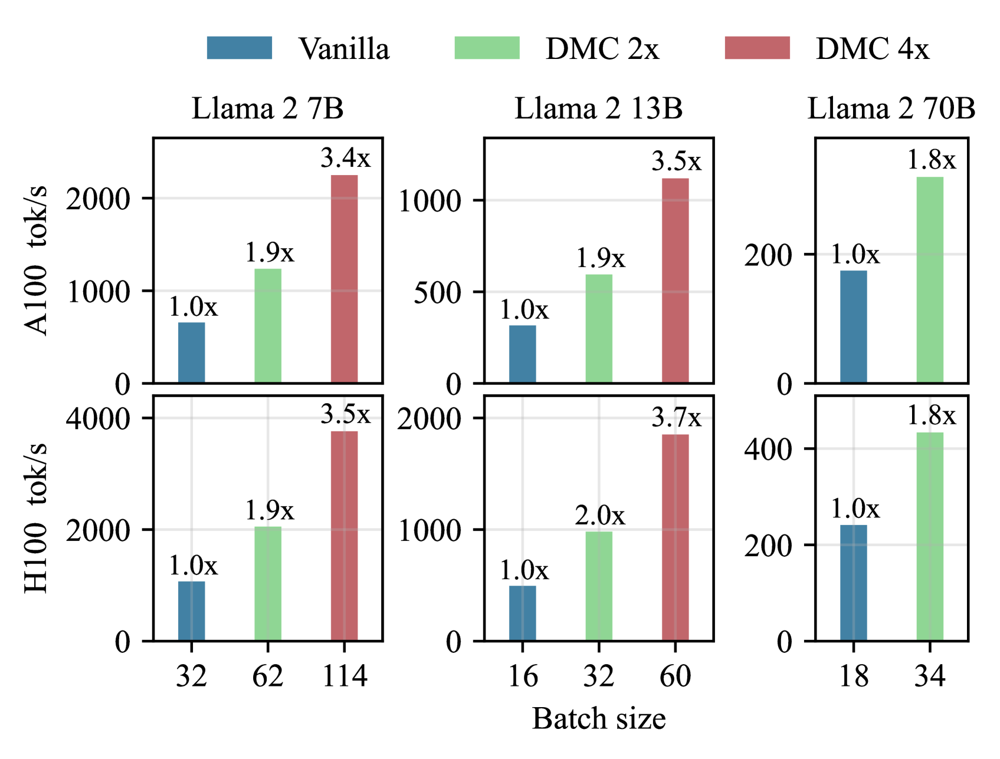

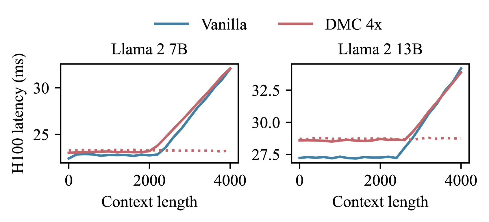

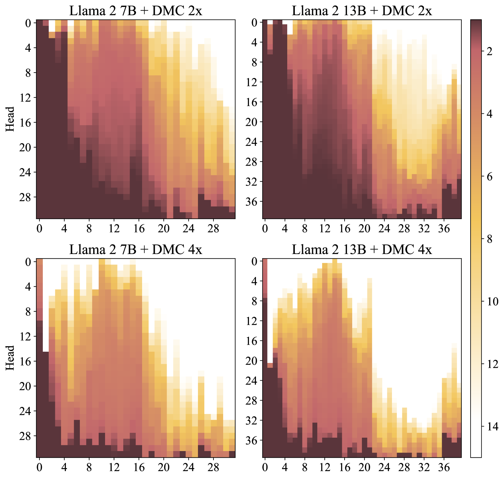

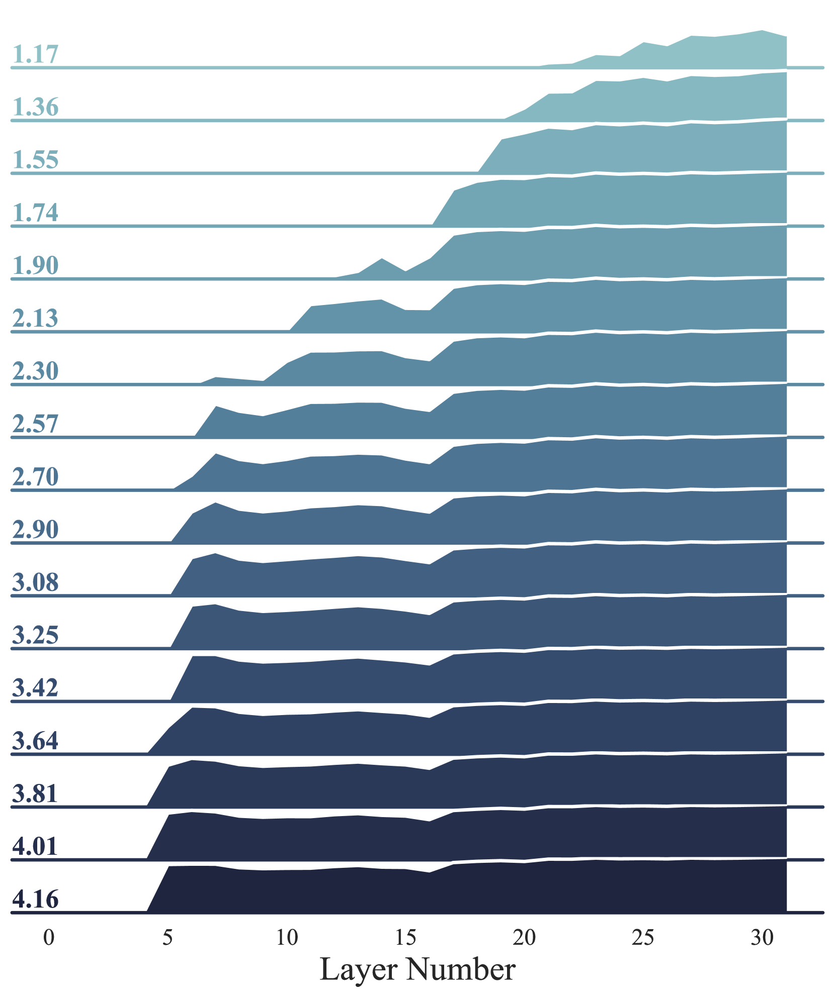

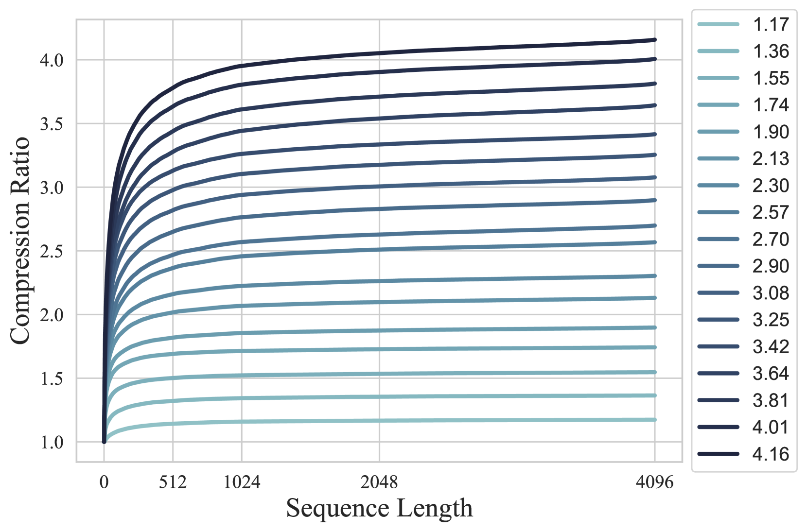

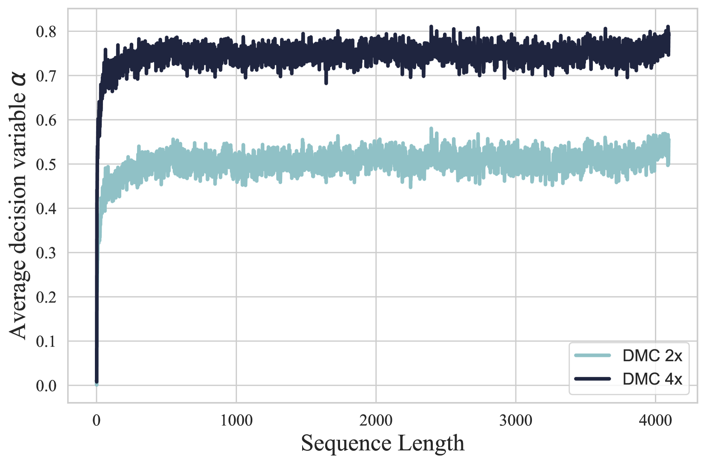

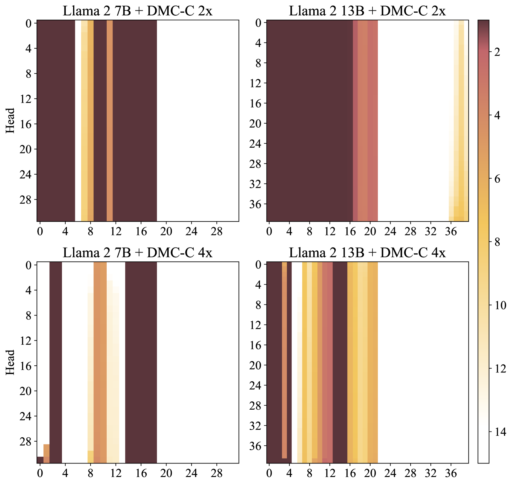

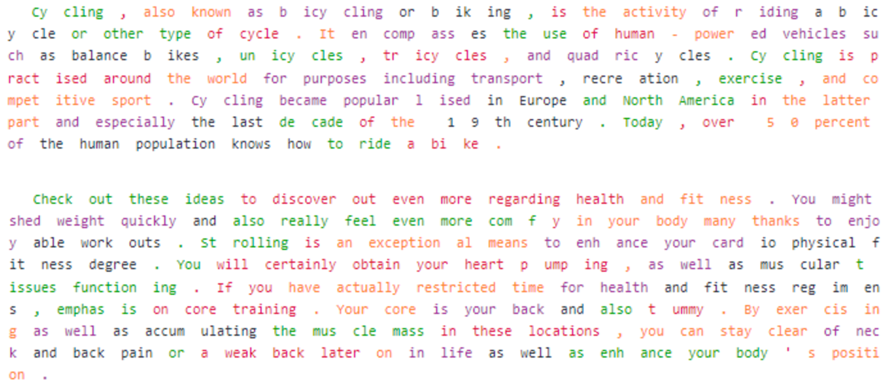

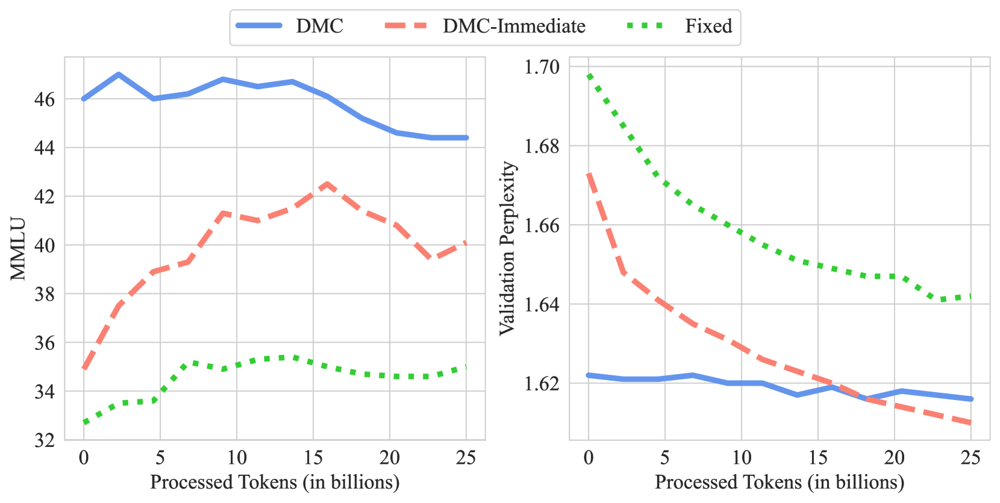

[Arxiv](https://arxiv.org/abs/2403.09636)