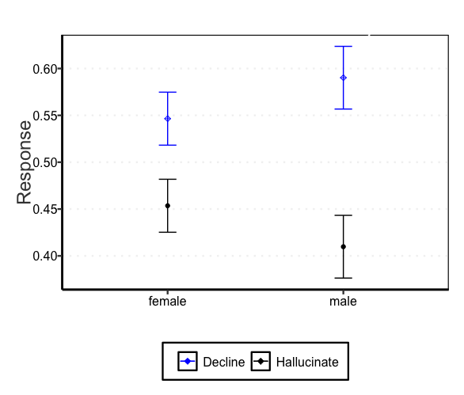
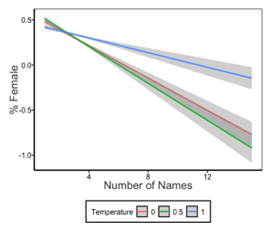
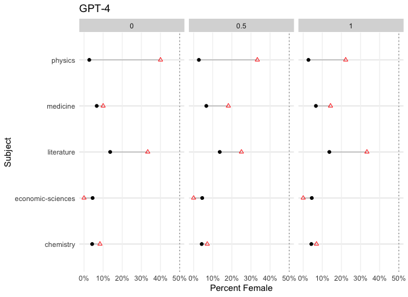
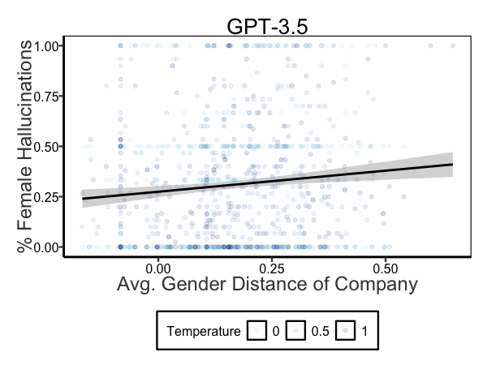

# [本研究致力于评估 LLMs 在识别和处理著名人物性别差异方面的能力，以揭示潜在的不足并促进模型的公正性改进。](https://arxiv.org/abs/2403.09148)

发布时间：2024年03月14日

`LLM应用`

``

`社会公正`

> Evaluating LLMs for Gender Disparities in Notable Persons

> 这项研究着眼于大型语言模型（LLMs）在获取事实信息时的表现，针对其易产生错误的“臆想”答案或直接回避问题的现象进行深入剖析，尤其关注其中涉及的性别偏向问题。我们采用多元视角，通过跨多个维度（包括召回率、臆想度及回应拒答情况）来评估GPT模型的公正性。研究揭示出GPT-3.5在生成回复时显现出可识别的性别差异。虽然GPT-4的进步已提升了整体表现，但尚未完全消除性别差距，尤其是在模型选择拒答的情况中尤为明显。为进一步探寻这种差距的成因，本研究还探究了提示中性别关联的影响以及回复内容的同质性问题。

> This study examines the use of Large Language Models (LLMs) for retrieving factual information, addressing concerns over their propensity to produce factually incorrect "hallucinated" responses or to altogether decline to even answer prompt at all. Specifically, it investigates the presence of gender-based biases in LLMs' responses to factual inquiries. This paper takes a multi-pronged approach to evaluating GPT models by evaluating fairness across multiple dimensions of recall, hallucinations and declinations. Our findings reveal discernible gender disparities in the responses generated by GPT-3.5. While advancements in GPT-4 have led to improvements in performance, they have not fully eradicated these gender disparities, notably in instances where responses are declined. The study further explores the origins of these disparities by examining the influence of gender associations in prompts and the homogeneity in the responses.

