# ExploRLLM 是一项研究，旨在利用大型语言模型（LLMs）来引导强化学习过程中的有效探索。

发布时间：2024年03月14日

`Agent` `机器人`

> ExploRLLM: Guiding Exploration in Reinforcement Learning with Large Language Models

> 面对大型观察与动作空间的图像驱动机器人操控任务时，强化学习常遭遇低效样本利用、缓慢训练及收敛性不明等困扰。而大模型预训练技术为机器人操作带来了曙光，尤其在零样本和少样本应用方面颇具潜力，但由于其推理能力有限及对物理、空间环境理解的难度，直接应用尚不稳定。为此，本文提出一种创新方法——ExploRLLM，巧妙借助大型基础模型（例如大型语言模型）的内在归纳偏好，指导强化学习过程中的探索行为。同时，我们还运用这类基础模型优化动作与观察空间表达，从而显著提升强化学习训练效率。实验证明，引入引导式探索后，训练收敛速度大幅提升。不仅如此，实验结果证实ExploRLLM超越了未经改造的基础模型基准，并且在模拟环境下训练出的策略无需额外训练即可成功迁移到真实世界场景中应用。

> In image-based robot manipulation tasks with large observation and action spaces, reinforcement learning struggles with low sample efficiency, slow training speed, and uncertain convergence. As an alternative, large pre-trained foundation models have shown promise in robotic manipulation, particularly in zero-shot and few-shot applications. However, using these models directly is unreliable due to limited reasoning capabilities and challenges in understanding physical and spatial contexts. This paper introduces ExploRLLM, a novel approach that leverages the inductive bias of foundation models (e.g. Large Language Models) to guide exploration in reinforcement learning. We also exploit these foundation models to reformulate the action and observation spaces to enhance the training efficiency in reinforcement learning. Our experiments demonstrate that guided exploration enables much quicker convergence than training without it. Additionally, we validate that ExploRLLM outperforms vanilla foundation model baselines and that the policy trained in simulation can be applied in real-world settings without additional training.

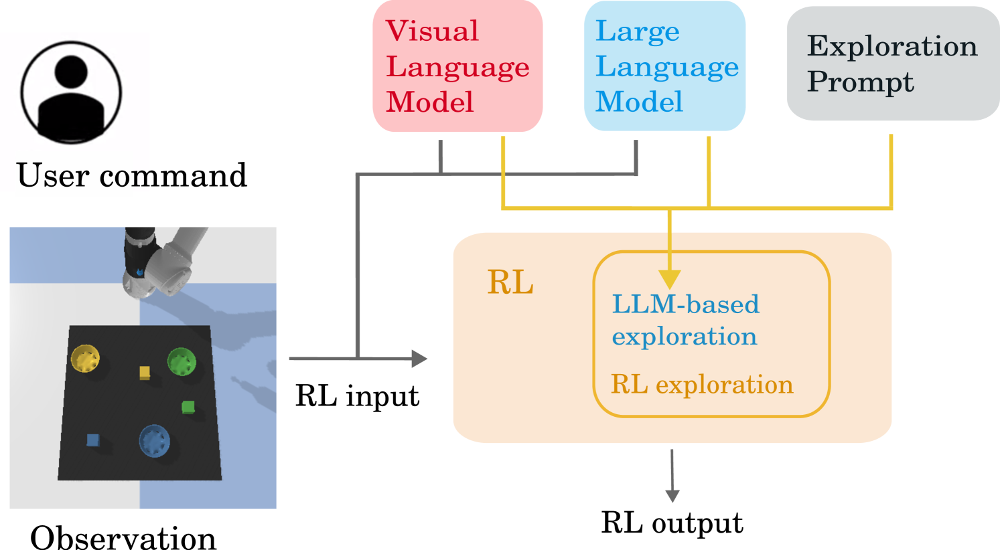

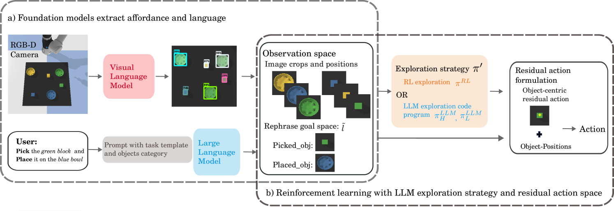

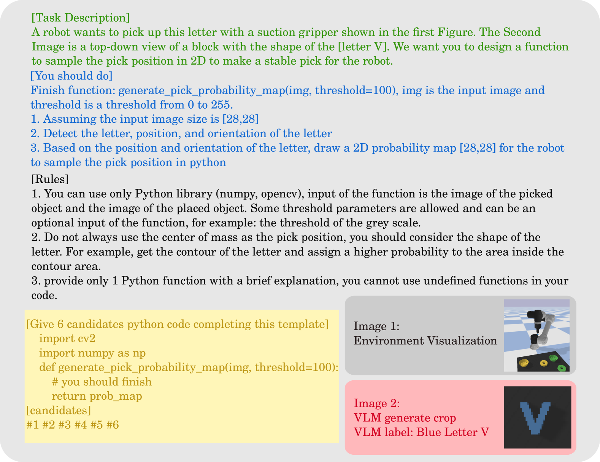

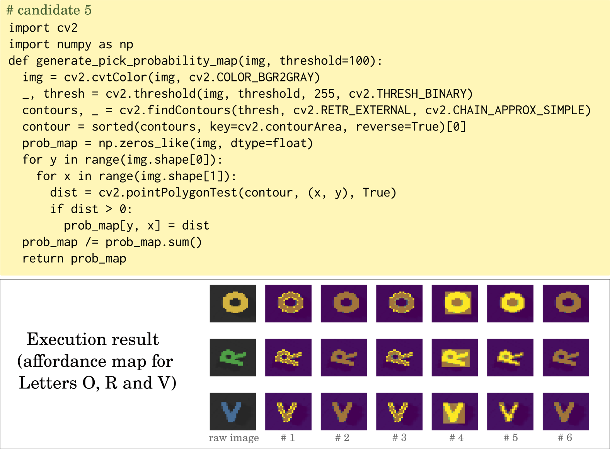

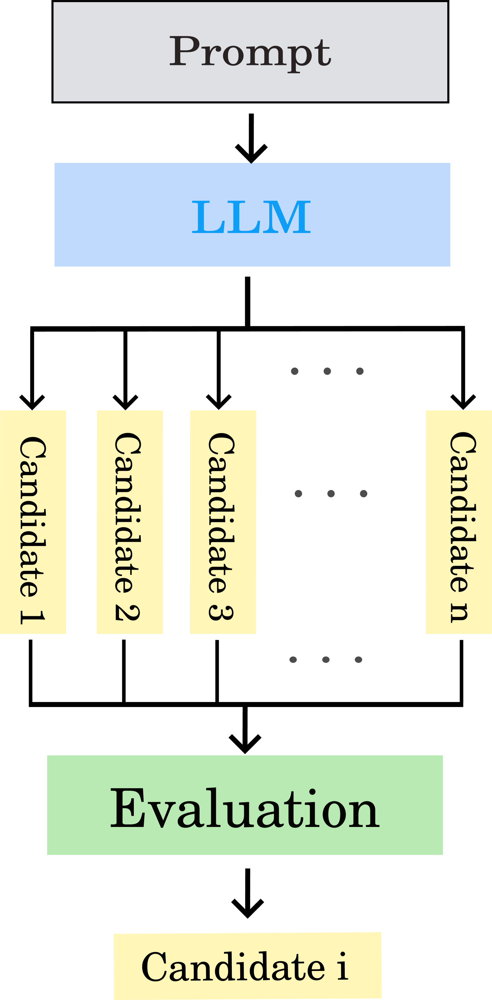

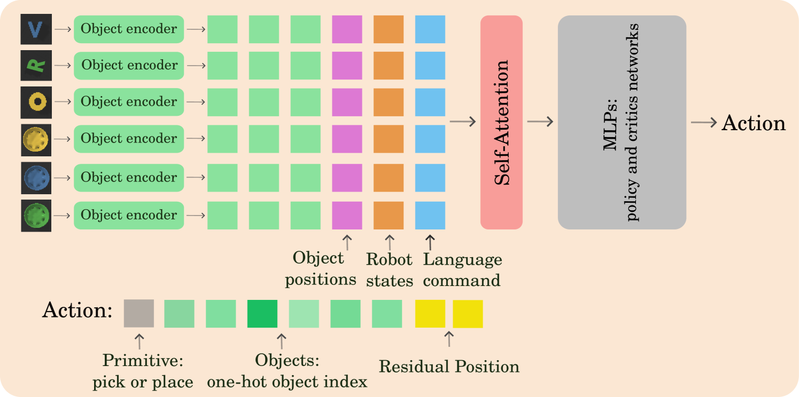

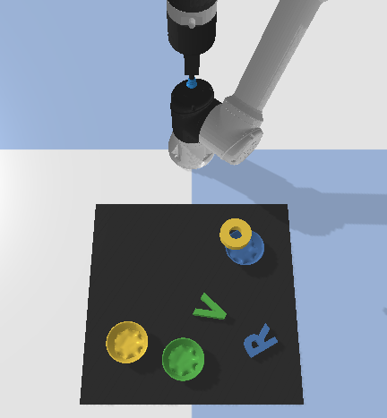

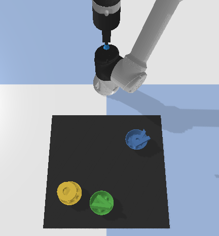

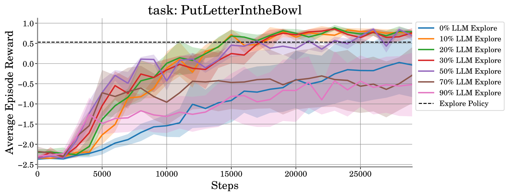

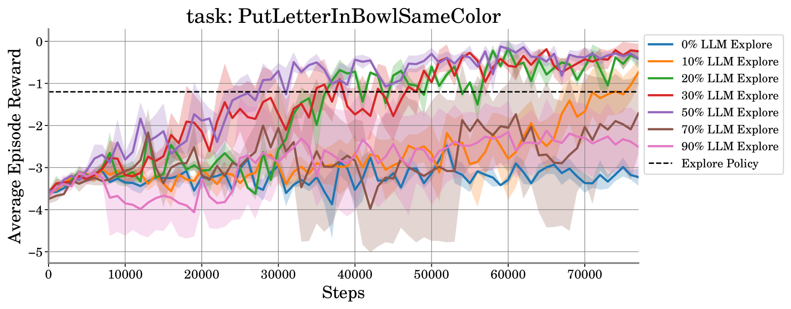

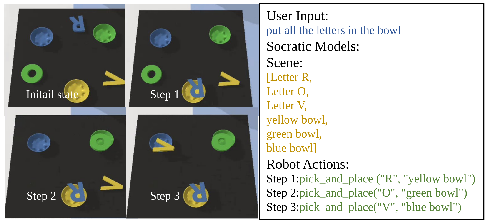

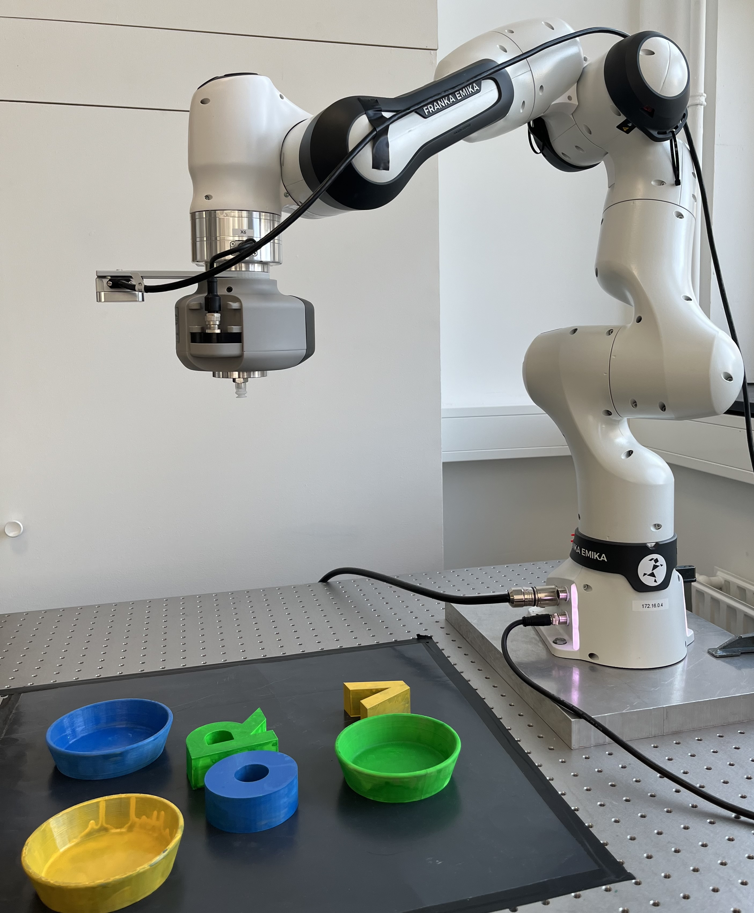

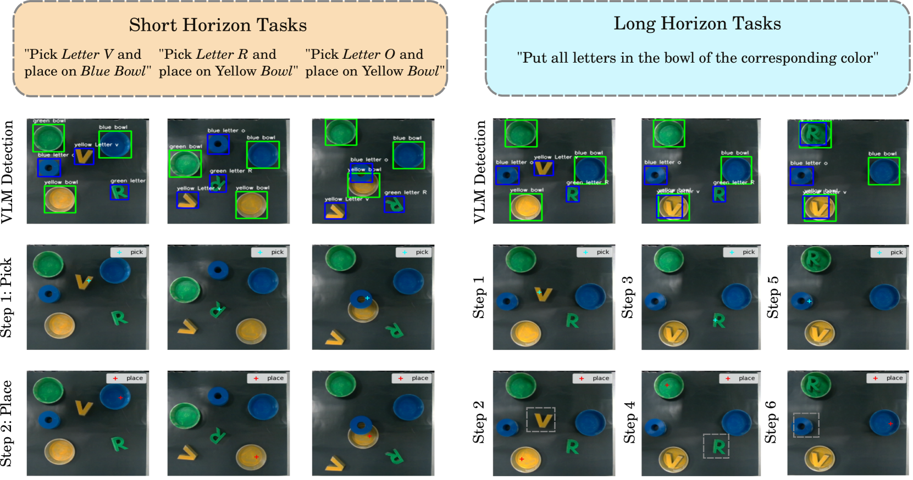

[Arxiv](https://arxiv.org/abs/2403.09583)