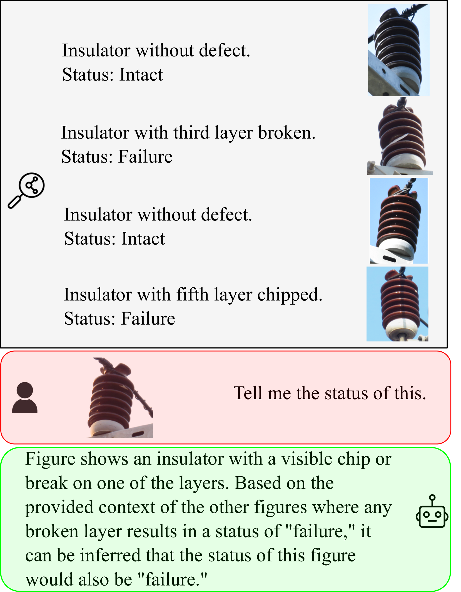
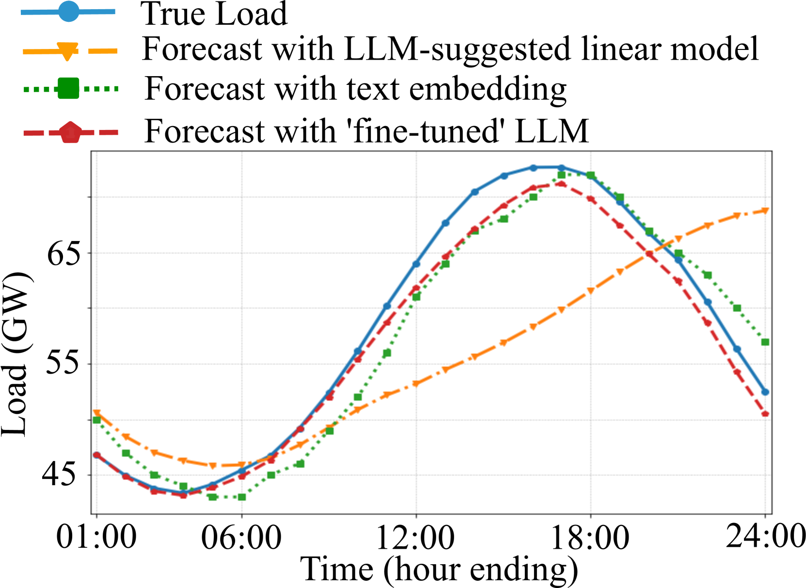
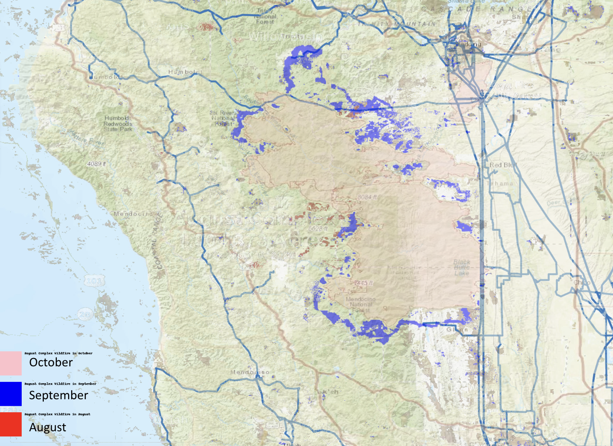

# [本研究致力于揭示大型语言模型在电力能源行业的潜力与局限，深入探讨其在该领域的表现特征及应用场景。]

发布时间：2024年03月14日

`LLM应用` `电力能源` `聊天机器人`

> Exploring the Capabilities and Limitations of Large Language Models in the Electric Energy Sector

> LLMs作为聊天机器人凭借其在自然语言处理和多种任务上的广泛适应性引起了广泛关注。尽管各界热衷于在各领域广泛应用这类基础模型驱动的人工智能工具，但LLMs在提升电力能源行业运行效率方面的潜力与局限性仍有待深入挖掘。本文为此明确了几个具有前景的研究路径：建立针对LLMs的精细调整数据采集系统，将电力系统专用工具整合进LLMs中，以及构建基于RAG技术的知识库来优化LLMs的回答质量和应对安全关键场景时的表现。

> Large Language Models (LLMs) as chatbots have drawn remarkable attention thanks to their versatile capability in natural language processing as well as in a wide range of tasks. While there has been great enthusiasm towards adopting such foundational model-based artificial intelligence tools in all sectors possible, the capabilities and limitations of such LLMs in improving the operation of the electric energy sector need to be explored, and this article identifies fruitful directions in this regard. Key future research directions include data collection systems for fine-tuning LLMs, embedding power system-specific tools in the LLMs, and retrieval augmented generation (RAG)-based knowledge pool to improve the quality of LLM responses and LLMs in safety-critical use cases.

[Arxiv](https://arxiv.org/abs/2403.09125)