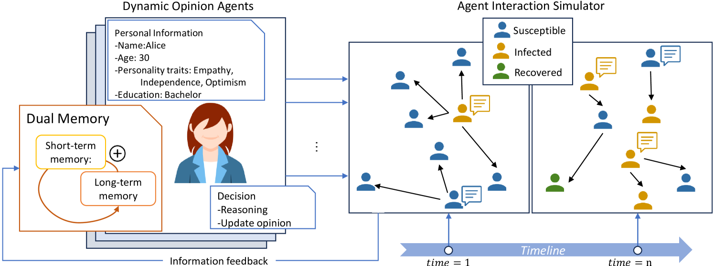
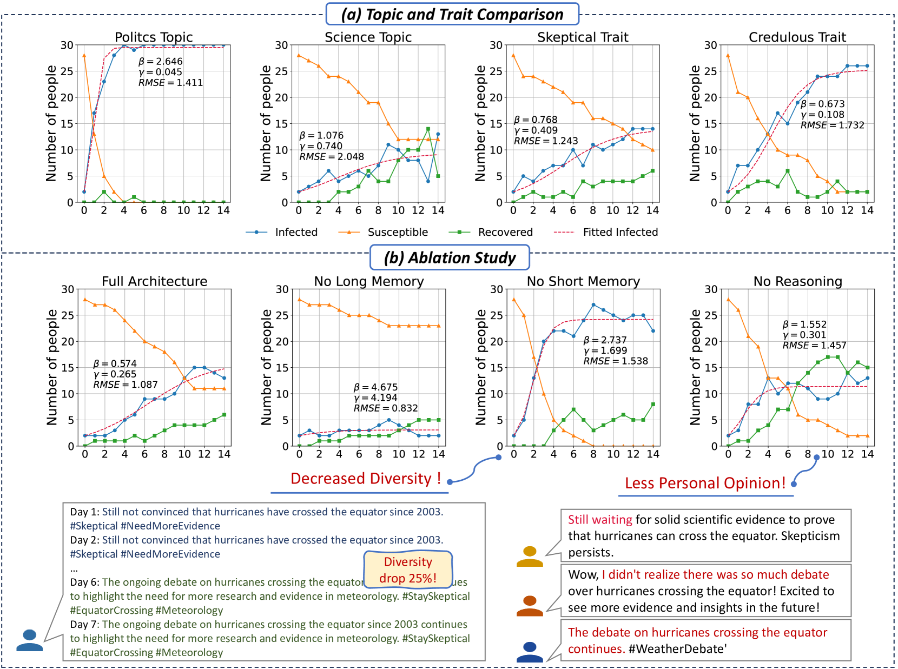

# [本研究模拟了人们对假新闻从怀疑到接受这一态度转变的动态过程。](https://arxiv.org/abs/2403.09498)

发布时间：2024年03月14日

`Agent` `社交网络` `新闻传播`

> From Skepticism to Acceptance: Simulating the Attitude Dynamics Toward Fake News

> 数字化时代下，假新闻和谣言在社交网络中的迅速扩散对社会带来了严峻挑战，并对舆论引导产生了深刻影响。传统假新闻模型多聚焦于各类群体的整体热度走势或以数值形式呈现观点转变，然而这类方法常简化现实复杂性，忽略新闻文本丰富的语义内涵。随着大型语言模型（LLMs）的到来，深入模拟舆论微妙变化成为可能。因此，本文提出了一种基于LLM的假新闻传播模拟框架（FPS），细致探究假新闻的传播趋势及其控制手段。在这个模拟中，每位“个体”代理都拥有独特的性格特征，并配备了模仿人类思考方式的短期记忆、长期记忆及反思机制。他们每日进行随机观点交流、反思自身想法并据此更新观点。模拟实验揭示出假新闻传播与话题关联度和个人特性相关的模式，这与现实生活中的观察结果相符。同时，我们评估了一系列干预策略，并证实早期且适频的干预能够在治理成本和效果间取得平衡，为实际应用场景提供了极具价值的洞察。此研究表明，LLMs在打击假新闻方面展现出巨大价值和广阔应用潜力。

> In the digital era, the rapid propagation of fake news and rumors via social networks brings notable societal challenges and impacts public opinion regulation. Traditional fake news modeling typically forecasts the general popularity trends of different groups or numerically represents opinions shift. However, these methods often oversimplify real-world complexities and overlook the rich semantic information of news text. The advent of large language models (LLMs) provides the possibility of modeling subtle dynamics of opinion. Consequently, in this work, we introduce a Fake news Propagation Simulation framework (FPS) based on LLM, which studies the trends and control of fake news propagation in detail. Specifically, each agent in the simulation represents an individual with a distinct personality. They are equipped with both short-term and long-term memory, as well as a reflective mechanism to mimic human-like thinking. Every day, they engage in random opinion exchanges, reflect on their thinking, and update their opinions. Our simulation results uncover patterns in fake news propagation related to topic relevance, and individual traits, aligning with real-world observations. Additionally, we evaluate various intervention strategies and demonstrate that early and appropriately frequent interventions strike a balance between governance cost and effectiveness, offering valuable insights for practical applications. Our study underscores the significant utility and potential of LLMs in combating fake news.

[Arxiv](https://arxiv.org/abs/2403.09498)