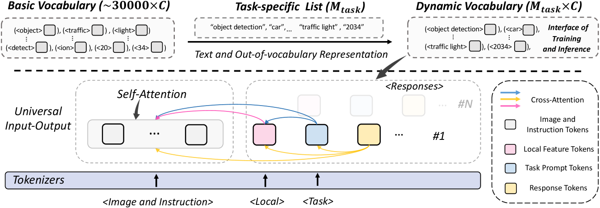
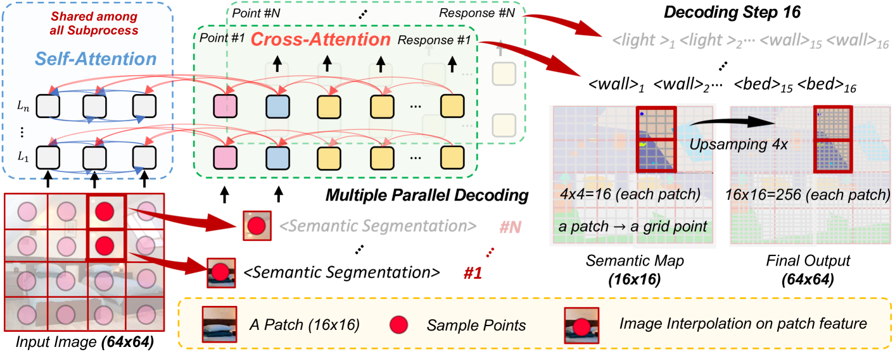
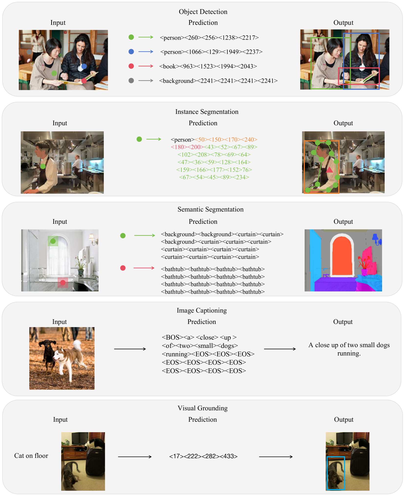

# GiT项目致力于打造一款全能型视觉Transformer，借助统一语言接口实现这一目标。

发布时间：2024年03月14日

`LLM应用` `计算机视觉` `Transformer`

> GiT: Towards Generalist Vision Transformer through Universal Language Interface

> 本文提出了一个新颖且实用的框架——GiT，它采用基础版的ViT就能轻松应对各类视觉任务。借鉴被广泛应用于大型语言模型（LLMs）中的多层Transformer架构（如GPT）所展现的普适性，我们尝试拓宽其应用场景，使其成为一种有力的视觉基础模型（VFM）。不过，与处理语言任务不同，视觉任务往往需要特定组件，如检测任务中的边界框识别头或分割任务中的像素解码器，这些都严重阻碍了多层Transformer在视觉领域的大显身手。为此，我们匠心独运，设计出一个通用语言接口，通过巧妙运用自回归解码技术，将图像理解（如图片描述）、稀疏感知（如目标检测）以及密集预测（如图像分割）等多种视觉任务融为一体。得益于此设计，GiT模型精简至仅包含一个ViT，无需额外复杂的组件。作为一个多任务视觉模型，GiT无需针对具体任务进行微调，即可在五个典型基准上联合训练并表现卓越。更令人欣喜的是，GiT在“全才”性能上树立了新标杆，促使各项任务间形成互促效应，从而带来相较于独立训练的巨大提升，这种现象与LLMs中的发现相呼应。通过整合27个数据集进行深入训练，GiT在各类任务上展现出强大的零样本学习能力。因其设计简洁，该模式有望拉近视觉与语言之间的架构鸿沟。相关代码和模型可在GitHub地址\url{https://github.com/Haiyang-W/GiT}获取。

> This paper proposes a simple, yet effective framework, called GiT, simultaneously applicable for various vision tasks only with a vanilla ViT. Motivated by the universality of the Multi-layer Transformer architecture (e.g, GPT) widely used in large language models (LLMs), we seek to broaden its scope to serve as a powerful vision foundation model (VFM). However, unlike language modeling, visual tasks typically require specific modules, such as bounding box heads for detection and pixel decoders for segmentation, greatly hindering the application of powerful multi-layer transformers in the vision domain. To solve this, we design a universal language interface that empowers the successful auto-regressive decoding to adeptly unify various visual tasks, from image-level understanding (e.g., captioning), over sparse perception (e.g., detection), to dense prediction (e.g., segmentation). Based on the above designs, the entire model is composed solely of a ViT, without any specific additions, offering a remarkable architectural simplification. GiT is a multi-task visual model, jointly trained across five representative benchmarks without task-specific fine-tuning. Interestingly, our GiT builds a new benchmark in generalist performance, and fosters mutual enhancement across tasks, leading to significant improvements compared to isolated training. This reflects a similar impact observed in LLMs. Further enriching training with 27 datasets, GiT achieves strong zero-shot results over various tasks. Due to its simple design, this paradigm holds promise for narrowing the architectural gap between vision and language. Code and models will be available at \url{https://github.com/Haiyang-W/GiT}.

[Arxiv](https://arxiv.org/abs/2403.09394)