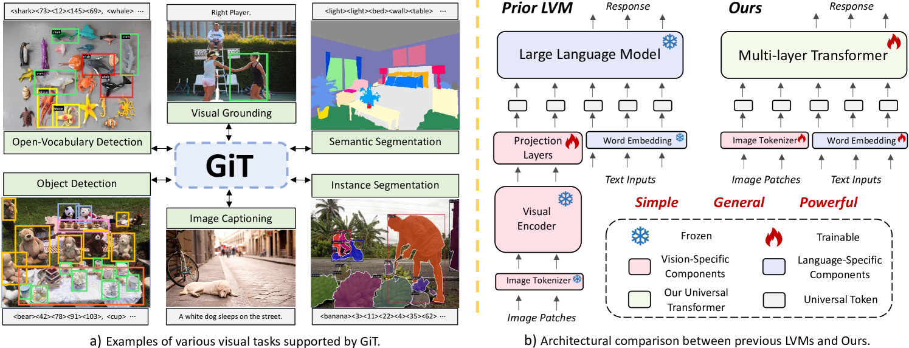
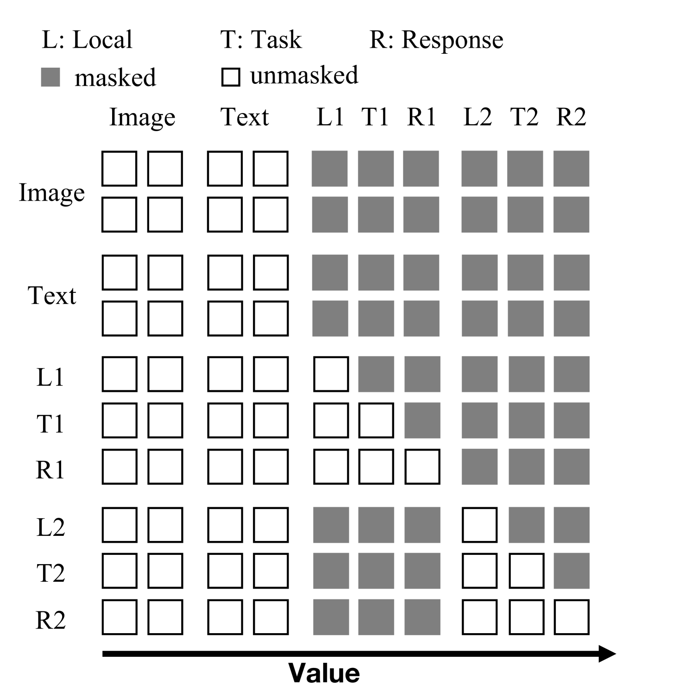
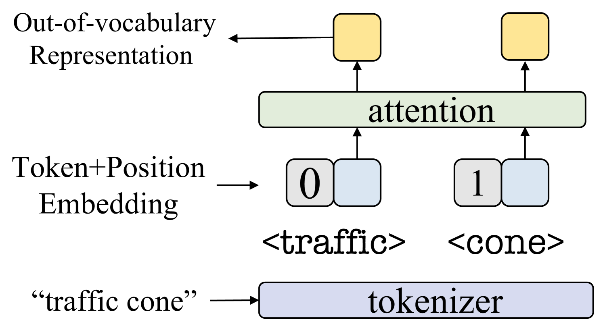

# [GiT项目致力于构建一个通用型视觉Transformer，它通过统一的语言接口达成目标。这个研究旨在借助通用语言界面让视觉Transformer能够广泛适应各类视觉任务。](https://arxiv.org/abs/2403.09394)

发布时间：2024年03月14日

`Agent`

`计算机视觉`

`Transformer`

> GiT: Towards Generalist Vision Transformer through Universal Language Interface

> 本研究提出“GiT”这一简洁高效的框架，它能够仅凭标准版ViT就应对各类视觉任务。受LLMs中广泛应用的多层Transformer架构（如GPT）普适性的启示，我们力求将其扩展为一种功能强大的视觉基础模型（VFM）。但不同于语言模型，视觉任务往往依赖特定模块，如检测任务的边界框头部和分割任务的像素解码器，这些因素严重制约了多层Transformer在视觉领域的大显身手。为此，我们匠心独运，设计出一种通用语言接口，借助自回归解码技术，轻松实现从图像理解、稀疏感知直至密集预测等多样视觉任务的一体化处理。在此基础上构建的GiT模型纯粹由单一ViT构成，无额外特殊组件，彰显出极简的架构革新。作为一个多任务视觉模型，GiT在五个典型基准上联合训练，无需针对具体任务的微调步骤，便展现出卓越的泛化能力。令人惊喜的是，GiT在综合性能上树立了新的标杆，并促进各项任务间的相互增强，与单独训练相比取得了显著提升，这与LLMs中观察到的现象不谋而合。通过结合27个数据集强化训练，GiT在众多任务上都实现了出色的零样本表现。因其设计精巧，这一新范式有望拉近视觉与语言之间的架构鸿沟。相关代码及模型将在\url{https://github.com/Haiyang-W/GiT}公布。

> This paper proposes a simple, yet effective framework, called GiT, simultaneously applicable for various vision tasks only with a vanilla ViT. Motivated by the universality of the Multi-layer Transformer architecture (e.g, GPT) widely used in large language models (LLMs), we seek to broaden its scope to serve as a powerful vision foundation model (VFM). However, unlike language modeling, visual tasks typically require specific modules, such as bounding box heads for detection and pixel decoders for segmentation, greatly hindering the application of powerful multi-layer transformers in the vision domain. To solve this, we design a universal language interface that empowers the successful auto-regressive decoding to adeptly unify various visual tasks, from image-level understanding (e.g., captioning), over sparse perception (e.g., detection), to dense prediction (e.g., segmentation). Based on the above designs, the entire model is composed solely of a ViT, without any specific additions, offering a remarkable architectural simplification. GiT is a multi-task visual model, jointly trained across five representative benchmarks without task-specific fine-tuning. Interestingly, our GiT builds a new benchmark in generalist performance, and fosters mutual enhancement across tasks, leading to significant improvements compared to isolated training. This reflects a similar impact observed in LLMs. Further enriching training with 27 datasets, GiT achieves strong zero-shot results over various tasks. Due to its simple design, this paradigm holds promise for narrowing the architectural gap between vision and language. Code and models will be available at \url{https://github.com/Haiyang-W/GiT}.

