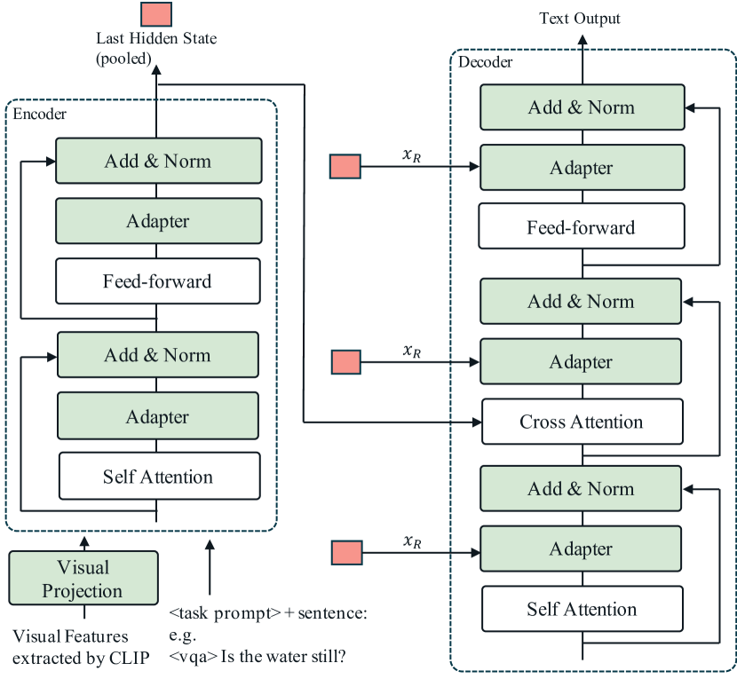
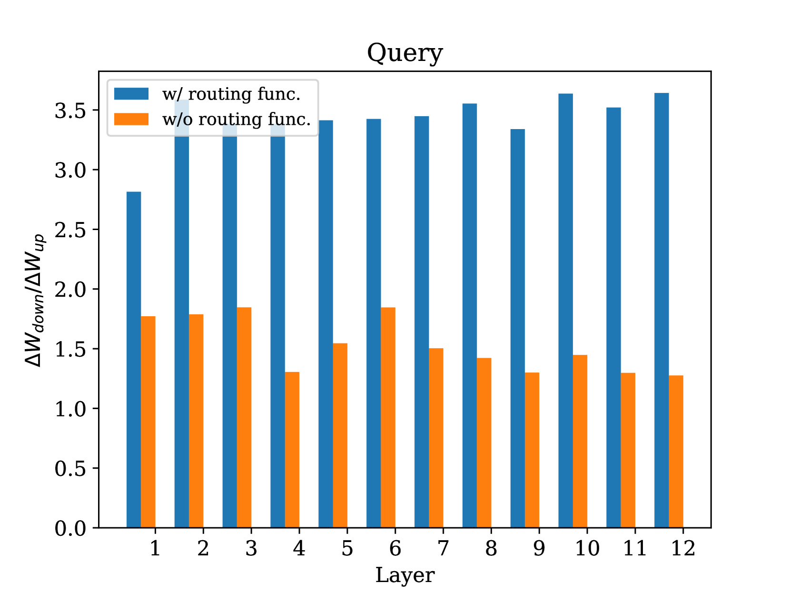
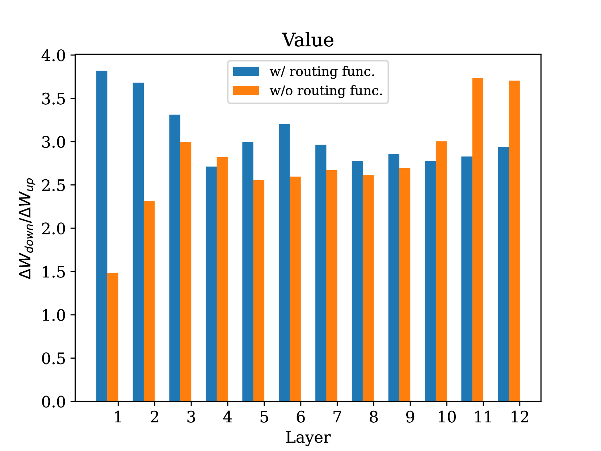

# [我们提出在采用低秩瓶颈进行视觉-语言参数高效微调时，融入路由函数这一技术。这一创新旨在提升模型性能的同时降低参数需求，尤其针对视觉-语言任务中的有效资源优化。](https://arxiv.org/abs/2403.09377)

发布时间：2024年03月14日

`Agent`

`多模态`

``

> Introducing Routing Functions to Vision-Language Parameter-Efficient Fine-Tuning with Low-Rank Bottlenecks

> 为解决 VL PEFT 任务中多模态适应与关系学习的问题，我们聚焦于像LoRA和Adapter这样的主流PEFT技术，它们通过将模型隐藏层降至低维空间，让预训练模型得以适应新数据。本研究创新性地提出了“路由函数”这一系列操作，在低秩瓶颈中强化视觉与语言信息的对齐。这种路由函数采用线性机制，无需新增训练参数。经过深度探究，我们发现该方法在不同的VL PEFT场景下表现卓越，如在VQAv2任务上使（$\text{RoBERTa}_{\text{large}}$+ViT-L/16）组合提升了超过20%的性能，在COCO Captioning任务上则助力（GPT2-medium+ViT-L/16）提高了30%的成绩。即使是对预训练的多模态模型CLIP-BART进行微调，路由函数也能带来稳定而持续的性能提升，贯穿于各类VL PEFT任务之中。

> Mainstream parameter-efficient fine-tuning (PEFT) methods, such as LoRA or Adapter, project a model's hidden states to a lower dimension, allowing pre-trained models to adapt to new data through this low-rank bottleneck. However, PEFT tasks involving multiple modalities, like vision-language (VL) tasks, require not only adaptation to new data but also learning the relationship between different modalities. Targeting at VL PEFT tasks, we propose a family of operations, called routing functions, to enhance VL alignment in the low-rank bottlenecks. The routing functions adopt linear operations and do not introduce new trainable parameters. In-depth analyses are conducted to study their behavior. In various VL PEFT settings, the routing functions significantly improve performance of the original PEFT methods, achieving over 20% improvement on VQAv2 ($\text{RoBERTa}_{\text{large}}$+ViT-L/16) and 30% on COCO Captioning (GPT2-medium+ViT-L/16). Also when fine-tuning a pre-trained multimodal model such as CLIP-BART, we observe smaller but consistent improvements across a range of VL PEFT tasks.

