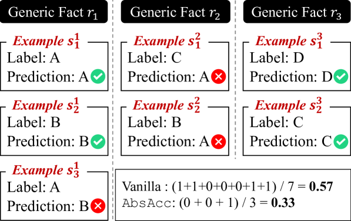
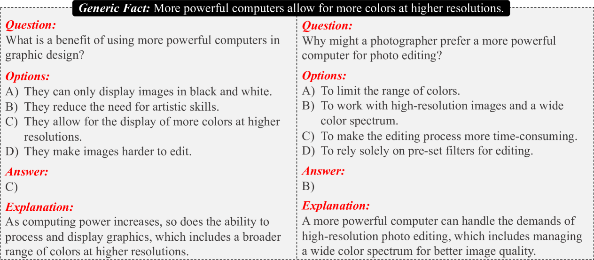
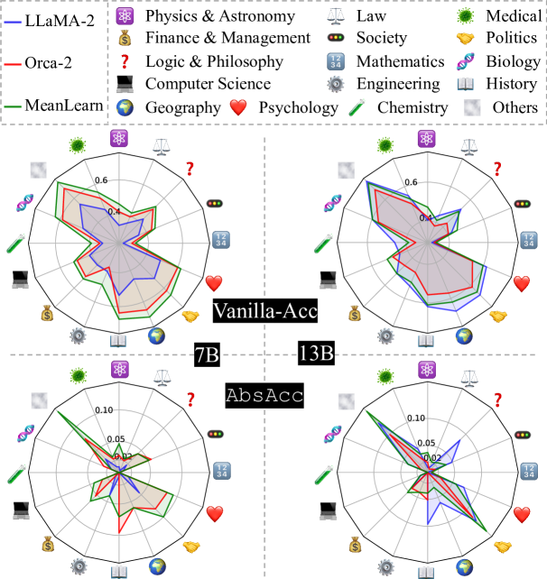

# [借助通用事实引导，促进大型语言模型进行有深度的抽象推理，即“有意义学习”，这一研究致力于提升LLM在处理抽象概念和复杂推理任务时的表现。](https://arxiv.org/abs/2403.09085)

发布时间：2024年03月14日

`LLM理论`

``

`人工智能`

> Meaningful Learning: Advancing Abstract Reasoning in Large Language Models via Generic Fact Guidance

> 尽管 LLMs 在各类推理情境中的表现出类拔萃，模拟人类智能卓有成效，但在回答依托于一般事实的简单问题时，往往不能给出连贯精准的答案，暴露出其在抽象推理方面的短板。为此，一场关于LLMs是真正推理还是仅靠记忆的热烈辩论应运而生。因此，我们开展了一项初步研究，旨在量化并深入探究现存LLMs的抽象推理能力。研究揭示，LLMs的一般推理与抽象推理能力之间存在明显差距。为改善这一状况，我们特别构建了一个名为AbsR的抽象推理数据集，并配套一个有意义的学习模式，以教会LLMs如何运用一般事实进行有效推理。实验结果显示，这种方法不仅提升了LLMs的一般推理能力，更使其在抽象推理领域取得实质性进步，从单纯的记忆模仿迈向对一般事实更为精妙的理解与运用阶段。

> Large language models (LLMs) have developed impressive performance and strong explainability across various reasoning scenarios, marking a significant stride towards mimicking human-like intelligence. Despite this, when tasked with simple questions supported by a generic fact, LLMs often fail to provide consistent and precise answers, indicating a deficiency in abstract reasoning abilities. This has sparked a vigorous debate about whether LLMs are genuinely reasoning or merely memorizing. In light of this, we design a preliminary study to quantify and delve into the abstract reasoning abilities of existing LLMs. Our findings reveal a substantial discrepancy between their general reasoning and abstract reasoning performances. To relieve this problem, we tailor an abstract reasoning dataset (AbsR) together with a meaningful learning paradigm to teach LLMs how to leverage generic facts for reasoning purposes. The results show that our approach not only boosts the general reasoning performance of LLMs but also makes considerable strides towards their capacity for abstract reasoning, moving beyond simple memorization or imitation to a more nuanced understanding and application of generic facts.

