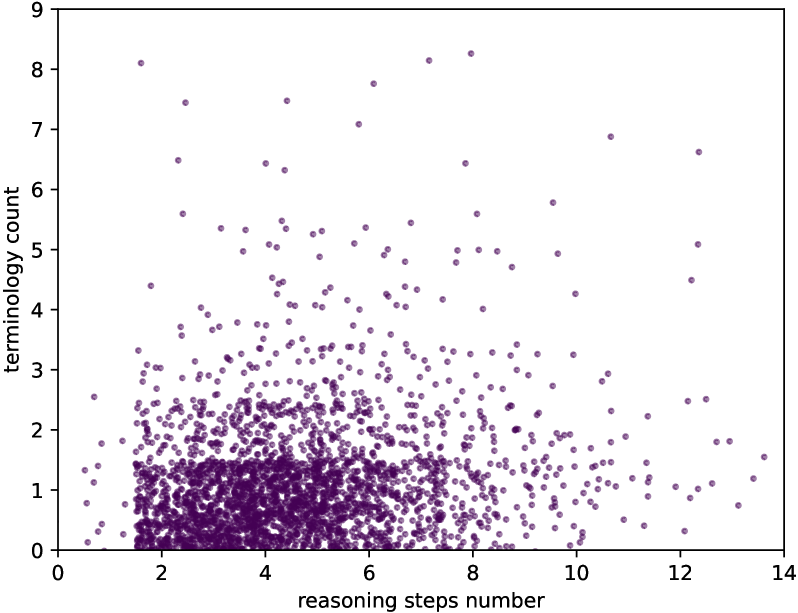

# [ProSwitch 是一种创新方法，它运用知识指导对语言模型进行精细调整，旨在实现生成兼具专业和非专业写作风格的文本。](https://arxiv.org/abs/2403.09131)

发布时间：2024年03月14日

`LLM应用` `文本生成` `语言模型`

> ProSwitch: Knowledge-Guided Language Model Fine-Tuning to Generate Professional and Non-Professional Styled Text

> LLMs在众多语言应用场景如文本摘要和可控文本生成中表现出色，但对于风格切换能力的研究尚待深入探索。本研究聚焦于文本的专业性，创新性地引入“ProSwitch”方法，利用知识引导的指令调优技术赋予语言模型同时产出专业和非专业响应的能力。ProSwitch过程包含三大步骤：首先，精心准备数据以汇集领域知识和构建训练语料库；其次，采用多层级指令格式对语言模型进行精细调优；最后，进行全面评估，衡量生成文本在专业性识别及基于参考标准的质量上表现如何。对比分析表明，相较于通用和专业型语言模型，ProSwitch在专业与非专业文本生成间的切换表现更胜一筹。

> Large Language Models (LLMs) have demonstrated efficacy in various linguistic applications, including text summarization and controlled text generation. However, studies into their capacity of switching between styles via fine-tuning remain underexplored. This study concentrates on textual professionalism and introduces a novel methodology, named ProSwitch, which equips a language model with the ability to produce both professional and non-professional responses through knowledge-guided instruction tuning. ProSwitch unfolds across three phases: data preparation for gathering domain knowledge and training corpus; instruction tuning for optimizing language models with multiple levels of instruction formats; and comprehensive evaluation for assessing the professionalism discrimination and reference-based quality of generated text. Comparative analysis of ProSwitch against both general and specialized language models reveals that our approach outperforms baselines in switching between professional and non-professional text generation.

[Arxiv](https://arxiv.org/abs/2403.09131)