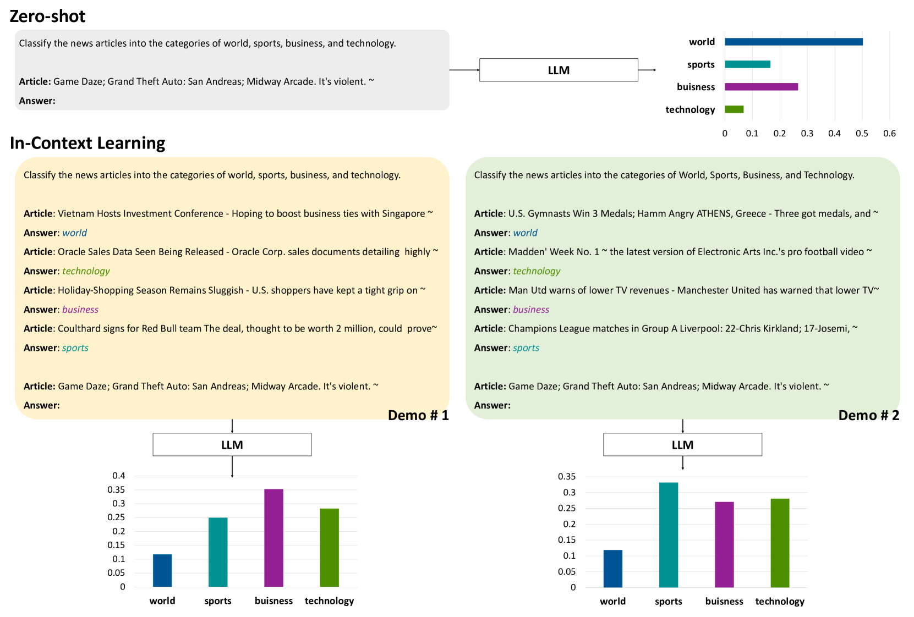
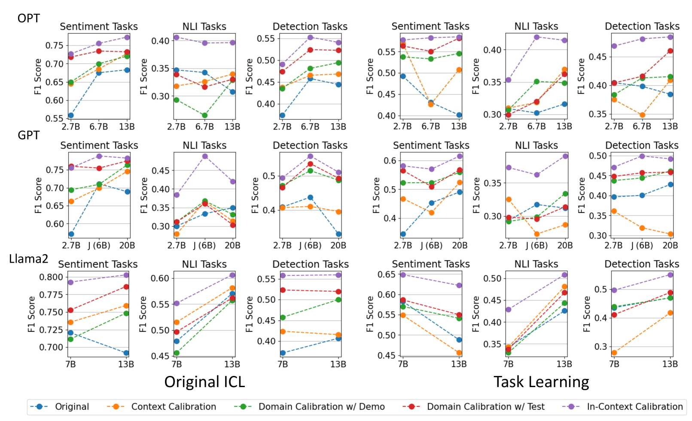
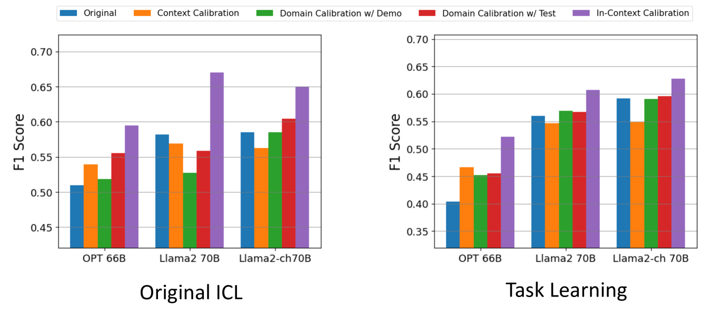
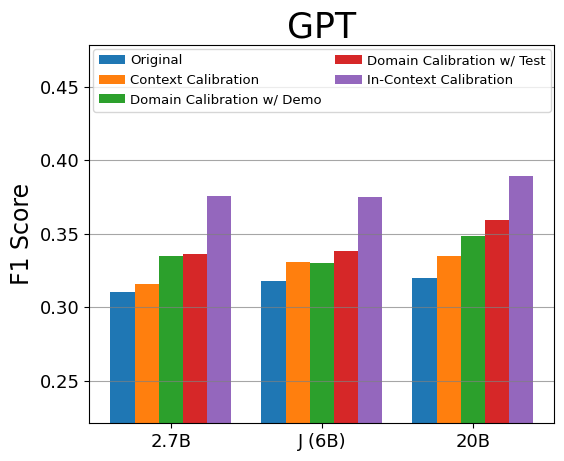
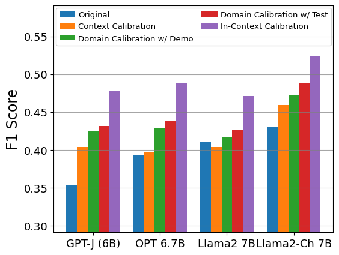
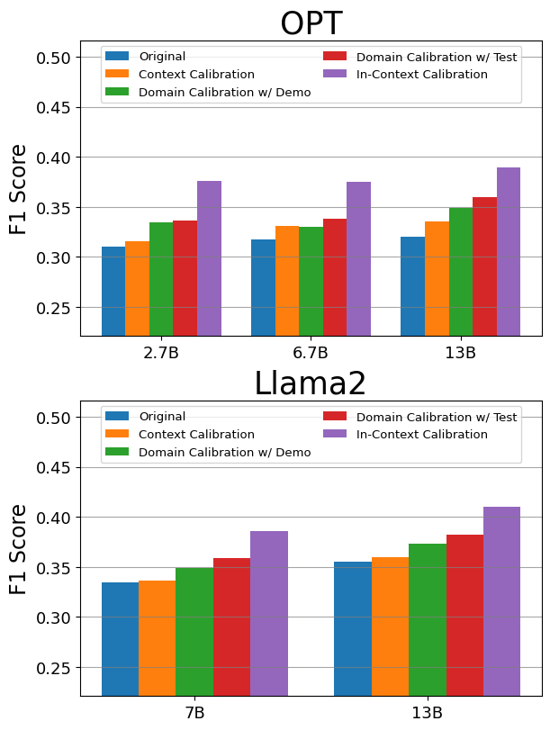
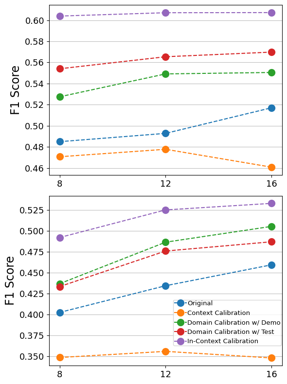
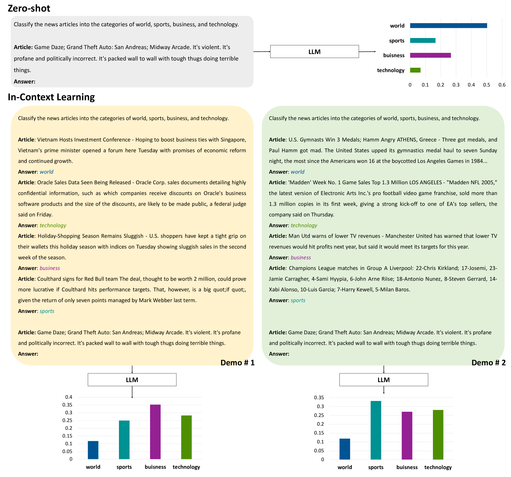

# [本研究致力于纠正ICL中的“演示捷径”问题，探讨如何改进上下文学习方法，以消除对示例的过度依赖，并提升其在各类任务中的泛化性能。](https://arxiv.org/abs/2403.09488)

发布时间：2024年03月14日

`LLM理论` `` `元学习`

> Rectifying Demonstration Shortcut in In-Context Learning

> 借助 ICL 能力，LLMs 可以凭借少数几个示例完成多种任务，但它们通常倚重预训练获得的示范语义偏好而非直接依据输入-标签关系来进行预测，这一现象我们称之为“示范捷径”。不同于先前着重提升预设任务 ICL 预测准确性的研究，本研究旨在矫正这一捷径，使 LLM 能够真正从示范中有效地掌握新的输入-标签关联。因此，我们创新提出了“上下文校准”这一考虑示范影响的校准方法，并在两个场景下检验其实效性：一是使用常规标签空间的原生 ICL 任务情境；二是将标签空间替换成语义无关标记的任务学习环境。实验结果显示，在上述两种情况以及 OPT、GPT 和 Llama2 等三大系列 LLM 的不同配置下，“上下文校准”都带来了显著的性能提升。

> Large language models (LLMs) are able to solve various tasks with only a few demonstrations utilizing their in-context learning (ICL) abilities. However, LLMs often rely on their pre-trained semantic priors of demonstrations rather than on the input-label relationships to proceed with ICL prediction. In this work, we term this phenomenon as the `Demonstration Shortcut'. While previous works have primarily focused on improving ICL prediction results for predefined tasks, we aim to rectify the Demonstration Shortcut, thereby enabling the LLM to effectively learn new input-label relationships from demonstrations. To achieve this, we introduce In-Context Calibration, a demonstration-aware calibration method. We evaluate the effectiveness of the proposed method in two settings: (1) the Original ICL Task using the standard label space and (2) the Task Learning setting, where the label space is replaced with semantically unrelated tokens. In both settings, In-Context Calibration demonstrates substantial improvements, with results generalized across three LLM families (OPT, GPT, and Llama2) under various configurations.

[Arxiv](https://arxiv.org/abs/2403.09488)