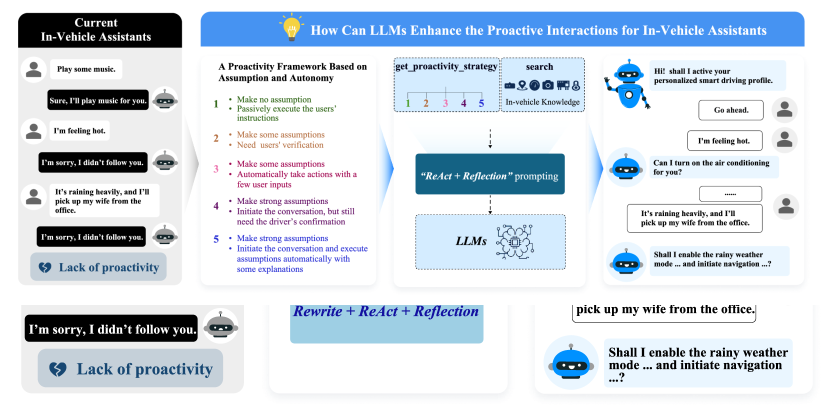
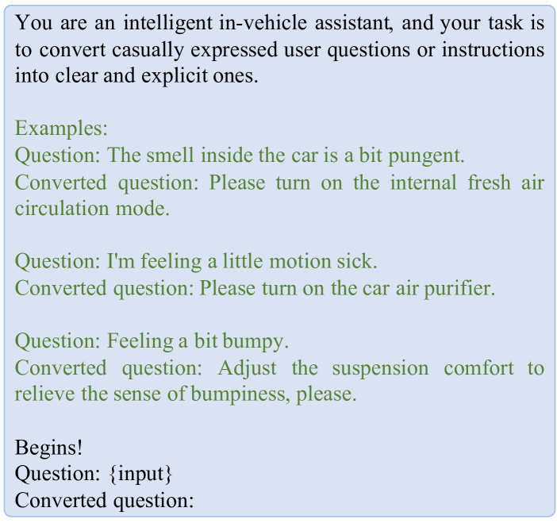

# [本研究致力于探索如何运用大型语言模型，使车载对话助手具备主动交互的能力。](https://arxiv.org/abs/2403.09135)

发布时间：2024年03月14日

`Agent`

``

``

> Towards Proactive Interactions for In-Vehicle Conversational Assistants Utilizing Large Language Models

> 研究表明，IVCAs的主动交流能力有助于降低驾驶者分心并提升行车安全，更能契合用户的心理需求。但目前的IVCAs在理解和把握用户意图、感知上下文环境方面存在问题，导致主动交互体验不足。尽管LLMs在借助提示执行多种任务上表现出广泛潜力，但在IVCAs领域的应用及其主动交互性的探索仍处于起步阶段。这一现状引出了新的问题：LLMs如何优化IVCAs的主动交互性能并影响用户感知？为此，我们构建了一个跨越“假设性”和“自主性”双维度、包含五个主动层级的IVCA框架。依据此框架，我们提出了一套“重写+反应+反思”的创新策略，旨在让LLMs在面对不同主动层级时能精准满足用户需求。实验证明，LLM在成功率上优于现有最先进模型，并且在各主动层级的表现均令人满意。另外，通过对40位参与者的主观实验评估，我们证实了这一框架的有效性，并发现具有高度假设性和用户确认机制的主动层级最为合适。

> Research demonstrates that the proactivity of in-vehicle conversational assistants (IVCAs) can help to reduce distractions and enhance driving safety, better meeting users' cognitive needs. However, existing IVCAs struggle with user intent recognition and context awareness, which leads to suboptimal proactive interactions. Large language models (LLMs) have shown potential for generalizing to various tasks with prompts, but their application in IVCAs and exploration of proactive interaction remain under-explored. These raise questions about how LLMs improve proactive interactions for IVCAs and influence user perception. To investigate these questions systematically, we establish a framework with five proactivity levels across two dimensions-assumption and autonomy-for IVCAs. According to the framework, we propose a "Rewrite + ReAct + Reflect" strategy, aiming to empower LLMs to fulfill the specific demands of each proactivity level when interacting with users. Both feasibility and subjective experiments are conducted. The LLM outperforms the state-of-the-art model in success rate and achieves satisfactory results for each proactivity level. Subjective experiments with 40 participants validate the effectiveness of our framework and show the proactive level with strong assumptions and user confirmation is most appropriate.

