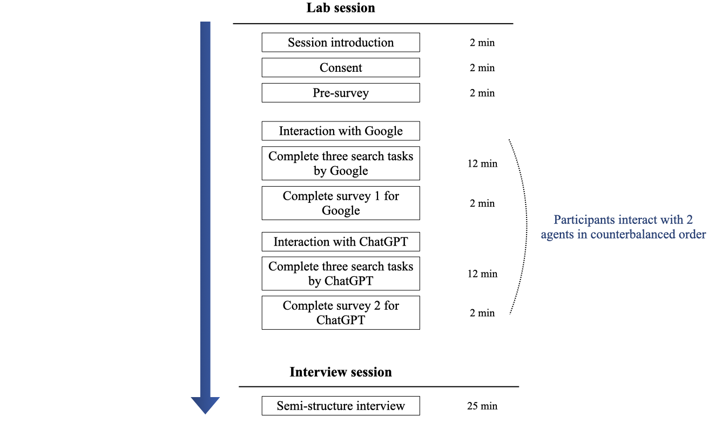
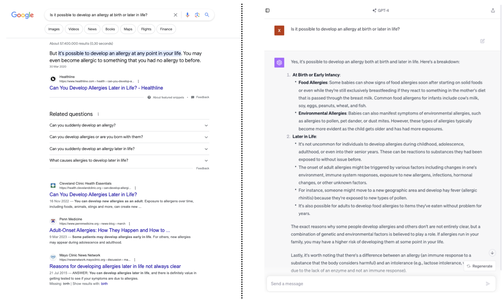
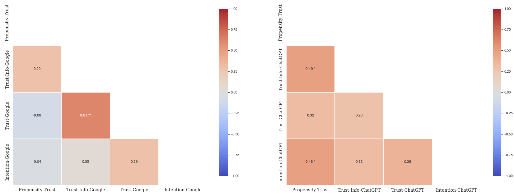

# [探究搜索背后的信任——深入理解人们在使用谷歌和ChatGPT获取健康信息时的信任构建机制](https://arxiv.org/abs/2403.09987)

发布时间：2024年03月14日

`Agent` `健康信息检索` `人工智能`

> Trusting the Search: Unraveling Human Trust in Health Information from Google and ChatGPT

> 随着生活节奏加快，人们愈发依赖便捷及时的在线资源获取健康信息，通常首选谷歌等搜索引擎。而今，生成式AI技术的发展催生了以ChatGPT为代表的基于LLM的对话型智能助手，逐渐成为健康信息检索的有力竞争者。尽管信任对于采纳线上健康建议极其关键，但对于LLM驱动的对话助手给出的健康信息，影响用户信任判断的因素却尚未明朗。为此，我们开展了一项结合定性定量分析的实验研究（样本数N=21），通过对比参与者在完成三项不同的健康搜索任务过程中与ChatGPT及谷歌两类代理互动后，对搜索结果及其代理本身信任度的变化情况。研究发现：(a)相较于谷歌，在寻找健康信息时，参与者对ChatGPT的信任度明显更高；(b)对于谷歌而言，对健康信息的信任与对搜索代理本身的信任之间存在显著关联；(c)搜索任务类型并未对参与者信任感产生影响；(d)参与者之前的健康知识储备、信息呈现方式以及与搜索代理的互动方式是影响其对健康信息信任度的重要决定因素。本研究深入剖析了在采用传统搜索引擎与LLM驱动对话助手搜寻健康信息时，用户信任感受的不同之处，并突显了LLM在引导健康信息搜索过程中的潜在价值，可视为进一步深入查找信息的基石。此外，我们还为在生成式AI时代保障个人健康信息搜索的有效性和可靠性提供了关键要素及思考方向。

> People increasingly rely on online sources for health information seeking due to their convenience and timeliness, traditionally using search engines like Google as the primary search agent. Recently, the emergence of generative Artificial Intelligence (AI) has made Large Language Model (LLM) powered conversational agents such as ChatGPT a viable alternative for health information search. However, while trust is crucial for adopting the online health advice, the factors influencing people's trust judgments in health information provided by LLM-powered conversational agents remain unclear. To address this, we conducted a mixed-methods, within-subjects lab study (N=21) to explore how interactions with different agents (ChatGPT vs. Google) across three health search tasks influence participants' trust judgments of the search results as well as the search agents themselves. Our key findings showed that: (a) participants' trust levels in ChatGPT were significantly higher than Google in the context of health information seeking; (b) there is a significant correlation between trust in health-related information and trust in the search agent, however only for Google; (c) the type of search tasks did not affect participants' perceived trust; and (d) participants' prior knowledge, the style of information presentation, and the interactive manner of using search agents were key determinants of trust in the health-related information. Our study taps into differences in trust perceptions when using traditional search engines compared to LLM-powered conversational agents. We highlight the potential role LLMs play in health-related information-seeking contexts, where they excel as stepping stones for further search. We contribute key factors and considerations for ensuring effective and reliable personal health information seeking in the age of generative AI.

[Arxiv](https://arxiv.org/abs/2403.09987)