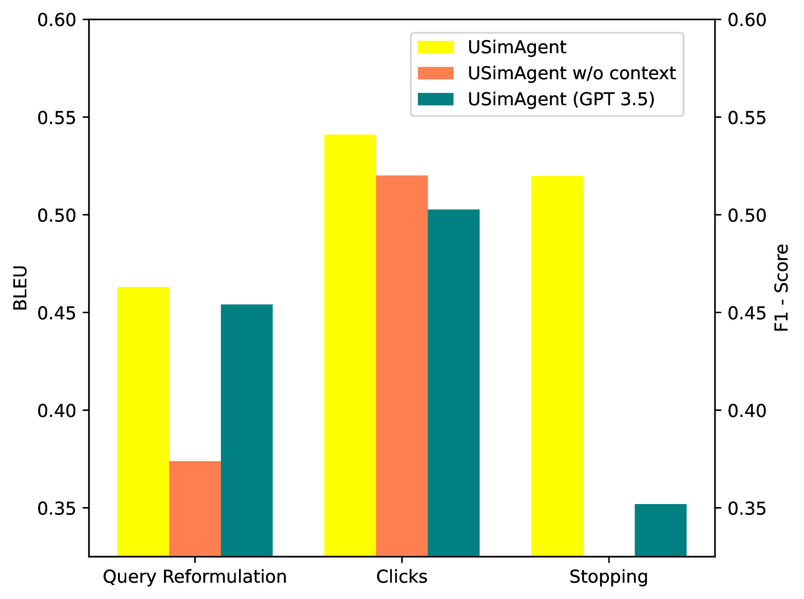

# [USimAgent 是一款专门针对模拟搜索用户而设计的大规模语言模型，它利用强大的自然语言处理能力来仿真用户的搜索行为与意图。](https://arxiv.org/abs/2403.09142)

发布时间：2024年03月14日

`Agent` `信息检索`

> USimAgent: Large Language Models for Simulating Search Users

> 鉴于成本效率高、易复制的特点，用户模拟已成为评估信息检索系统的有效途径。然而，因用户搜索行为受复杂认知机制如学习、推理及规划驱使，精确模拟其行为颇具难度。近期，大型语言模型（LLMs）展现出了模拟人类智慧的强大潜能，并被广泛应用于构建各类任务的自主智能体，但将其应用于模拟搜索行为的研究尚不充分。本文提出了一款基于LLM的用户搜索行为模拟器USimAgent，它可以生动再现用户查询、点击和停止等搜索全过程，从而针对特定搜索任务生成完整的搜索会话记录。通过对真实用户行为数据集的实际验证发现，此模拟器在生成查询时表现优于现存方法，并在预测用户点击和停止行为上与传统方法旗鼓相当。这一研究成果不仅肯定了运用LLMs进行用户模拟的有效性，还为研发更为稳健且通用的用户模拟器开辟了新思路。

> Due to the advantages in the cost-efficiency and reproducibility, user simulation has become a promising solution to the user-centric evaluation of information retrieval systems. Nonetheless, accurately simulating user search behaviors has long been a challenge, because users' actions in search are highly complex and driven by intricate cognitive processes such as learning, reasoning, and planning. Recently, Large Language Models (LLMs) have demonstrated remarked potential in simulating human-level intelligence and have been used in building autonomous agents for various tasks. However, the potential of using LLMs in simulating search behaviors has not yet been fully explored. In this paper, we introduce a LLM-based user search behavior simulator, USimAgent. The proposed simulator can simulate users' querying, clicking, and stopping behaviors during search, and thus, is capable of generating complete search sessions for specific search tasks. Empirical investigation on a real user behavior dataset shows that the proposed simulator outperforms existing methods in query generation and is comparable to traditional methods in predicting user clicks and stopping behaviors. These results not only validate the effectiveness of using LLMs for user simulation but also shed light on the development of a more robust and generic user simulators.

[Arxiv](https://arxiv.org/abs/2403.09142)