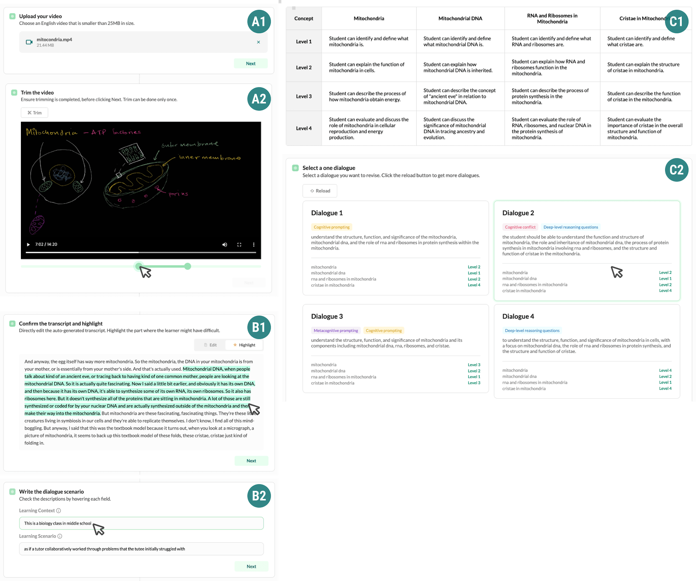
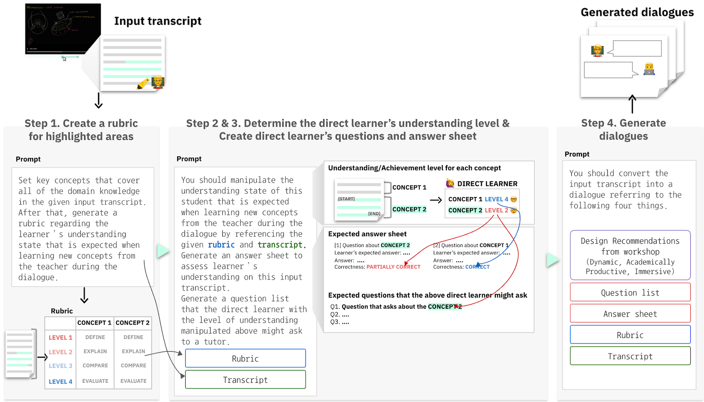
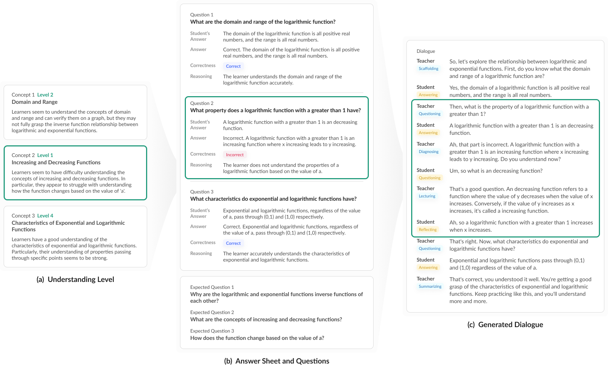
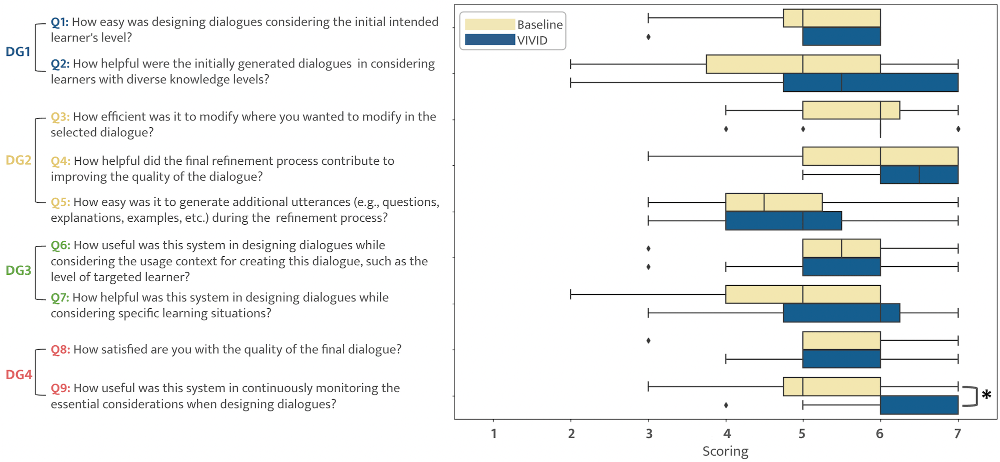
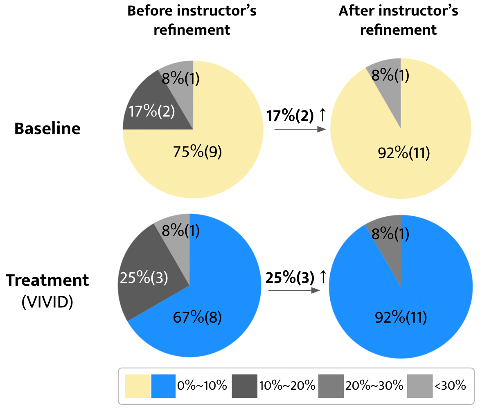
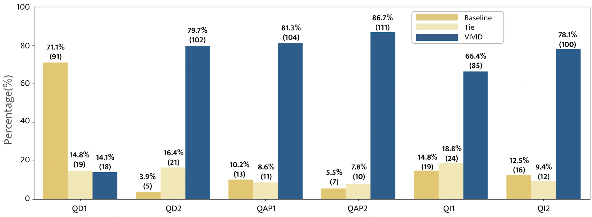
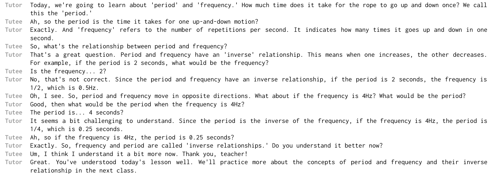

# [VIVID项目致力于实现人机协作，共同从讲座视频中创作生动的、身临其境的对话内容。]

发布时间：2024年03月14日

`LLM应用` `在线教育`

> VIVID: Human-AI Collaborative Authoring of Vicarious Dialogues from Lecture Videos

> 面对冗长的独白式网课使学习者易于失去注意力的问题，我们提出将讲座设计为更具互动性的“替代对话”形式，以有效激发学习者的认知参与。尽管如此，满足不同学习者需求而精心设计对话式网课对教师来说是一项繁重的任务。为此，我们联合八位教育专家及七位一线教师开展了一次设计工作坊，提炼出关键设计原则，并探讨利用大型语言模型（LLM）转化独白讲座为富有教学价值的对话的可能性。基于这些原则，我们创新研发了VIVID系统，让教师能与LLM合作，便捷地设计、评价及调整教学对话内容。通过一项涉及12位教师的内部对照实验，我们证实VIVID有效地助力教师高效选取和优化对话素材，从而有力支持高品质对话课堂的构建。此研究进一步揭示了LLM在协助教师创设各学习阶段高质量教育对话方面的巨大潜能。

> The lengthy monologue-style online lectures cause learners to lose engagement easily. Designing lectures in a "vicarious dialogue" format can foster learners' cognitive activities more than monologue-style. However, designing online lectures in a dialogue style catered to the diverse needs of learners is laborious for instructors. We conducted a design workshop with eight educational experts and seven instructors to present key guidelines and the potential use of large language models (LLM) to transform a monologue lecture script into pedagogically meaningful dialogue. Applying these design guidelines, we created VIVID which allows instructors to collaborate with LLMs to design, evaluate, and modify pedagogical dialogues. In a within-subjects study with instructors (N=12), we show that VIVID helped instructors select and revise dialogues efficiently, thereby supporting the authoring of quality dialogues. Our findings demonstrate the potential of LLMs to assist instructors with creating high-quality educational dialogues across various learning stages.

[Arxiv](https://arxiv.org/abs/2403.09168)