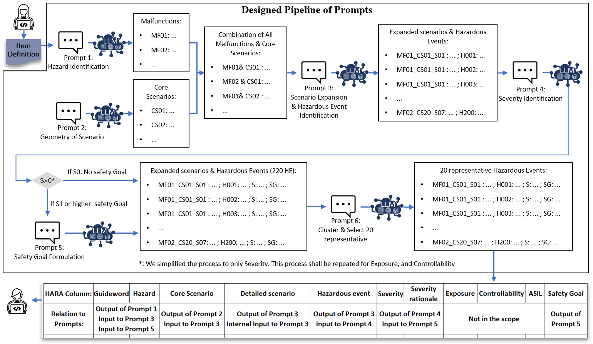

# [向您介绍您的新晋AI队友，它将通过约束大型语言模型的方式助力安全分析工作。]

发布时间：2024年03月14日

`LLM应用` `自动驾驶` `安全工程`

> Welcome Your New AI Teammate: On Safety Analysis by Leashing Large Language Models

> DevOps 已成为诸多行业的必备实践，自动驾驶汽车开发也不例外。然而，在此类场景下，诸如“危害分析与风险评估”（HARA）等反复进行的活动拖慢了 SafetyOps 的进程。鉴于此，我们着眼于大型语言模型（LLMs）的强大功能，探索如何加速这一安全需求规范起点——HARA 步骤。我们的研究目标明确，旨在系统考察 LLMs 在安全工程领域中的潜在应用价值。因此，我们设计了一个框架，旨在借助 LLMs 实现 HARA 更高水平的自动化。尽管我们致力于最大程度地自动化流程，但在保证分析结果准确无误的前提下，专家评审仍不可或缺，需根据实际情况做出相应调整。

> DevOps is a necessity in many industries, including the development of Autonomous Vehicles. In those settings, there are iterative activities that reduce the speed of SafetyOps cycles. One of these activities is "Hazard Analysis & Risk Assessment" (HARA), which is an essential step to start the safety requirements specification. As a potential approach to increase the speed of this step in SafetyOps, we have delved into the capabilities of Large Language Models (LLMs).
  Our objective is to systematically assess their potential for application in the field of safety engineering. To that end, we propose a framework to support a higher degree of automation of HARA with LLMs. Despite our endeavors to automate as much of the process as possible, expert review remains crucial to ensure the validity and correctness of the analysis results, with necessary modifications made accordingly.

[Arxiv](https://arxiv.org/abs/2403.09565)