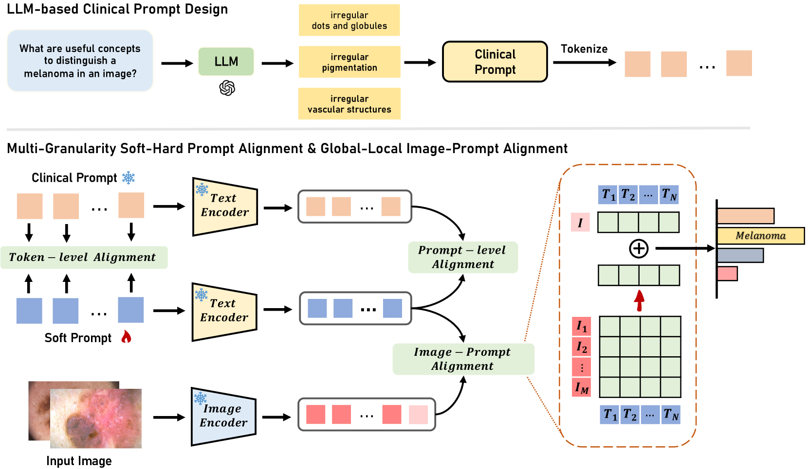
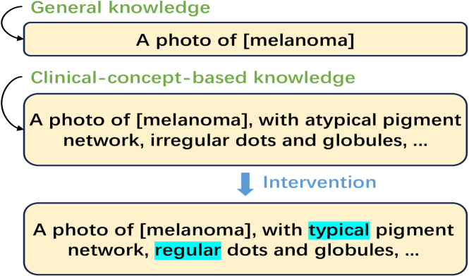
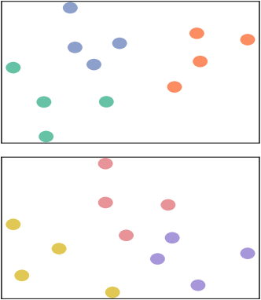

# [XCoOp 是一种新颖的方法，它利用概念引导的上下文优化技术，实现了针对计算机辅助诊断任务的可解释性提示学习。通过这种方法，XCoOp 能够在诊断过程中提供清晰、易理解的依据，提升诊断准确性和决策可信度。](https://arxiv.org/abs/2403.09410)

发布时间：2024年03月14日

`Agent`

``

`图像识别`

`可解释人工智能`

> XCoOp: Explainable Prompt Learning for Computer-Aided Diagnosis via Concept-guided Context Optimization

> 随着大型视觉-语言模型(VLMs)的强大表示被广泛应用到众多下游任务中，软提示学习作为一种高效适应CLIP等模型的方法，在图像分类等领域备受瞩目。但现有的大部分提示学习技术所得到的文本提示不具备可解释性，难以满足在关键领域如医疗健康中严苛的XAI解释需求。因此，我们创新性地设计了一种基于医学知识的可解释提示学习框架，它能够在多种粒度层级上对图像语义、可学习提示以及临床概念驱动的提示进行语义对齐。此外，我们还巧妙借助大型语言模型抽取知识，填补了宝贵概念标注的缺失，并为提示生成了图文并茂的解释。广泛且深入的实验证明，在包含或未包含概念标签的不同数据集上，我们的方法都能兼顾出色的诊断效果、灵活的应用以及高度的可解释性，有力展示了基础模型在推动XAI发展中的重要作用。该代码将会公开发布。

> Utilizing potent representations of the large vision-language models (VLMs) to accomplish various downstream tasks has attracted increasing attention. Within this research field, soft prompt learning has become a representative approach for efficiently adapting VLMs such as CLIP, to tasks like image classification. However, most existing prompt learning methods learn text tokens that are unexplainable, which cannot satisfy the stringent interpretability requirements of Explainable Artificial Intelligence (XAI) in high-stakes scenarios like healthcare. To address this issue, we propose a novel explainable prompt learning framework that leverages medical knowledge by aligning the semantics of images, learnable prompts, and clinical concept-driven prompts at multiple granularities. Moreover, our framework addresses the lack of valuable concept annotations by eliciting knowledge from large language models and offers both visual and textual explanations for the prompts. Extensive experiments and explainability analyses conducted on various datasets, with and without concept labels, demonstrate that our method simultaneously achieves superior diagnostic performance, flexibility, and interpretability, shedding light on the effectiveness of foundation models in facilitating XAI. The code will be made publically available.

