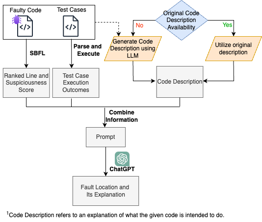
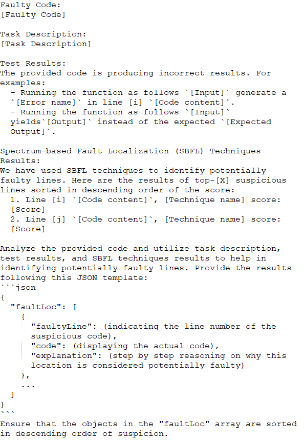
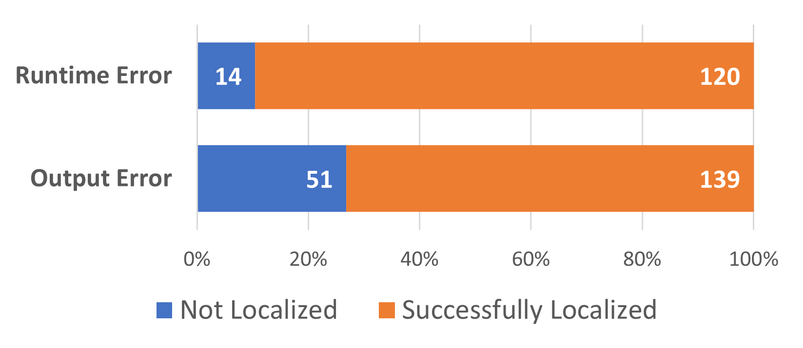
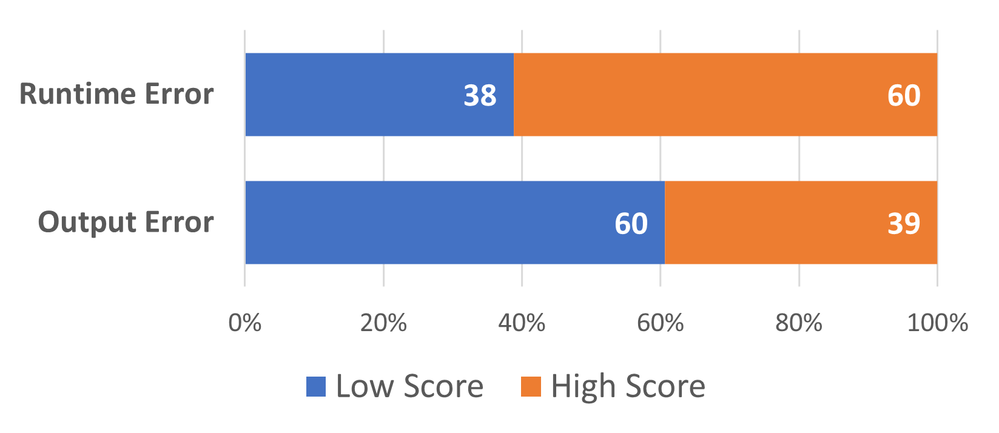

# [通过 LLM 逐步揭秘错误代码，提供可理解的故障定位机制步骤 1：利用 LLM 解析错误代码：针对可解释性故障定位的逐层深入分析步骤 2：本研究借助 LLM，对错误代码进行逐行剖析和逻辑解读，致力于实现可解释的故障定位过程。](https://arxiv.org/abs/2403.10507)

发布时间：2024年03月15日

`Agent`

`软件工程`

`故障定位`

> Demystifying Faulty Code with LLM: Step-by-Step Reasoning for Explainable Fault Localization

> 故障定位是识别引发程序失败的关键环节，涉及确定特定的类、方法或语句等代码元素，而人工完成这一任务极其耗时。面对这一挑战，一系列故障定位工具应运而生，它们能够生成可疑代码元素的优先级列表。然而，单纯依赖排名列表不足以解决问题，先前研究指出自动故障定位应具备提供推理依据的能力。本研究致力于深入探究可解释故障定位的分步推理机制，并发掘大型语言模型（LLM）辅助开发者解析代码的潜能。我们创新性地提出FuseFL方案，将光谱故障定位结果、测试用例运行情况及代码描述（即对代码目的的解释）等多种信息整合，以优化LLM的表现。通过运用Refactory数据集中带有缺陷的代码样本，我们首先检验了自动化故障定位的效能，并发现FuseFL在Top-1位置成功定位的故障数相较于基准提升了超过30%。为了验证FuseFL生成的解释质量，我们构建了一个包含324个含有故障代码文件及其对应600条故障行的人工推理解释数据集。此外，我们还组织了人为评测实验，结果显示，在随机选取的30个案例中，FuseFL为其中22个案例准确地生成了符合逻辑的解释。

> Fault localization is a critical process that involves identifying specific program elements responsible for program failures. Manually pinpointing these elements, such as classes, methods, or statements, which are associated with a fault is laborious and time-consuming. To overcome this challenge, various fault localization tools have been developed. These tools typically generate a ranked list of suspicious program elements. However, this information alone is insufficient. A prior study emphasized that automated fault localization should offer a rationale.
  In this study, we investigate the step-by-step reasoning for explainable fault localization. We explore the potential of Large Language Models (LLM) in assisting developers in reasoning about code. We proposed FuseFL that utilizes several combinations of information to enhance the LLM results which are spectrum-based fault localization results, test case execution outcomes, and code description (i.e., explanation of what the given code is intended to do). We conducted our investigation using faulty code from Refactory dataset. First, we evaluate the performance of the automated fault localization. Our results demonstrate a more than 30% increase in the number of successfully localized faults at Top-1 compared to the baseline. To evaluate the explanations generated by FuseFL, we create a dataset of human explanations that provide step-by-step reasoning as to why specific lines of code are considered faulty. This dataset consists of 324 faulty code files, along with explanations for 600 faulty lines. Furthermore, we also conducted human studies to evaluate the explanations. We found that for 22 out of the 30 randomly sampled cases, FuseFL generated correct explanations.

