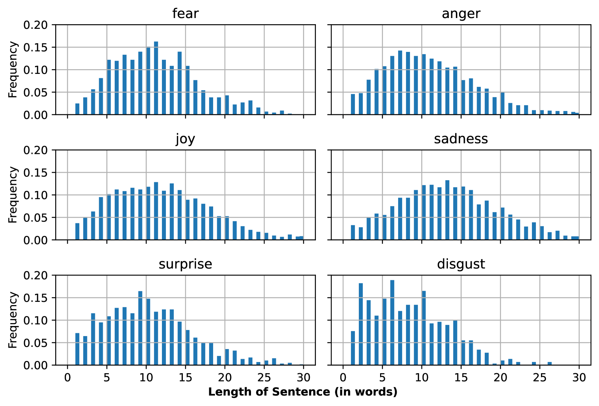
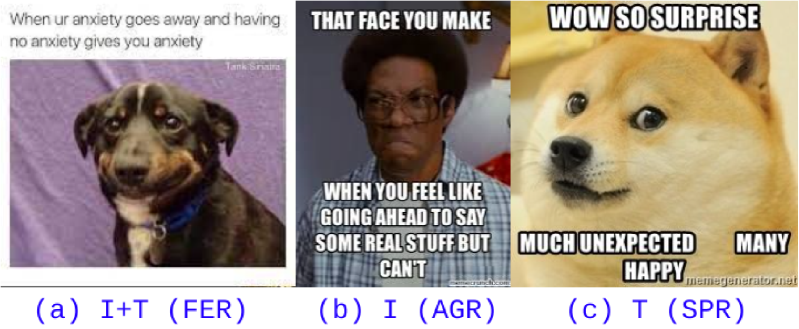
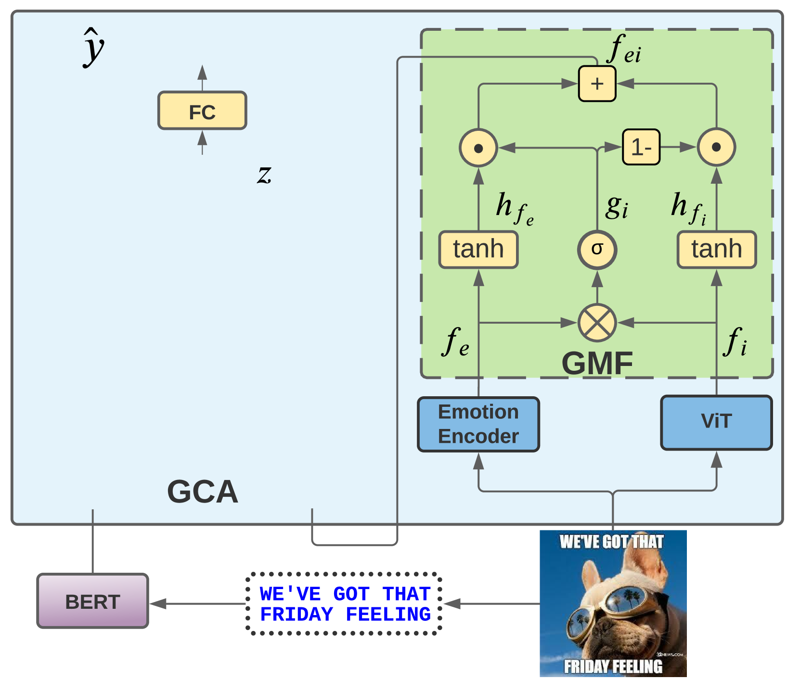
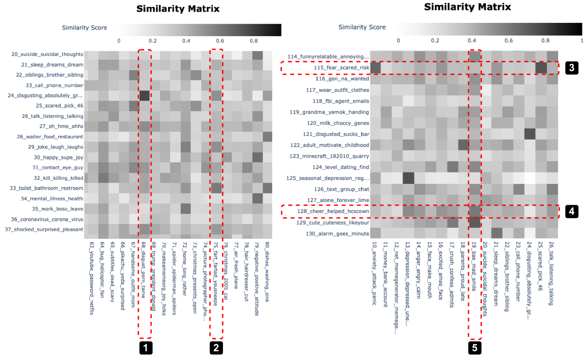
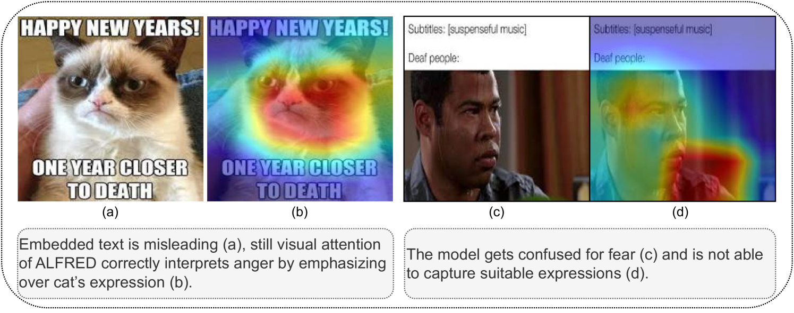
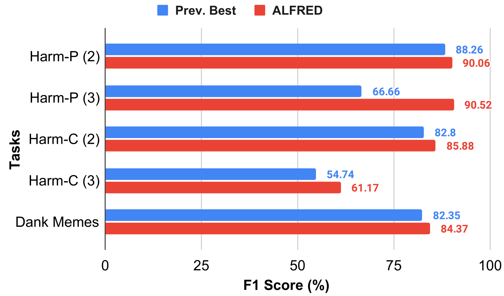
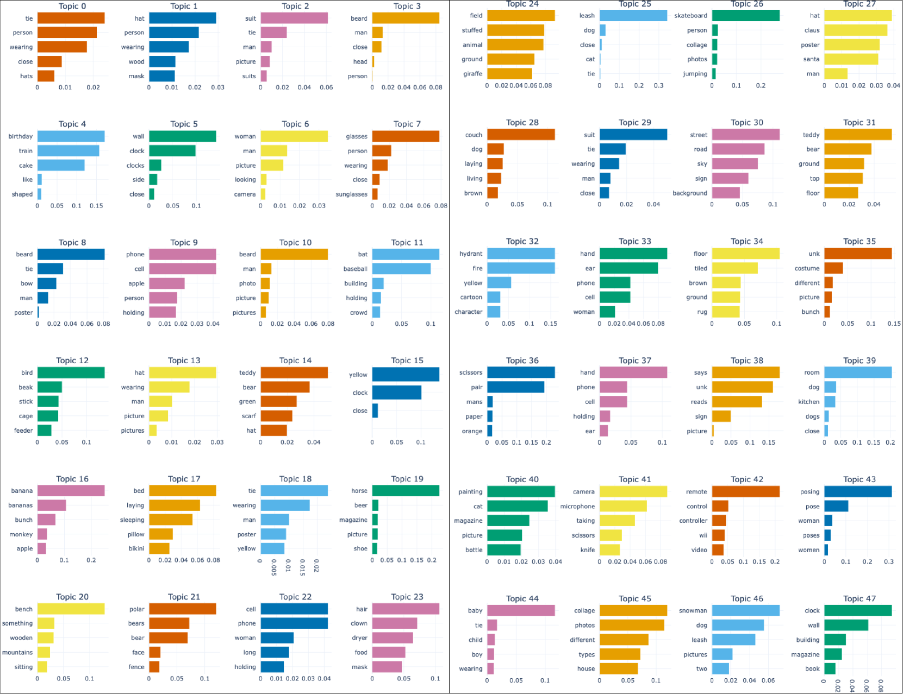
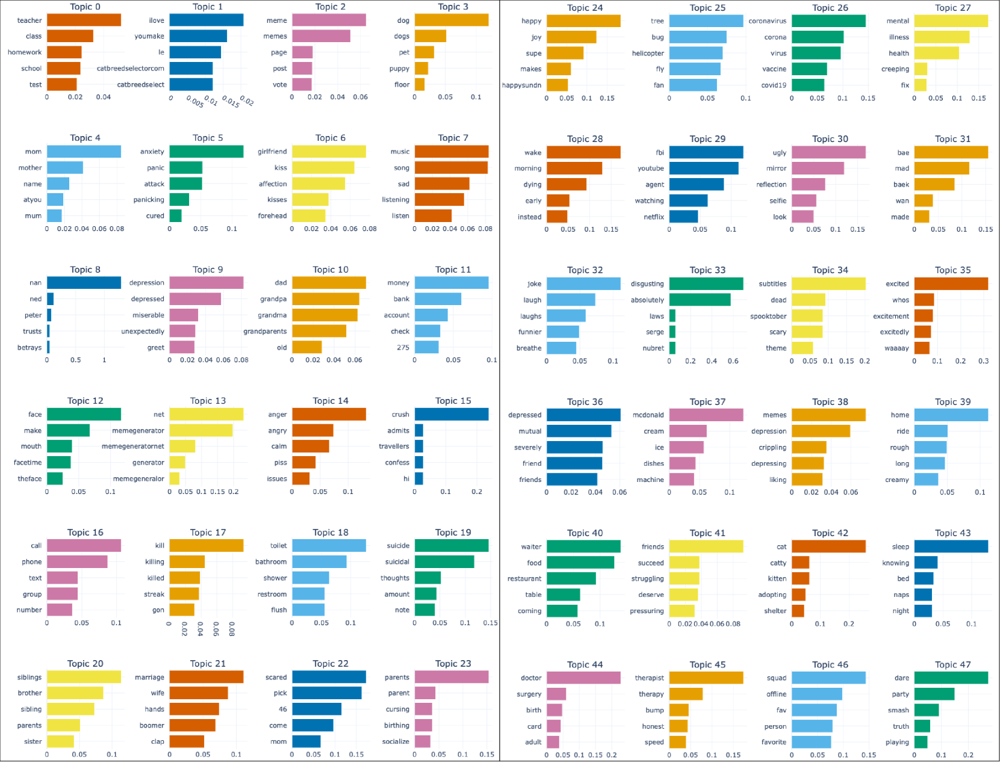
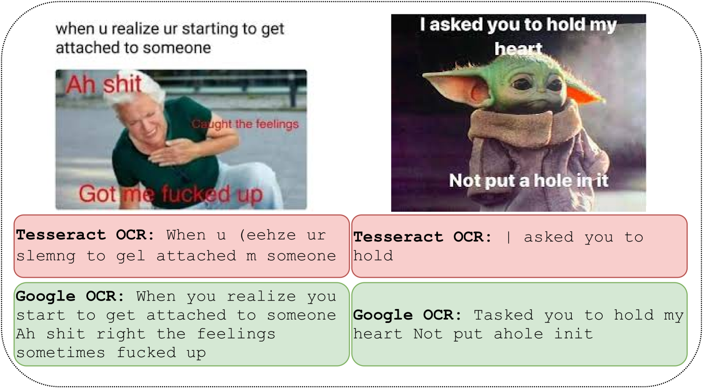

# 为了提升表情包情感检测的准确性，我们提出了一种情绪感知的多模态融合方法，通过深度融合图像与文本信息，精准捕捉表情包中蕴含的情感色彩。

发布时间：2024年03月15日

`Agent` `社交媒体` `情感分析`

> Emotion-Aware Multimodal Fusion for Meme Emotion Detection

> 随着社交媒体的发展，表情包已成为民众表达观点、抒发异议的重要方式，同时又被企业和政治团体用来挖掘舆论风向。表情包富含情感信息，揭示社会心理状态，但目前的研究方法尚无法有效捕捉其中的情感维度，且受限于视觉-语言结合的基础，使得模型泛化能力较弱。为此，本文推出MOOD数据集，包含六种基本情绪类型。同时，我们创新设计了ALFRED——一种情感感知的多模态融合框架，它特别关注并精细建模富含情感的视觉线索，并通过巧妙的门控机制实现了高效的跨模态融合。实验证明，ALFRED相较于现有基准方法在F1指标上提升了4.94%，在极具挑战性的Memotion任务中表现出色，甚至能与先前最优方法一较高下。我们进一步通过在新近公开的HarMeme和Dank Memes数据集上的实验展示了ALFRED强大的领域适应性和普遍有效性。同时，我们利用注意力图深入探讨了ALFRED的可解释性。最后，我们指出表情包分析过程中因各模态特有线索复杂交织所带来的内在挑战。

> The ever-evolving social media discourse has witnessed an overwhelming use of memes to express opinions or dissent. Besides being misused for spreading malcontent, they are mined by corporations and political parties to glean the public's opinion. Therefore, memes predominantly offer affect-enriched insights towards ascertaining the societal psyche. However, the current approaches are yet to model the affective dimensions expressed in memes effectively. They rely extensively on large multimodal datasets for pre-training and do not generalize well due to constrained visual-linguistic grounding. In this paper, we introduce MOOD (Meme emOtiOns Dataset), which embodies six basic emotions. We then present ALFRED (emotion-Aware muLtimodal Fusion foR Emotion Detection), a novel multimodal neural framework that (i) explicitly models emotion-enriched visual cues, and (ii) employs an efficient cross-modal fusion via a gating mechanism. Our investigation establishes ALFRED's superiority over existing baselines by 4.94% F1. Additionally, ALFRED competes strongly with previous best approaches on the challenging Memotion task. We then discuss ALFRED's domain-agnostic generalizability by demonstrating its dominance on two recently-released datasets - HarMeme and Dank Memes, over other baselines. Further, we analyze ALFRED's interpretability using attention maps. Finally, we highlight the inherent challenges posed by the complex interplay of disparate modality-specific cues toward meme analysis.

[Arxiv](https://arxiv.org/abs/2403.10279)