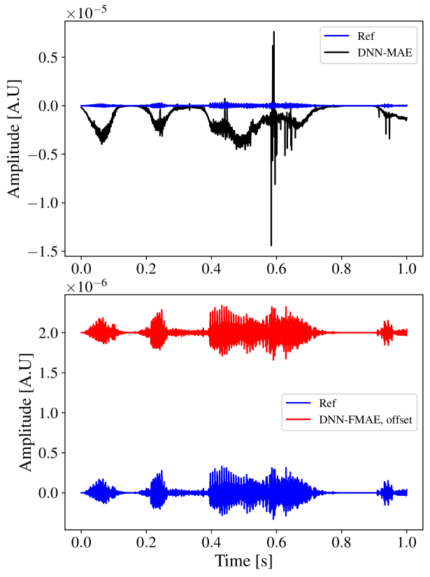
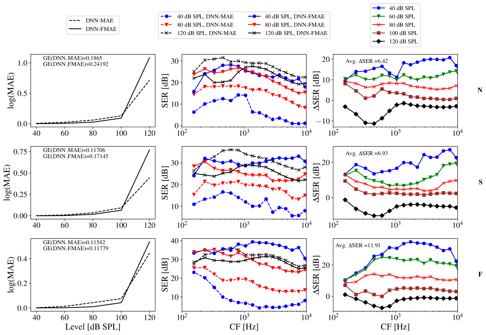
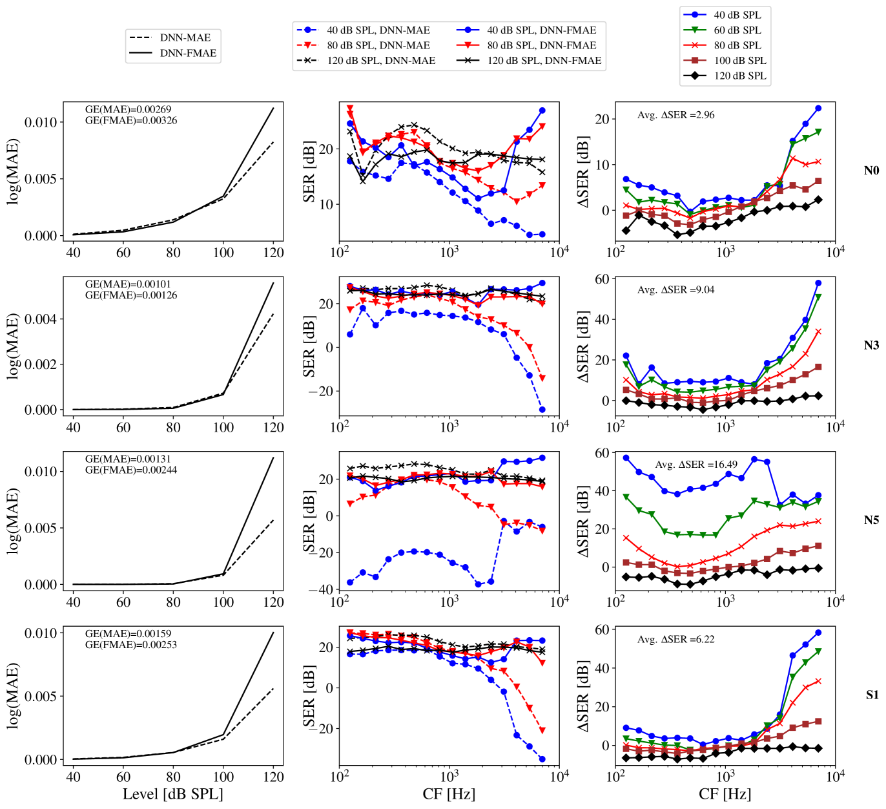
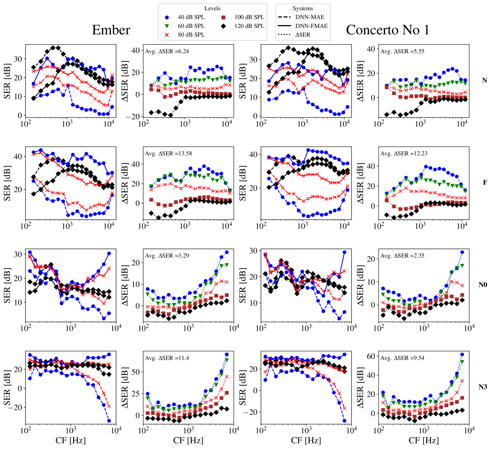
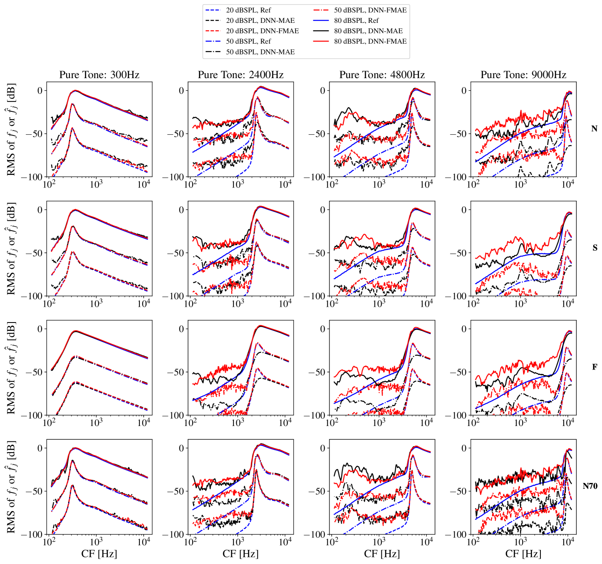
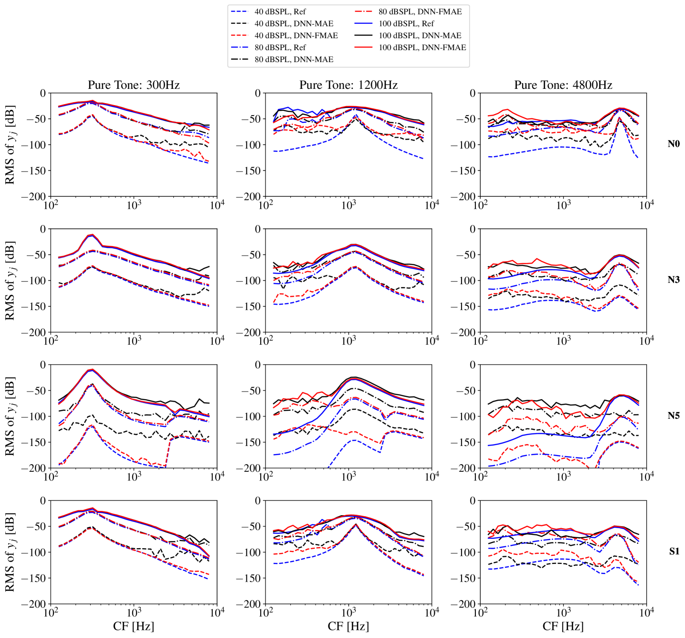

# [本研究探讨如何通过模拟听觉模型，有效提升对大动态范围声音输入以及应对轻度至重度听力损失情况下的听力理解能力。]

发布时间：2024年03月15日

`Agent` `听力学` `信号处理`

> How to train your ears: Auditory-model emulation for large-dynamic-range inputs and mild-to-severe hearing losses

> 先进的听觉模型在开发针对听力损失补偿及语音增强的信号处理算法上功不可没，能够依据生理测量提供详尽的听觉路径描绘，并个性定制处理策略。但受限于计算复杂度，这类模型通常耗时较长。先前研究尝试运用深度神经网络模拟听觉模型以缩短推理时间，虽然确实提升了计算效率，但在不同频率通道和声压级下的仿真效果却不够稳定，无法满足多样化的应用场景。在本次研究中，我们揭示了当前前沿技术采用的传统机器学习优化目标正是造成这一短板的主要原因，因其忽略了由宽广输入动态范围和听觉模型模拟的各种听力损失类型引起的频率与声压级相关依赖性。因此，我们提出一种创新的优化目标，明确地将听觉模型的频率与声压级依赖性纳入考量。实验证明，新优化目标能够在保持推理阶段计算负荷不变的前提下，显著提升深度神经网络在各类相关输入声压级及听觉模型频率通道上的仿真性能。攻克此类局限对推动听觉模型在信号处理任务领域的深入应用具有决定性意义，确保其在各色场景下都能发挥实效。

> Advanced auditory models are useful in designing signal-processing algorithms for hearing-loss compensation or speech enhancement. Such auditory models provide rich and detailed descriptions of the auditory pathway, and might allow for individualization of signal-processing strategies, based on physiological measurements. However, these auditory models are often computationally demanding, requiring significant time to compute. To address this issue, previous studies have explored the use of deep neural networks to emulate auditory models and reduce inference time. While these deep neural networks offer impressive efficiency gains in terms of computational time, they may suffer from uneven emulation performance as a function of auditory-model frequency-channels and input sound pressure level, making them unsuitable for many tasks. In this study, we demonstrate that the conventional machine-learning optimization objective used in existing state-of-the-art methods is the primary source of this limitation. Specifically, the optimization objective fails to account for the frequency- and level-dependencies of the auditory model, caused by a large input dynamic range and different types of hearing losses emulated by the auditory model. To overcome this limitation, we propose a new optimization objective that explicitly embeds the frequency- and level-dependencies of the auditory model. Our results show that this new optimization objective significantly improves the emulation performance of deep neural networks across relevant input sound levels and auditory-model frequency channels, without increasing the computational load during inference. Addressing these limitations is essential for advancing the application of auditory models in signal-processing tasks, ensuring their efficacy in diverse scenarios.

[Arxiv](https://arxiv.org/abs/2403.10428)