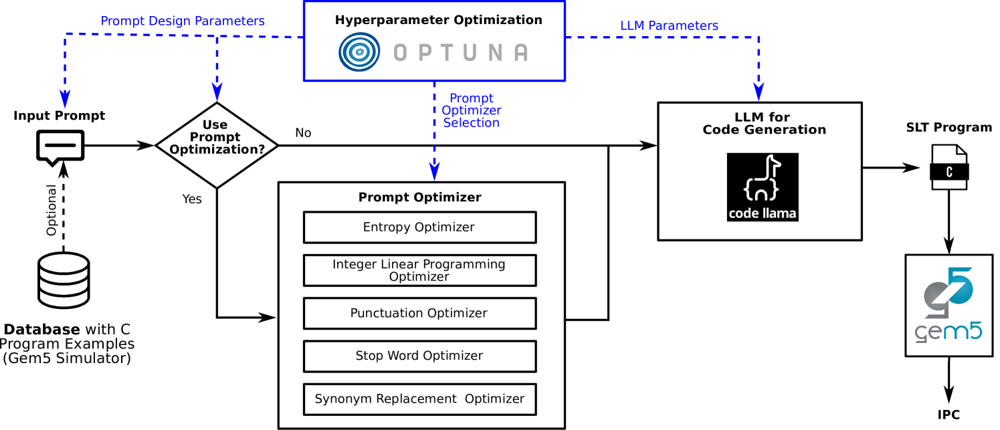

# [我们探索利用大型语言模型来创作针对非功能性属性的系统级测试程序，旨在通过智能化手段提升软件质量保障效能。](https://arxiv.org/abs/2403.10086)

发布时间：2024年03月15日

`LLM应用` `集成电路` `软件测试`

> Large Language Models to Generate System-Level Test Programs Targeting Non-functional Properties

> 历经十余年发展，SLT已成为集成电路测试流程的关键环节，但针对被测设备（DUT）非功能性属性的测试程序自动生成方法仍是一片空白。当前，测试工程师们需手动整合市面软件构建测试集，力求逼近DUT的实际应用场景，这一过程费时费力，却难以确保对非功能性属性的有效把控。为此，本论文引入大型语言模型（LLMs）技术来生成测试程序。我们首次尝试运用预训练LLMs，探究其在优化DUT非功能性属性测试程序生成上的能力。具体而言，我们设计了一种提示方式，使其生成C代码片段，以最大化模拟环境中超标量乱序架构的每周期执行指令数量。同时，我们还进行了提示与超参数优化，力求在无需额外训练的前提下达到最优效果。

> System-Level Test (SLT) has been a part of the test flow for integrated circuits for over a decade and still gains importance. However, no systematic approaches exist for test program generation, especially targeting non-functional properties of the Device under Test (DUT). Currently, test engineers manually compose test suites from off-the-shelf software, approximating the end-user environment of the DUT. This is a challenging and tedious task that does not guarantee sufficient control over non-functional properties. This paper proposes Large Language Models (LLMs) to generate test programs. We take a first glance at how pre-trained LLMs perform in test program generation to optimize non-functional properties of the DUT. Therefore, we write a prompt to generate C code snippets that maximize the instructions per cycle of a super-scalar, out-of-order architecture in simulation. Additionally, we apply prompt and hyperparameter optimization to achieve the best possible results without further training.

[Arxiv](https://arxiv.org/abs/2403.10086)