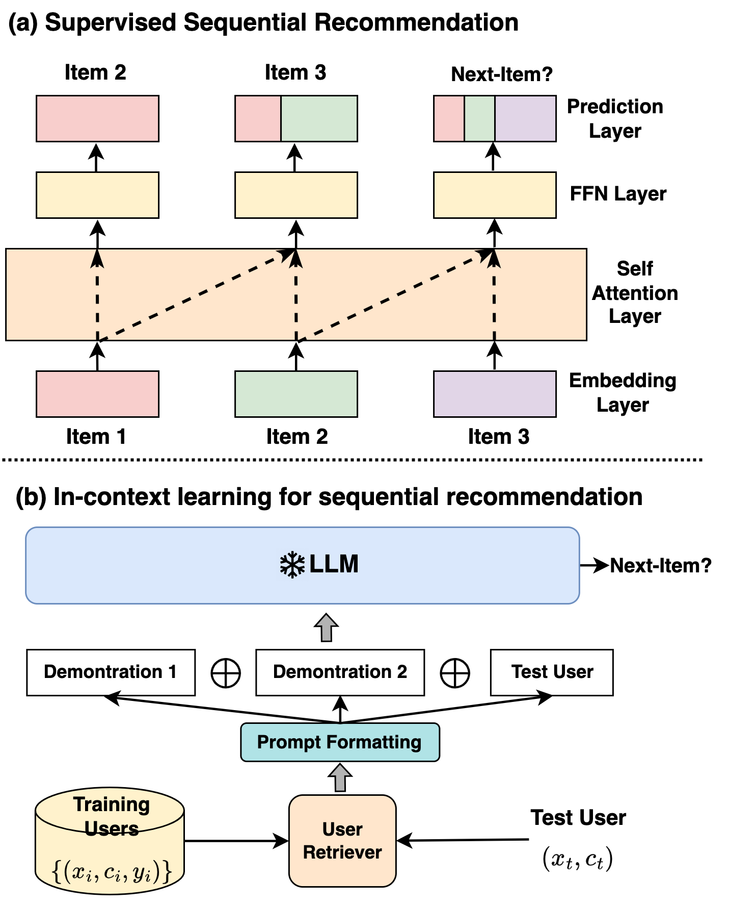
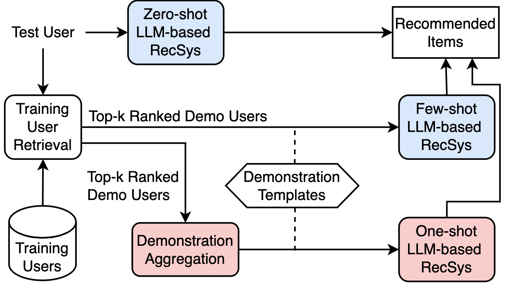
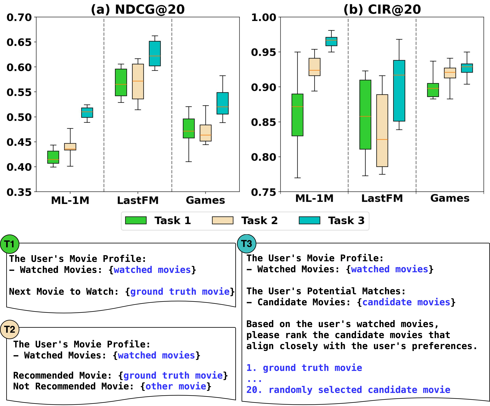
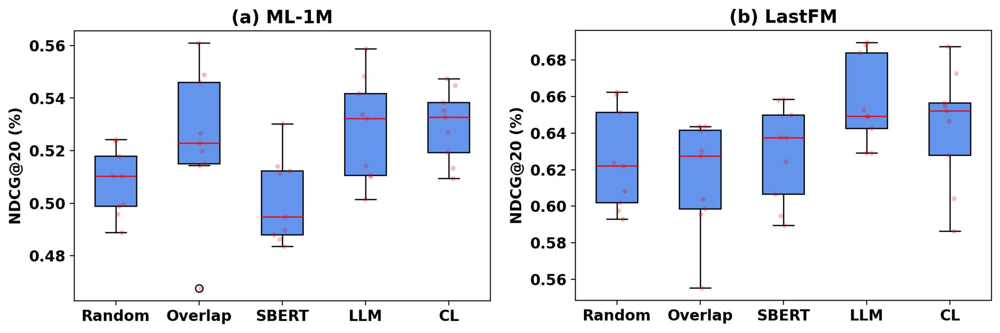
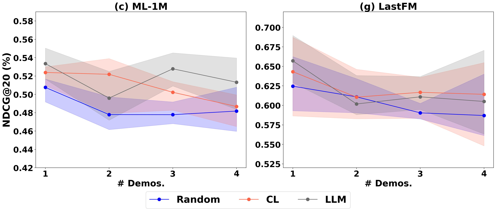
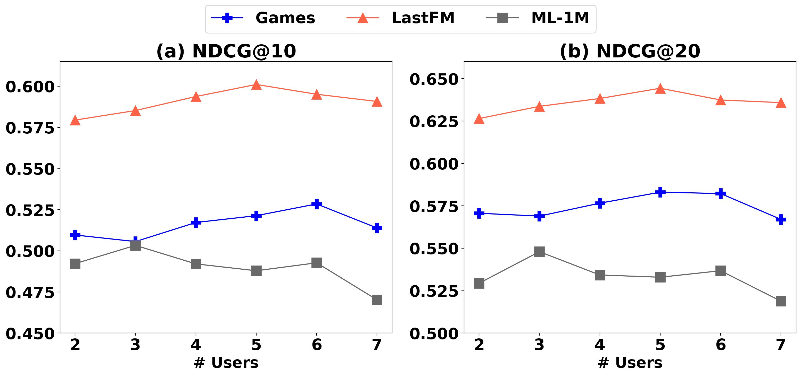
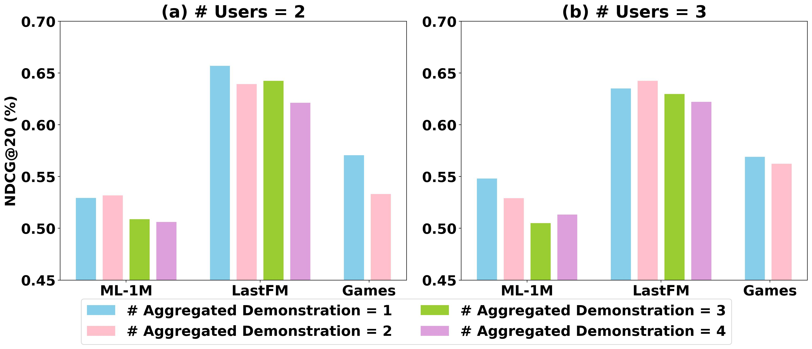

# 整体胜于局部：本研究探讨将聚合演示应用于序列推荐任务的上下文学习，以期实现超越单个示例之和的效果。

发布时间：2024年03月15日

`LLM应用` `推荐系统`

> The Whole is Better than the Sum: Using Aggregated Demonstrations in In-Context Learning for Sequential Recommendation

> LLMs 在多种 NLP 任务上表现出色，本研究尝试利用 ICL 方法将其打造成高效的序列推荐器。我们深入探究了指令形式、任务连贯性、示范选取以及示范数量对序列推荐效果的影响，并发现仅增加示范数量并不能有效提升准确性。为此，我们创新设计了 LLMSRec-Syn 算法，巧妙地将多个用户示范融合为一个综合示范。实验证明，在三个推荐数据集上，LLMSRec-Syn 显著优于当前最先进的基于 LLM 的序列推荐技术，且在部分场景下，其性能堪比甚至超过监督学习方法。相关代码已开源，地址为 https://github.com/demoleiwang/LLMSRec_Syn。

> Large language models (LLMs) have shown excellent performance on various NLP tasks. To use LLMs as strong sequential recommenders, we explore the in-context learning approach to sequential recommendation. We investigate the effects of instruction format, task consistency, demonstration selection, and number of demonstrations. As increasing the number of demonstrations in ICL does not improve accuracy despite using a long prompt, we propose a novel method called LLMSRec-Syn that incorporates multiple demonstration users into one aggregated demonstration. Our experiments on three recommendation datasets show that LLMSRec-Syn outperforms state-of-the-art LLM-based sequential recommendation methods. In some cases, LLMSRec-Syn can perform on par with or even better than supervised learning methods. Our code is publicly available at https://github.com/demoleiwang/LLMSRec_Syn.

[Arxiv](https://arxiv.org/abs/2403.10135)