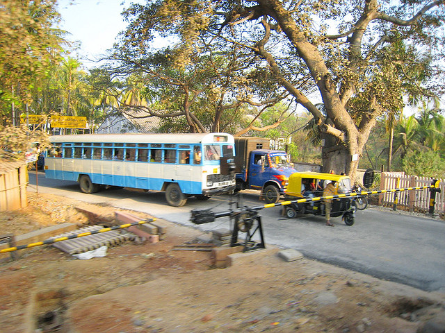
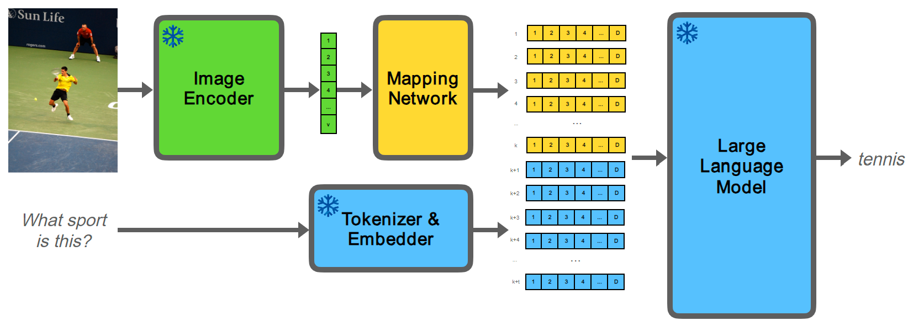

# 在“少量样本 VQA 与冻结 LLM：两种方法的探析”中，我们探讨了如何利用冻结的大型语言模型，在仅提供少量样本的情况下解决视觉问答（VQA）任务，通过对比两种不同策略来揭示其潜力和特点。

发布时间：2024年03月17日

`LLM应用` `图像处理` `视觉问答`

> Few-Shot VQA with Frozen LLMs: A Tale of Two Approaches

> 对于输入LLMs的图像处理，目前主要有两种途径：一是通过自然语言生成图像描述，二是将图像特征嵌入转换至LLM所处的语义空间并直接送入LLM。然而，大部分最新的少量样本多模态研究虽然采用了这两种方法的不同变体，却忽视了二者间的深入比较。因此，我们精心设计了一项对照实验，专注于对比这两种方法在利用LLMs解决少量样本VQA任务时的效果。实验结果显示，在拥有30亿参数的Flan-T5 XL LLM中，直接将视觉嵌入与LLM嵌入空间相连并不一定能确保超越使用图像标题的表现。在零样本场景下，采用文本形式的图像标题更胜一筹；而在少量样本场景中，决定哪种方法更优的关键在于如何选择上下文示例。

> Two approaches have emerged to input images into large language models (LLMs). The first is to caption images into natural language. The second is to map image feature embeddings into the domain of the LLM and pass the mapped embeddings directly to the LLM. The majority of recent few-shot multimodal work reports performance using architectures that employ variations of one of these two approaches. But they overlook an important comparison between them. We design a controlled and focused experiment to compare these two approaches to few-shot visual question answering (VQA) with LLMs. Our findings indicate that for Flan-T5 XL, a 3B parameter LLM, connecting visual embeddings directly to the LLM embedding space does not guarantee improved performance over using image captions. In the zero-shot regime, we find using textual image captions is better. In the few-shot regimes, how the in-context examples are selected determines which is better.

[Arxiv](https://arxiv.org/abs/2403.11317)