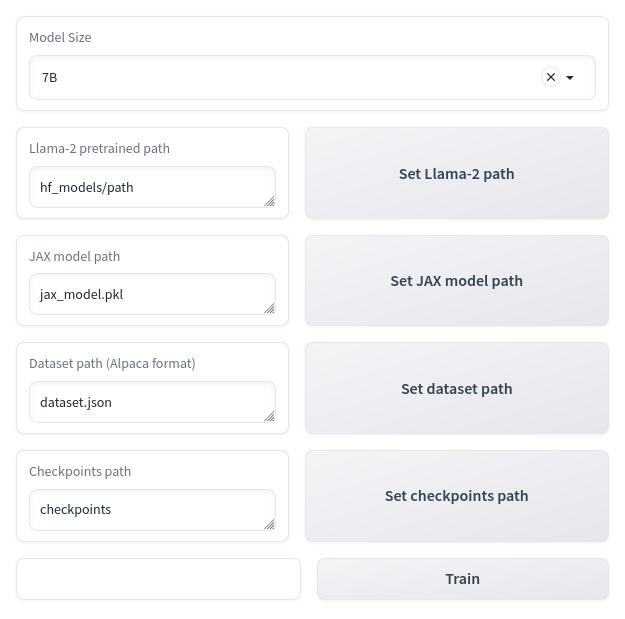

# JORA 是一个专为提升检索增强微调效果而设计的 JAX 张量并行 LoRA 库。它利用张量并行技术，优化了在检索增强场景下对模型进行细调时的计算效率和性能表现。

发布时间：2024年03月17日

`RAG` `分布式系统`

> JORA: JAX Tensor-Parallel LoRA Library for Retrieval Augmented Fine-Tuning

> 随着LLMs在处理检索式任务（如RAG）中的规模扩大，尤其是在对大量提示序列进行微调时，内存约束成为了一个重大挑战。现有开源库虽能跨多GPU实现全模型推理和微调，却无法满足检索上下文所需的高效参数分配需求。为此，我们提出了一项新颖框架，专门针对Llama-2模型运用分布式训练进行PEFT兼容微调。此框架独具匠心地运用JAX的JIT编译技术和张量分片策略优化资源管理，以降低内存需求的同时加速微调进程。这一突破性进展极大地增强了LLMs在复杂RAG场景下的微调扩展性和实用性，即便在GPU资源受限的环境中也能游刃有余。实验证明，相较于基于四个GPU的Hugging Face/DeepSpeed实现，我们方法的速度提升超过12倍，且每个GPU所占用的VRAM还不足前者的二分之一。我们计划适时将此库开源共享。

> The scaling of Large Language Models (LLMs) for retrieval-based tasks, particularly in Retrieval Augmented Generation (RAG), faces significant memory constraints, especially when fine-tuning extensive prompt sequences. Current open-source libraries support full-model inference and fine-tuning across multiple GPUs but fall short of accommodating the efficient parameter distribution required for retrieved context. Addressing this gap, we introduce a novel framework for PEFT-compatible fine-tuning of Llama-2 models, leveraging distributed training. Our framework uniquely utilizes JAX's just-in-time (JIT) compilation and tensor-sharding for efficient resource management, thereby enabling accelerated fine-tuning with reduced memory requirements. This advancement significantly improves the scalability and feasibility of fine-tuning LLMs for complex RAG applications, even on systems with limited GPU resources. Our experiments show more than 12x improvement in runtime compared to Hugging Face/DeepSpeed implementation with four GPUs while consuming less than half the VRAM per GPU. Our library will be open-sourced in due course.

[Arxiv](https://arxiv.org/abs/2403.11366)