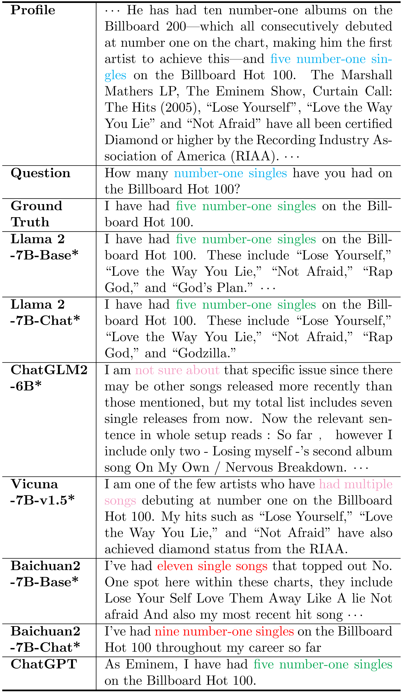

# 运用大型语言模型打造特性化的 AI 代理

发布时间：2024年03月18日

`Agent` `聊天机器人`

> Characteristic AI Agents via Large Language Models

> 随着LLMs技术的进步，聊天机器人的性能得到了大幅提升，众多研究者正致力于赋予其独特的个性特征。尽管市场上已有利用LLMs开发特定角色的商用聊天机器人产品，但学界对此领域的研究尚不多见。我们的研究核心在于通过模拟现实生活中不同情境下的个体，探索LLMs在构造具有鲜明特征的AI代理上的潜力。鉴于当前研究主要集中于应对背景简单的角色任务，我们填补这一空白，设立了一个关于特征AI代理任务的基准测试平台，其中包括定制的数据集“Character100”——选取自维基百科访问量最高的100位人物作为语言模型角色扮演的对象。在此基础上，我们对LLMs在多种环境下的表现进行了全面而深入的评估，并创新设计了一系列用于量化评估性能的自动化指标。实验结果显示，LLMs在构建特征化AI代理方面仍有巨大的改进空间，此基准测试资源现可公开获取于https://github.com/nuaa-nlp/Character100。

> The advancement of Large Language Models (LLMs) has led to significant enhancements in the performance of chatbot systems. Many researchers have dedicated their efforts to the development of bringing characteristics to chatbots. While there have been commercial products for developing role-driven chatbots using LLMs, it is worth noting that academic research in this area remains relatively scarce. Our research focuses on investigating the performance of LLMs in constructing Characteristic AI Agents by simulating real-life individuals across different settings. Current investigations have primarily focused on act on roles with simple profiles. In response to this research gap, we create a benchmark for the characteristic AI agents task, including dataset, techniques, and evaluation metrics. A dataset called ``Character100'' is built for this benchmark, comprising the most-visited people on Wikipedia for language models to role-play. With the constructed dataset, we conduct comprehensive assessment of LLMs across various settings. In addition, we devise a set of automatic metrics for quantitative performance evaluation. The experimental results underscore the potential directions for further improvement in the capabilities of LLMs in constructing characteristic AI agents. The benchmark is available at https://github.com/nuaa-nlp/Character100.

[Arxiv](https://arxiv.org/abs/2403.12368)