# CLIP 是否总能胜过 ImageNet 模型，展现出更强的泛化性能？

发布时间：2024年03月18日

`LLM应用` `机器学习` `计算机视觉`

> Do CLIPs Always Generalize Better than ImageNet Models?

> CLIPs等大型视觉语言模型引领了一场机器学习的革命，它们在面对分布转移情境时展现出了非凡的泛化能力。但现有的针对CLIPs的评估数据集多源自ImageNet变种，可能无法全面揭示CLIPs对偶然关联（如背景）的鲁棒性，尤其是那些在LAION上预训练的CLIPs。为此，我们构建了一款真实场景数据集CounterAnimal，内含大量动物照片中的现实偶然特征，分为两类：一类是“常见组”，包含在普通背景下的动物；另一类是“对抗组”，包含在非常规背景下的动物。通过比较这两组间的性能差距，可以衡量模型对背景这类偶然特征的依赖程度。实验结果显示，无论是在LAION还是OpenAI数据上训练的CLIPs，在对抗组的表现均有显著下滑。意外的是，仅在ImageNet上训练的单模态模型竟比CLIPs更具有鲁棒性。我们深入探讨并给出了CLIPs为何还会学习偶然特征的理论与实证解释。这些发现提示我们，分布转移仍是对CLIPs的一大挑战，而在评估大规模、差异性预训练的基础模型时，对测试环境的选择应尤为审慎。

> Large vision language models, such as CLIPs, have revolutionized modern machine learning. CLIPs have demonstrated great generalizability under distribution shifts, supported by an increasing body of literature. However, the evaluation datasets for CLIPs are variations primarily designed for ImageNet benchmarks, which may not fully reflect the extent to which CLIPs, e.g., pre-trained on LAION, robust to spurious correlations. To bridge the gap, we collect a real-world dataset called CounterAnimal that contains realistic spurious features found in animal photos. CounterAnimal consists of a) the common group: comprising animals on common backgrounds, and b) the counter group: including animals on unusual backgrounds. The performance drops from the common to counter groups quantify the reliance of models on spurious features (i.e., backgrounds) to predict the animals. We find that CLIPs trained on either LAION or the OpenAI data exhibit notable performance drops on the counter group. Surprisingly, we observe that single-modal models trained on ImageNet are more robust than CLIPs. We provide both theoretical and empirical explanations for why CLIPs still learn spurious features. Our findings suggest that distribution shifts remain an open problem for CLIPs, and one needs to be cautious about test setups when evaluating foundation models pre-trained on a significantly different scale and distribution.

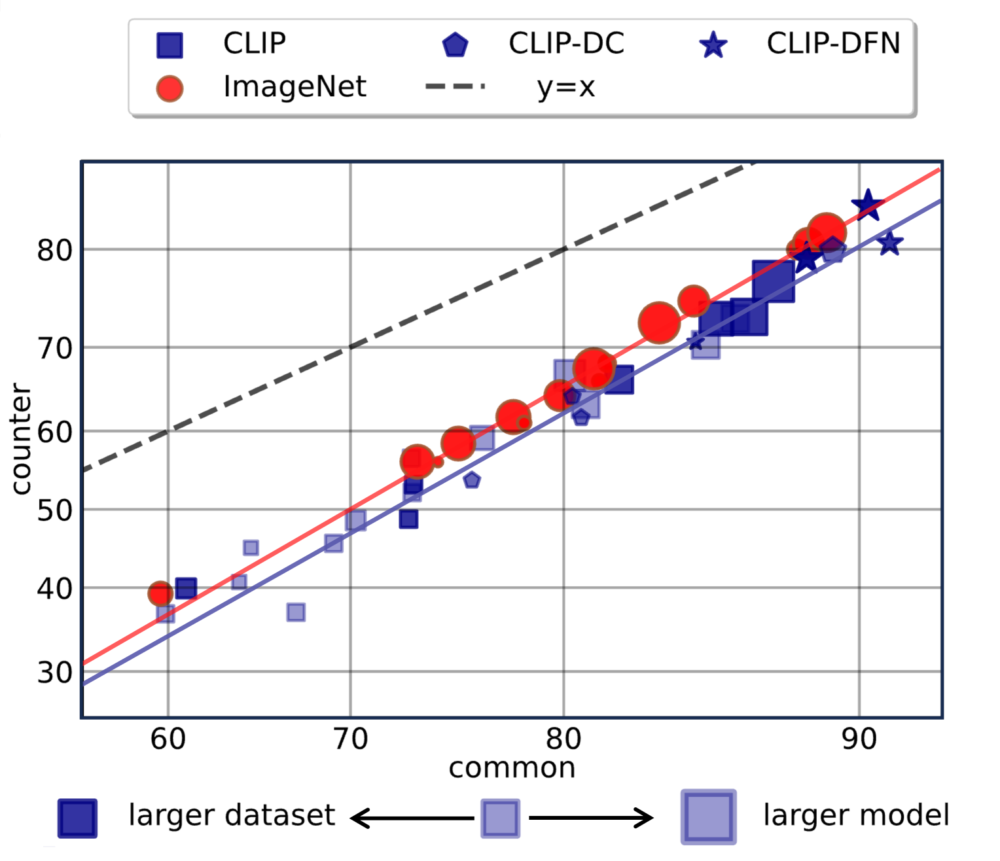

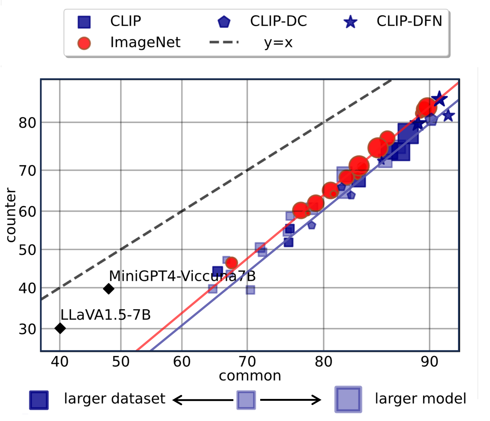

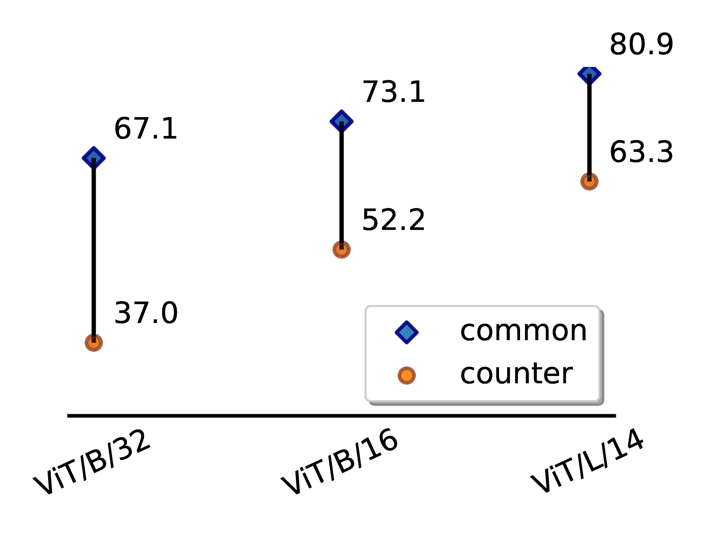

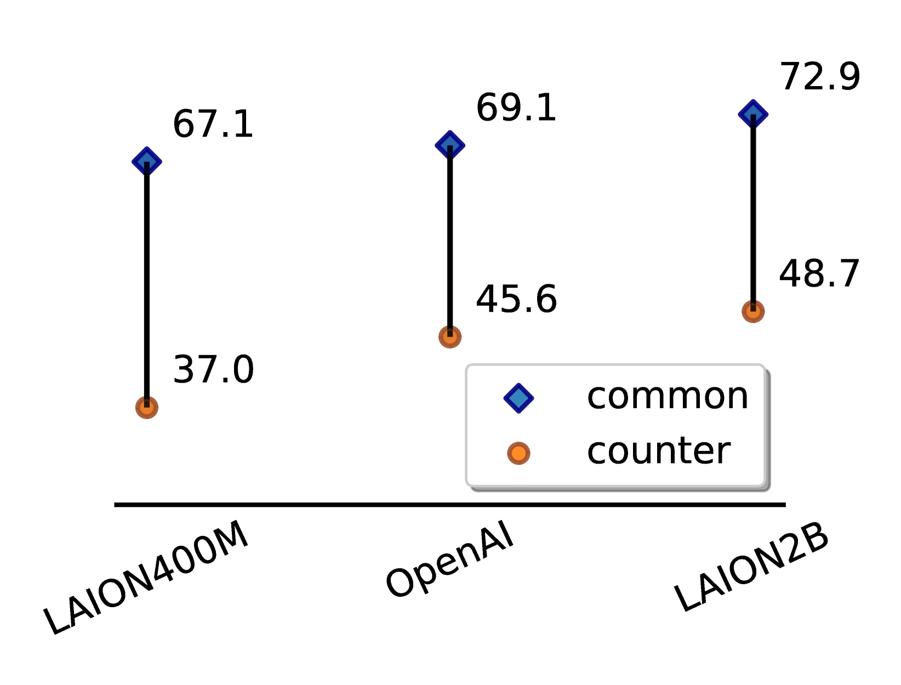

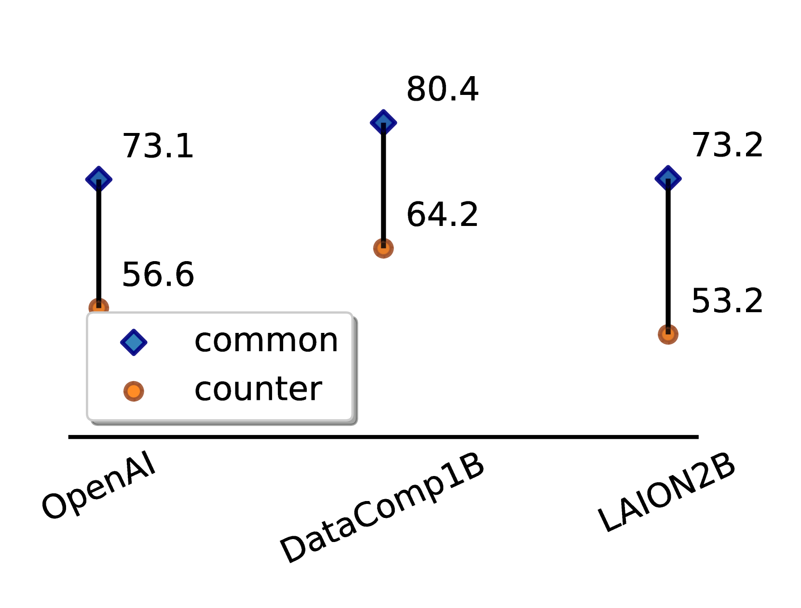

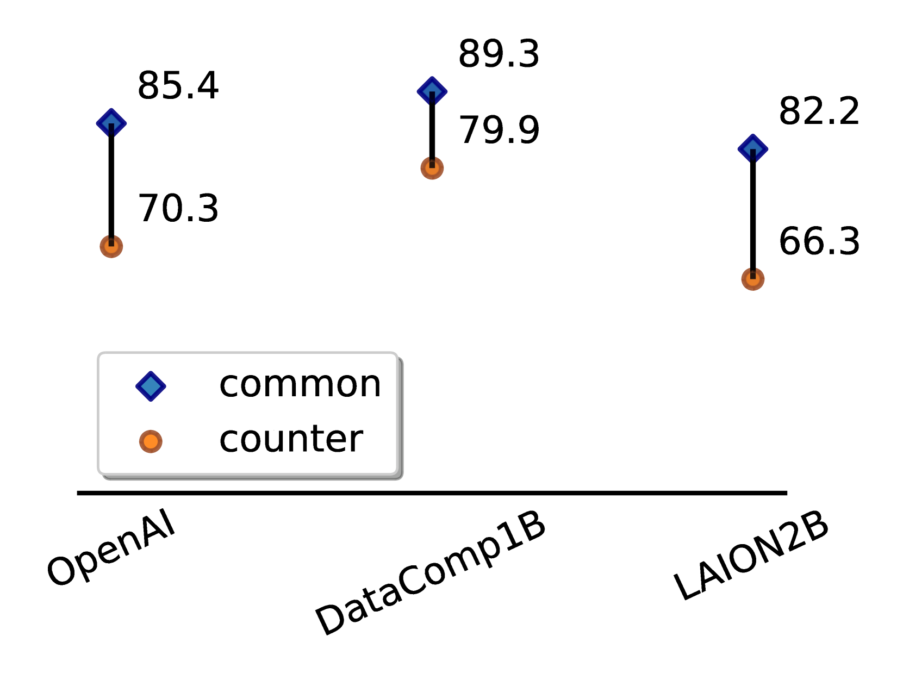

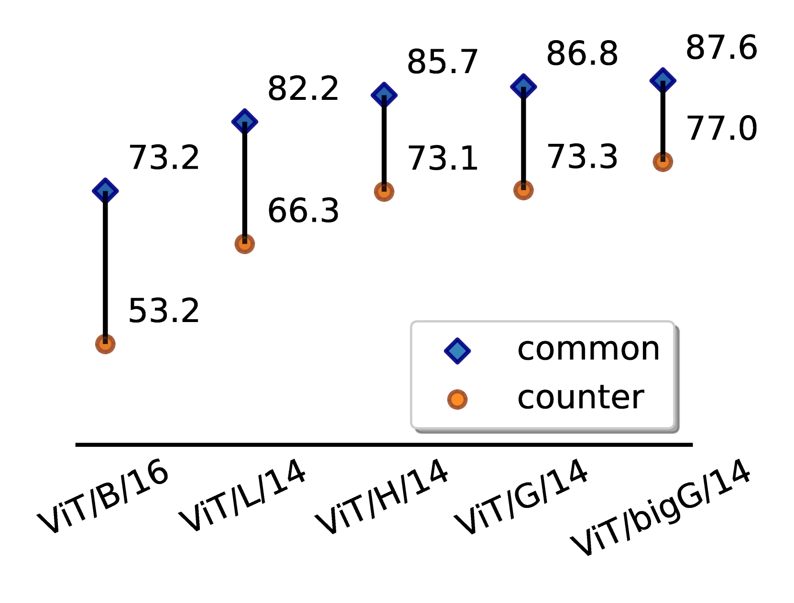

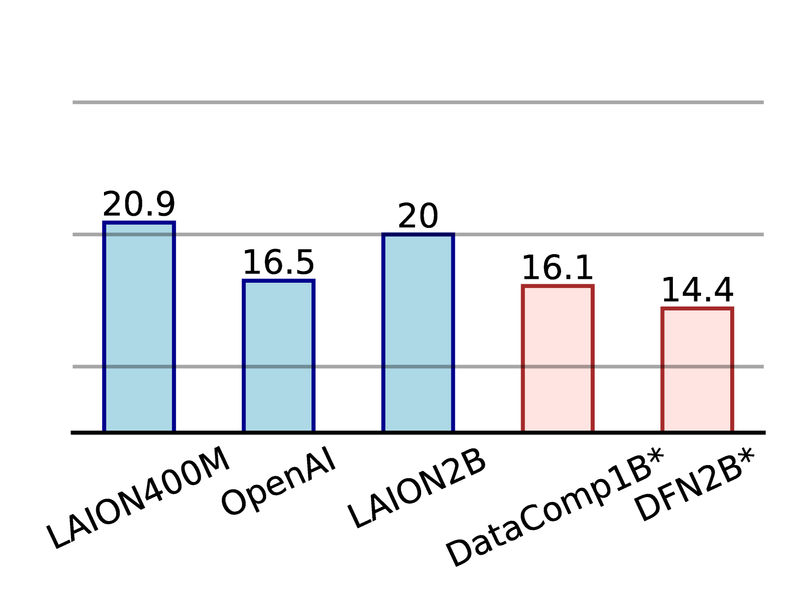

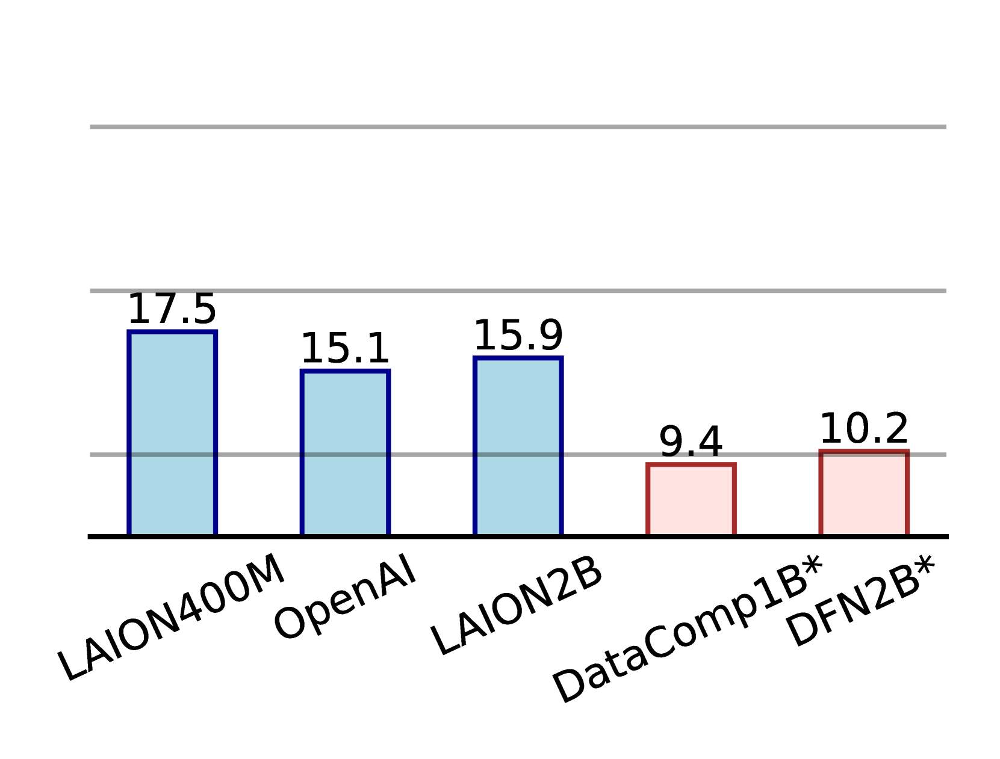

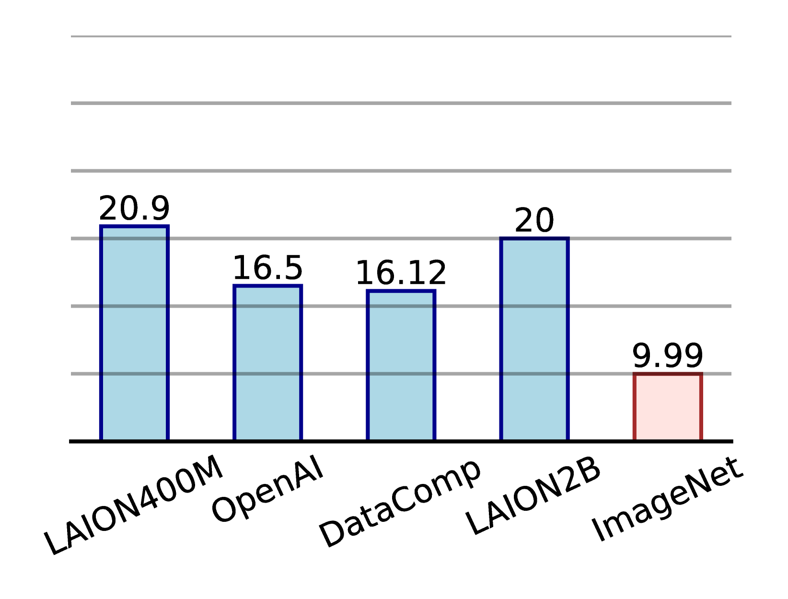

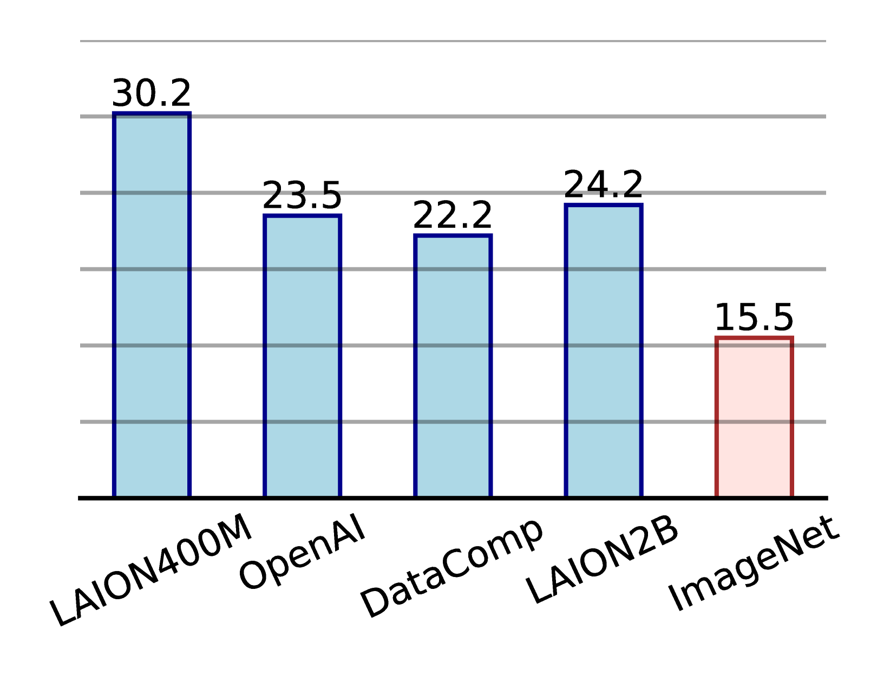

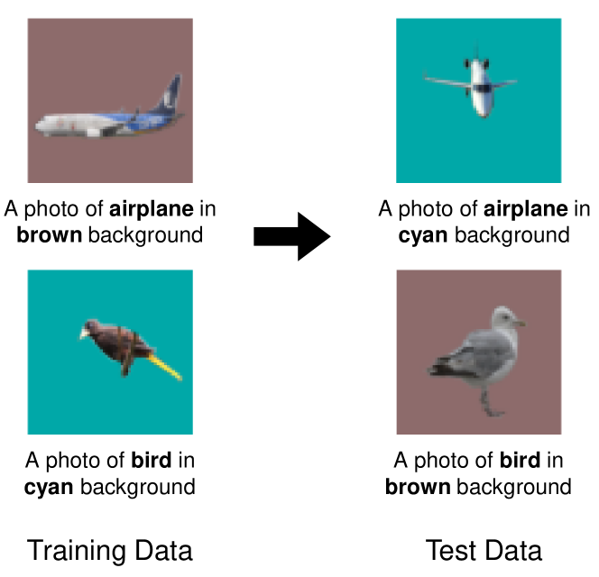

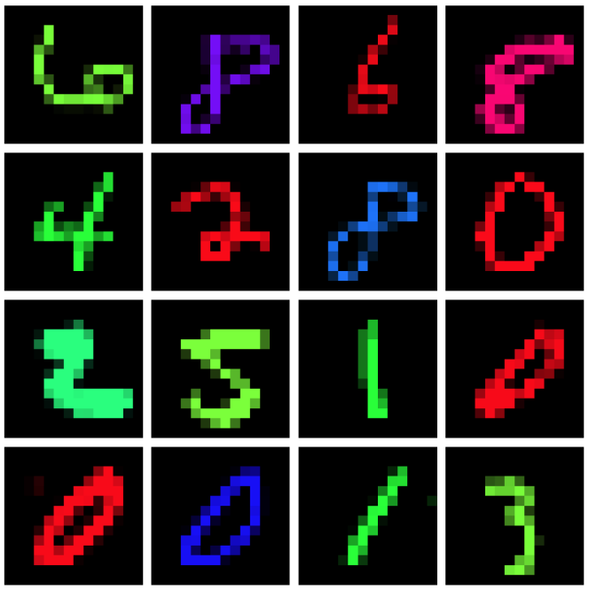

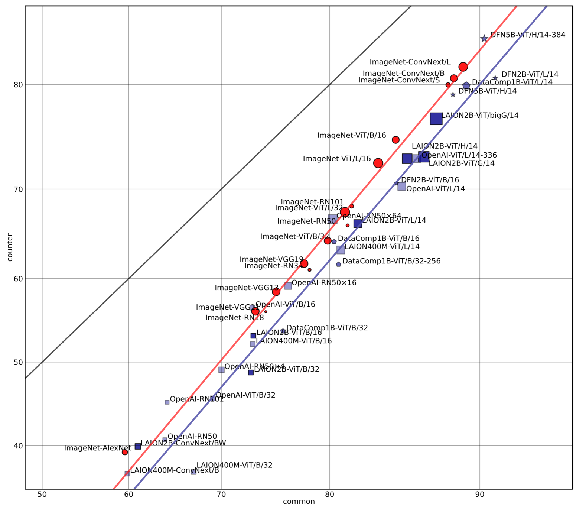

[Arxiv](https://arxiv.org/abs/2403.11497)