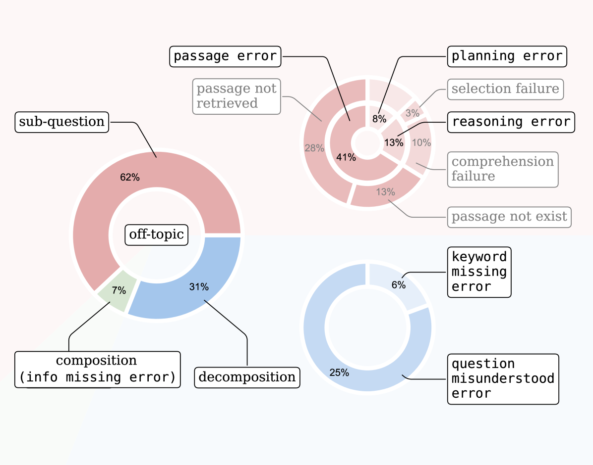
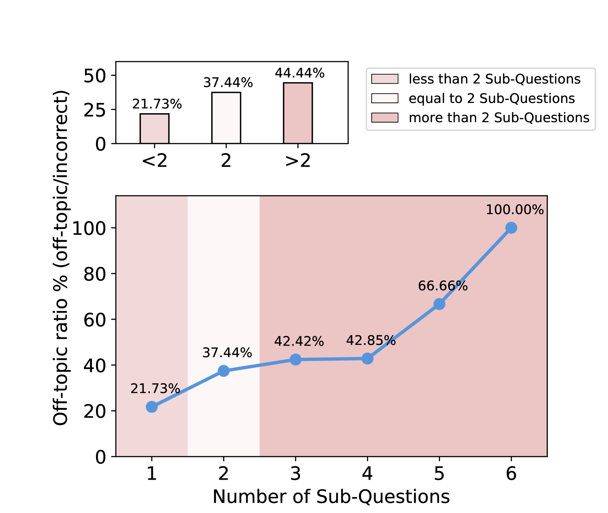

# 针对开放领域多跳问题回答任务，Dr3研究提出让大型语言模型避免提供离题答案的策略。

发布时间：2024年03月18日

`LLM应用` `问答系统`

> Dr3: Ask Large Language Models Not to Give Off-Topic Answers in Open Domain Multi-Hop Question Answering

> 在NLP领域，ODMHQA承担着通过多步推理外部知识源获取的信息解答复杂问题的重要职责，而LLMs凭借强大的综合能力，在应对这类任务时表现出色。不过，在解决ODMHQA问题的过程中，LLMs有时会产生偏离主题的错误答案，这一问题约占所有错误答案的三分之一，却未得到应有的深入探究。为此，我们创新性地设计了一种名为“辨别-重组-重解-再分解”（Dr3）的机制。该机制中的辨别模块运用LLMs内建功能识别答案是否跑题，一旦发现跑题，修正模块则沿着逆向推理路径逐步调整（重组、重解、再分解），直至得出贴合主题的正确答案。实验证明，在HotpotQA和2WikiMultiHopQA数据集上，Dr3机制成功将ODMHQA中离题答案的比例减少了约13%，使得精确匹配（EM）性能提升了近3%，相比没有采用Dr3机制的基准方法有了显著提升。

> Open Domain Multi-Hop Question Answering (ODMHQA) plays a crucial role in Natural Language Processing (NLP) by aiming to answer complex questions through multi-step reasoning over retrieved information from external knowledge sources. Recently, Large Language Models (LLMs) have demonstrated remarkable performance in solving ODMHQA owing to their capabilities including planning, reasoning, and utilizing tools. However, LLMs may generate off-topic answers when attempting to solve ODMHQA, namely the generated answers are irrelevant to the original questions. This issue of off-topic answers accounts for approximately one-third of incorrect answers, yet remains underexplored despite its significance. To alleviate this issue, we propose the Discriminate->Re-Compose->Re- Solve->Re-Decompose (Dr3) mechanism. Specifically, the Discriminator leverages the intrinsic capabilities of LLMs to judge whether the generated answers are off-topic. In cases where an off-topic answer is detected, the Corrector performs step-wise revisions along the reversed reasoning chain (Re-Compose->Re-Solve->Re-Decompose) until the final answer becomes on-topic. Experimental results on the HotpotQA and 2WikiMultiHopQA datasets demonstrate that our Dr3 mechanism considerably reduces the occurrence of off-topic answers in ODMHQA by nearly 13%, improving the performance in Exact Match (EM) by nearly 3% compared to the baseline method without the Dr3 mechanism.

[Arxiv](https://arxiv.org/abs/2403.12393)