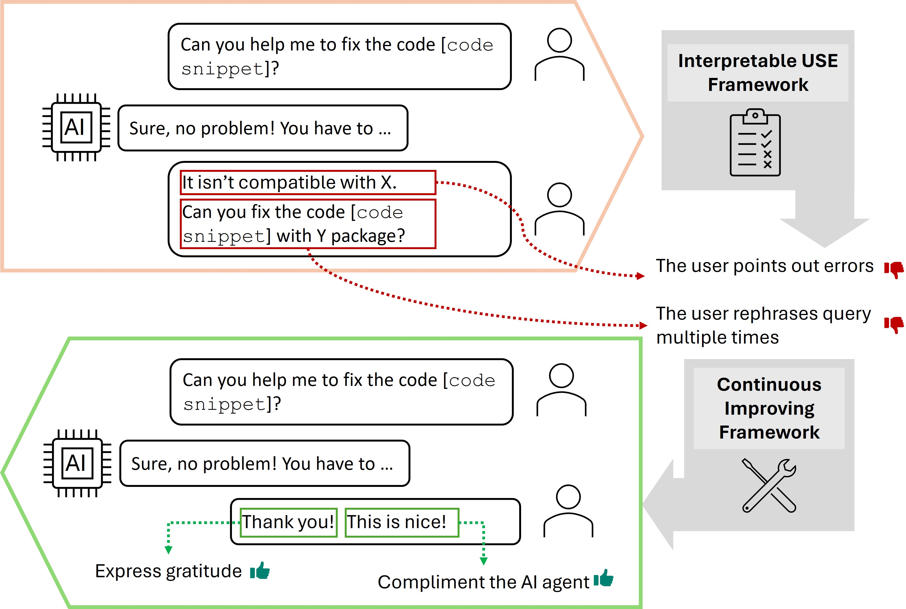
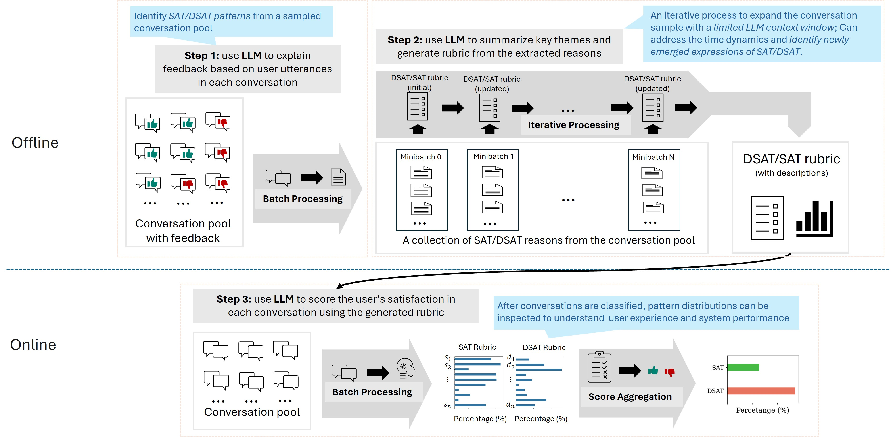
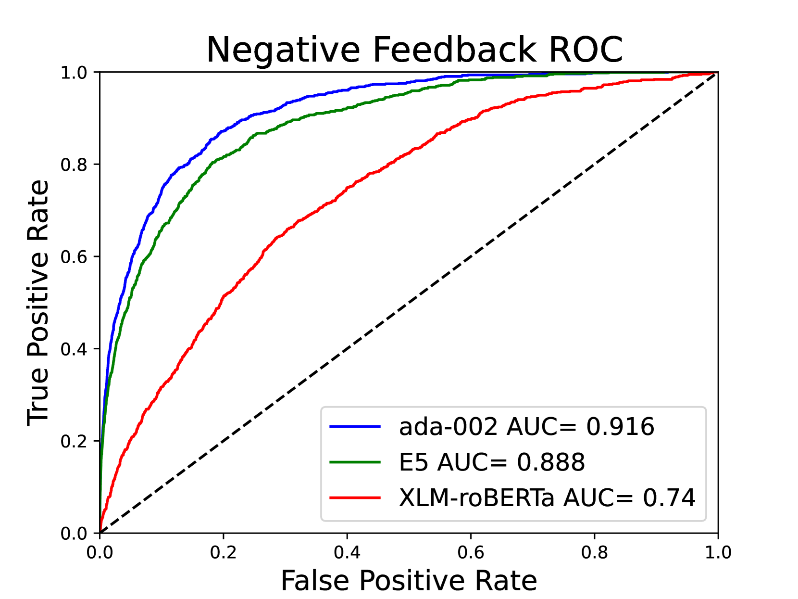
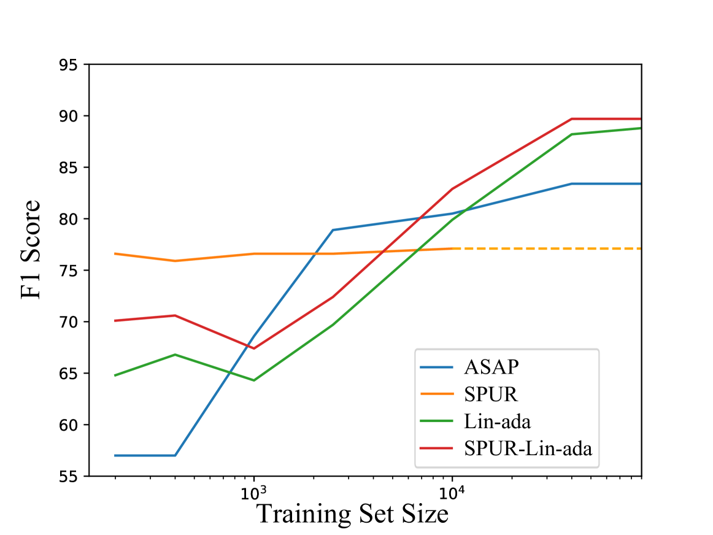
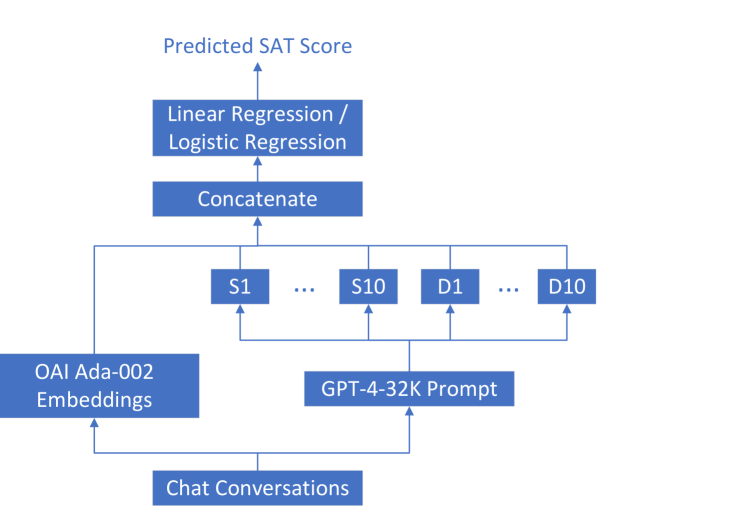

# 本研究致力于为基于大型语言模型的对话系统开发可解释的用户满意度评估技术，旨在深入理解并准确预测用户的使用体验。

发布时间：2024年03月18日

`Agent` `会话系统` `用户满意度分析`

> Interpretable User Satisfaction Estimation for Conversational Systems with Large Language Models

> 要深入洞察、评估并不断优化会话系统，精准且易于理解的用户满意度估计（USE）不可或缺。无论是通用型（例如ChatGPT和Bing Copilot）还是任务导向型（如客服聊天机器人）的会话系统中，用户都会以丰富多样的对话形式展现其满意或不满情绪。现有基于特征化ML模型或文本嵌入的方法在捕捉普适性规律方面显得力不从心，同时难以进行解读。本研究揭示了LLMs能够从用户的自然语言表达中更有效地抽取出反映用户满意度的可解释信号，相较于基于嵌入的方法更具优势。另外，我们提出了一种创新方法，即借助于带标签样例的监督，通过迭代提示框架来定制LLM以满足USE需求。这种方法名为“Supervised Prompting for User satisfaction Rubrics”（SPUR），不仅提升了预测精度，还因其采用习得的详尽评价准则来量化用户满意度而变得更加易懂透彻。

> Accurate and interpretable user satisfaction estimation (USE) is critical for understanding, evaluating, and continuously improving conversational systems. Users express their satisfaction or dissatisfaction with diverse conversational patterns in both general-purpose (ChatGPT and Bing Copilot) and task-oriented (customer service chatbot) conversational systems. Existing approaches based on featurized ML models or text embeddings fall short in extracting generalizable patterns and are hard to interpret. In this work, we show that LLMs can extract interpretable signals of user satisfaction from their natural language utterances more effectively than embedding-based approaches. Moreover, an LLM can be tailored for USE via an iterative prompting framework using supervision from labeled examples. The resulting method, Supervised Prompting for User satisfaction Rubrics (SPUR), not only has higher accuracy but is more interpretable as it scores user satisfaction via learned rubrics with a detailed breakdown.

[Arxiv](https://arxiv.org/abs/2403.12388)