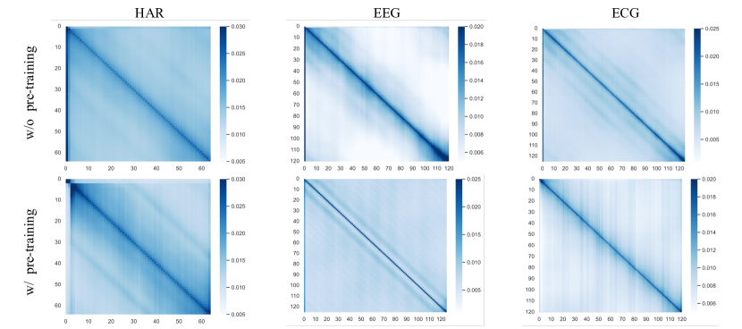
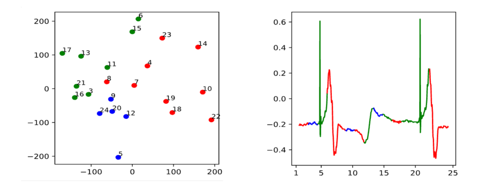

# 本研究提出利用语言模型进行跨域预训练，以构建能够应用于不同领域的、具有强迁移能力的时间序列分类器。

发布时间：2024年03月18日

`Agent` `时间序列` `跨域学习`

> Learning Transferable Time Series Classifier with Cross-Domain Pre-training from Language Model

> 随着 SSL 技术的跃进，学习能够应用于不同场景的可迁移时间序列表示取得了重大突破，对改进下游任务大有助益。然而，当前大多数研究在实现跨域 SSL 预训练方面力不从心，未能充分利用各领域间的潜在规律和特性，主要原因在于不同领域的时间序列数据特点各异，如通道数和时间分辨率的差异显著。为此，我们创新性地提出 CrossTimeNet，一个强大的跨域 SSL 学习框架，它能汲取多个领域中的可迁移知识，以大幅提升目标任务效果。CrossTimeNet 的亮点之一在于独创的时间序列标记化模块，通过重构优化机制将原始连续时间序列转化为离散的标记序列。同时，我们揭示了一直以来被忽视的现象：在 SSL 预训练过程中，成功预测较高比例的受损标记有助于深度挖掘跨域的有效模式。不同于以往的研究，我们尝试将预训练好的语言模型（PLM）作为编码器网络的初始状态，探索 PLM 中蕴含的知识如何迁移到时间序列领域。经过不懈努力，我们成功铺就了通用时间序列模型进行跨域预训练的道路。在一系列真实世界的时间序列分类场景中，我们展开了全面实验，实验结果有力证明了 CrossTimeNet 出色的性能表现。

> Advancements in self-supervised pre-training (SSL) have significantly advanced the field of learning transferable time series representations, which can be very useful in enhancing the downstream task. Despite being effective, most existing works struggle to achieve cross-domain SSL pre-training, missing valuable opportunities to integrate patterns and features from different domains. The main challenge lies in the significant differences in the characteristics of time-series data across different domains, such as variations in the number of channels and temporal resolution scales. To address this challenge, we propose CrossTimeNet, a novel cross-domain SSL learning framework to learn transferable knowledge from various domains to largely benefit the target downstream task. One of the key characteristics of CrossTimeNet is the newly designed time series tokenization module, which could effectively convert the raw time series into a sequence of discrete tokens based on a reconstruction optimization process. Besides, we highlight that predicting a high proportion of corrupted tokens can be very helpful for extracting informative patterns across different domains during SSL pre-training, which has been largely overlooked in past years. Furthermore, unlike previous works, our work treats the pre-training language model (PLM) as the initialization of the encoder network, investigating the feasibility of transferring the knowledge learned by the PLM to the time series area. Through these efforts, the path to cross-domain pre-training of a generic time series model can be effectively paved. We conduct extensive experiments in a real-world scenario across various time series classification domains. The experimental results clearly confirm CrossTimeNet's superior performance.

[Arxiv](https://arxiv.org/abs/2403.12372)