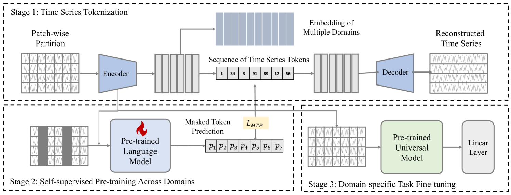
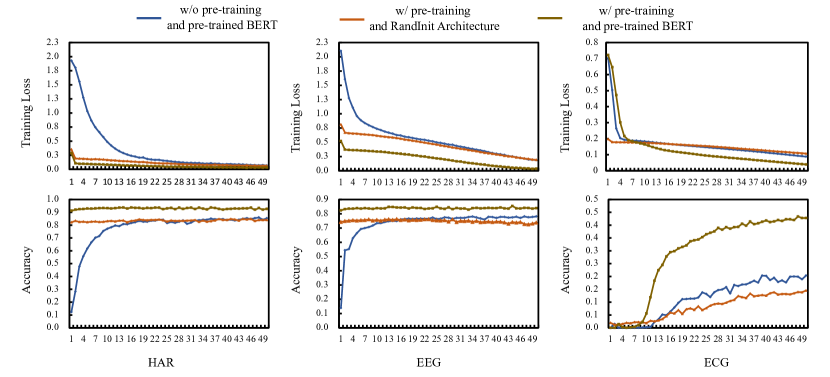

# 本研究提出了一种方法，利用语言模型在多个领域进行预训练，以习得能够跨不同领域有效迁移的时间序列分类器。

发布时间：2024年03月18日

`Agent` `时间序列` `预训练模型`

> Learning Transferable Time Series Classifier with Cross-Domain Pre-training from Language Model

> 随着 SSL 技术的发展，学习可迁移时间序列表示的能力大为增强，对下游任务提升效果显著。然而，目前大部分研究尚难以实现跨域 SSL 预训练，未能充分利用各领域间的模式和特征资源。问题的核心在于不同领域的时间序列数据特性各异，例如通道数和时间分辨率的不同。为此，我们创新性地提出了CrossTimeNet，一个针对跨域 SSL 学习的新框架，旨在汇集多个领域的可迁移知识，有力赋能目标下游任务。CrossTimeNet的一大亮点在于其独创的时间序列标记化模块，采用重构优化机制将原始连续的时间序列转换为离散的标记序列。同时，我们指出，在 SSL 预训练过程中，大量预测被损坏的标记有助于挖掘跨域间的信息模式，这是过去研究中常常忽视的一点。再者，不同于以往研究，我们尝试将 PLM 作为编码器网络的初始化方式，探究将 PLM 中所学知识迁移至时间序列领域的可能性。经过不懈努力，我们成功铺设了一条通往通用时间序列模型跨域预训练的有效道路。通过在众多实际应用场景下开展全面的时间序列分类任务实验，结果显示CrossTimeNet展现出卓越的性能优势。

> Advancements in self-supervised pre-training (SSL) have significantly advanced the field of learning transferable time series representations, which can be very useful in enhancing the downstream task. Despite being effective, most existing works struggle to achieve cross-domain SSL pre-training, missing valuable opportunities to integrate patterns and features from different domains. The main challenge lies in the significant differences in the characteristics of time-series data across different domains, such as variations in the number of channels and temporal resolution scales. To address this challenge, we propose CrossTimeNet, a novel cross-domain SSL learning framework to learn transferable knowledge from various domains to largely benefit the target downstream task. One of the key characteristics of CrossTimeNet is the newly designed time series tokenization module, which could effectively convert the raw time series into a sequence of discrete tokens based on a reconstruction optimization process. Besides, we highlight that predicting a high proportion of corrupted tokens can be very helpful for extracting informative patterns across different domains during SSL pre-training, which has been largely overlooked in past years. Furthermore, unlike previous works, our work treats the pre-training language model (PLM) as the initialization of the encoder network, investigating the feasibility of transferring the knowledge learned by the PLM to the time series area. Through these efforts, the path to cross-domain pre-training of a generic time series model can be effectively paved. We conduct extensive experiments in a real-world scenario across various time series classification domains. The experimental results clearly confirm CrossTimeNet's superior performance.

[Arxiv](https://arxiv.org/abs/2403.12372)