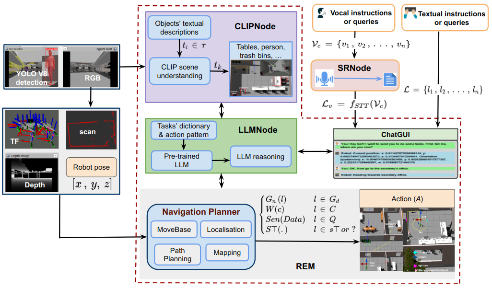
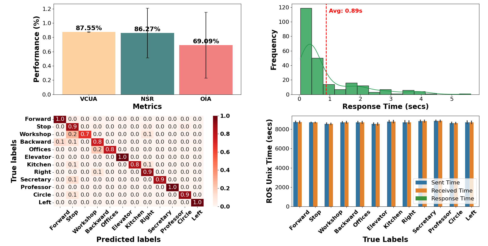

# 借助预先训练好的语言和视觉底层模型，探索多模态下人类与自主智能体的互动方式

发布时间：2024年03月18日

`Agent` `人机交互`

> Multimodal Human-Autonomous Agents Interaction Using Pre-Trained Language and Visual Foundation Models

> 本文扩展了一种方法，让人们借助口头和文字交谈轻松与自主智能体交流。该方法巧妙运用预训练的大型语言模型、多模态视觉语言模型及语音识别技术，解析并提炼机器人任务环境中的高级别对话含义，转化为可操作指令或查询。我们针对拥有不同种族背景和英语口音的参与者，对框架在理解和处理自然语音对话的能力上进行了量化评估。参与者以口语和文本形式向机器人下达指令，在基于记录的交互数据基础上，该框架成功实现高达87.55%的语音指令解码准确度、86.27%的指令执行完成率，且从接收到用户语音指令至机器人开始执行实际动作的平均时延仅为0.89秒。相关视频展示可在网址https://linusnep.github.io/MTCC-IRoNL/查看。

> In this paper, we extended the method proposed in [17] to enable humans to interact naturally with autonomous agents through vocal and textual conversations. Our extended method exploits the inherent capabilities of pre-trained large language models (LLMs), multimodal visual language models (VLMs), and speech recognition (SR) models to decode the high-level natural language conversations and semantic understanding of the robot's task environment, and abstract them to the robot's actionable commands or queries. We performed a quantitative evaluation of our framework's natural vocal conversation understanding with participants from different racial backgrounds and English language accents. The participants interacted with the robot using both spoken and textual instructional commands. Based on the logged interaction data, our framework achieved 87.55% vocal commands decoding accuracy, 86.27% commands execution success, and an average latency of 0.89 seconds from receiving the participants' vocal chat commands to initiating the robot's actual physical action. The video demonstrations of this paper can be found at https://linusnep.github.io/MTCC-IRoNL/.

[Arxiv](https://arxiv.org/abs/2403.12273)