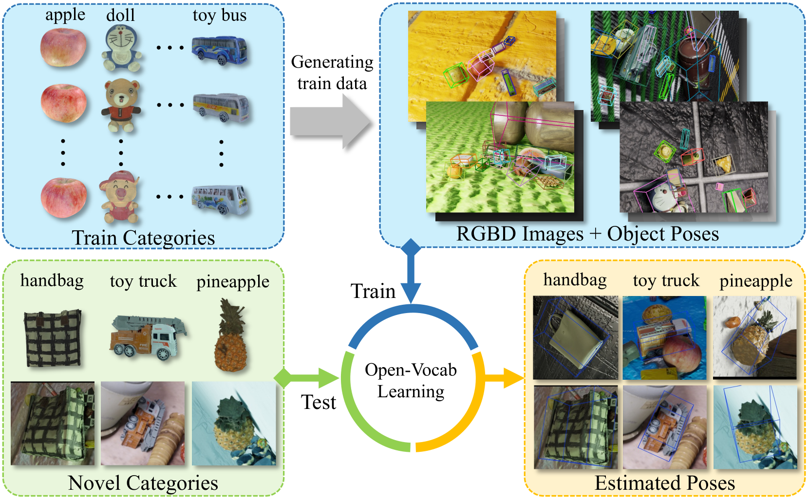
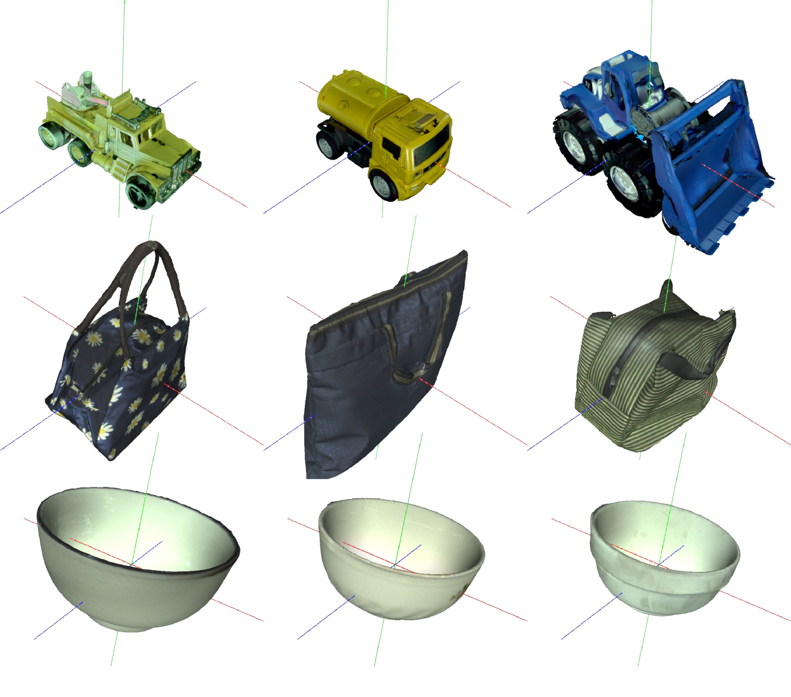
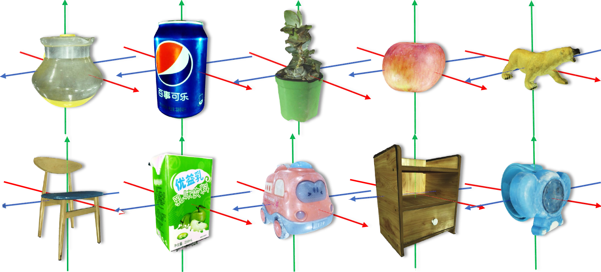
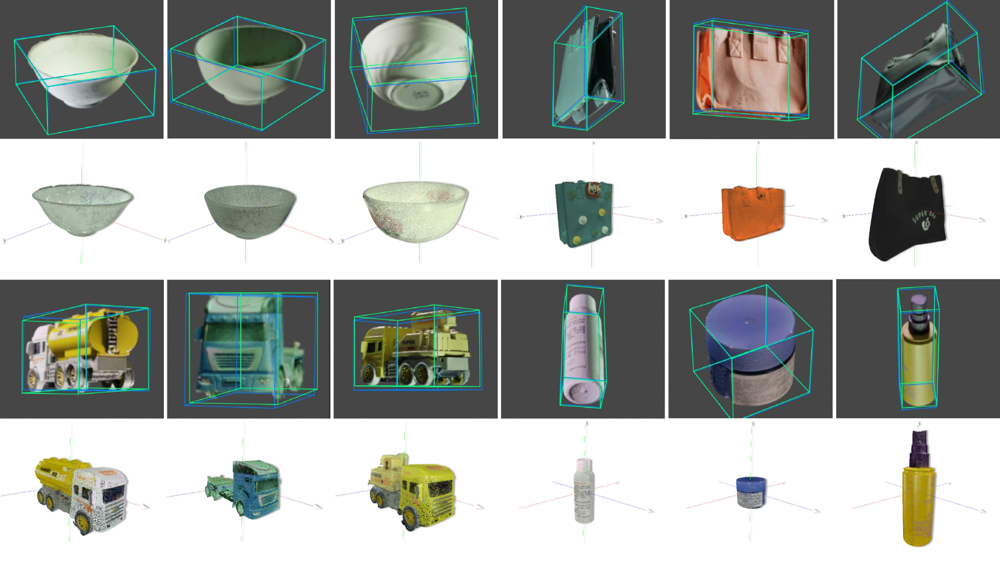

# OV9D 是一种针对开放词汇类别物体的 9 维姿态与尺寸估计方法，旨在精准估算各类物体在三维空间中的位置、方向及大小信息。

发布时间：2024年03月18日

`Agent` `机器人` `计算机视觉`

> OV9D: Open-Vocabulary Category-Level 9D Object Pose and Size Estimation

> 本研究探讨了一项新颖的开放集挑战——开放词汇物体姿态与尺寸估计。面对人类用自然语言描述的各种未知类别物体，机器人需从场景图像中准确预测其位置、方向和大小。为此，我们首次构建了大型逼真数据集OO3D-9D，它是目前规模最大、类别最丰富的类别级物体姿态与尺寸估计资源，且包含了帮助解决对称性难题的各类别对称轴标注。此外，我们发现，预训练的视觉-语言基础模型中蕴含的强大先验知识是实现这一泛化能力的另一把钥匙。因此，我们提出了一种基于预训练DinoV2和文本到图像稳定扩散模型的框架，用于生成目标物体的归一化对象坐标空间（NOCS）图。这一框架充分整合了DinoV2的视觉语义信息以及文本到图像扩散模型中高度匹配的视觉与语言知识，使得系统能够应对各种描述未知类别的文本输入。大量的定量与定性实验显示，使用大规模合成数据训练的开放词汇方法不仅远超基准方法，在处理真实世界中未曾见过的类别图像时也展现出卓越的泛化性能。项目主页地址为https://ov9d.github.io。

> This paper studies a new open-set problem, the open-vocabulary category-level object pose and size estimation. Given human text descriptions of arbitrary novel object categories, the robot agent seeks to predict the position, orientation, and size of the target object in the observed scene image. To enable such generalizability, we first introduce OO3D-9D, a large-scale photorealistic dataset for this task. Derived from OmniObject3D, OO3D-9D is the largest and most diverse dataset in the field of category-level object pose and size estimation. It includes additional annotations for the symmetry axis of each category, which help resolve symmetric ambiguity. Apart from the large-scale dataset, we find another key to enabling such generalizability is leveraging the strong prior knowledge in pre-trained visual-language foundation models. We then propose a framework built on pre-trained DinoV2 and text-to-image stable diffusion models to infer the normalized object coordinate space (NOCS) maps of the target instances. This framework fully leverages the visual semantic prior from DinoV2 and the aligned visual and language knowledge within the text-to-image diffusion model, which enables generalization to various text descriptions of novel categories. Comprehensive quantitative and qualitative experiments demonstrate that the proposed open-vocabulary method, trained on our large-scale synthesized data, significantly outperforms the baseline and can effectively generalize to real-world images of unseen categories. The project page is at https://ov9d.github.io.

[Arxiv](https://arxiv.org/abs/2403.12396)