# 针对可控文本生成任务，我们采用强化学习方法并引入Token级别的精细反馈机制，以实现对文本生成过程的精准控制与优化。

发布时间：2024年03月18日

`Agent`

> Reinforcement Learning with Token-level Feedback for Controllable Text Generation

> 面对实际应用对LLMs生成可控性的需求，研究者们已尝试结合强化学习（RL）优化可控文本生成，但现有方法常受限于过拟合（微调法）或语义退化（后处理法）的问题。目前的RL方法普遍依赖于粗略的句子/段落级反馈指导，可能因句内语义变化而影响最优效果。因此，我们创新提出了一种名为TOLE的强化学习算法，该算法针对可控文本生成设计了Token级别的奖励机制，并采用了“先量化再添加噪声”的策略，以提升RL算法的稳健性。更令人欣喜的是，TOLE能够轻松适应多重约束条件，且计算开销极小。实验证明，此算法在单一属性和多重属性控制任务中均表现出色，相关代码已发布于https://github.com/WindyLee0822/CTG。

> To meet the requirements of real-world applications, it is essential to control generations of large language models (LLMs). Prior research has tried to introduce reinforcement learning (RL) into controllable text generation while most existing methods suffer from overfitting issues (finetuning-based methods) or semantic collapse (post-processing methods). However, current RL methods are generally guided by coarse-grained (sentence/paragraph-level) feedback, which may lead to suboptimal performance owing to semantic twists or progressions within sentences. To tackle that, we propose a novel reinforcement learning algorithm named TOLE which formulates TOken-LEvel rewards for controllable text generation, and employs a "first-quantize-then-noise" paradigm to enhance the robustness of the RL algorithm.Furthermore, TOLE can be flexibly extended to multiple constraints with little computational expense. Experimental results show that our algorithm can achieve superior performance on both single-attribute and multi-attribute control tasks. We have released our codes at https://github.com/WindyLee0822/CTG

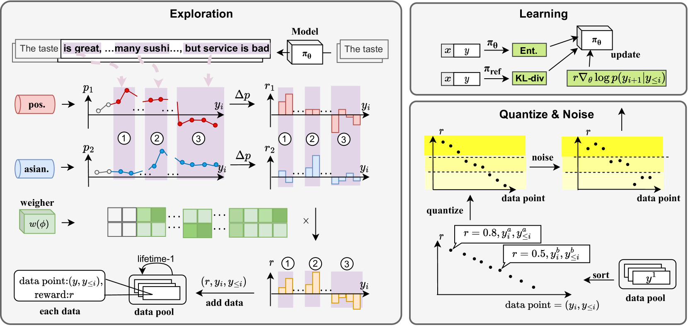

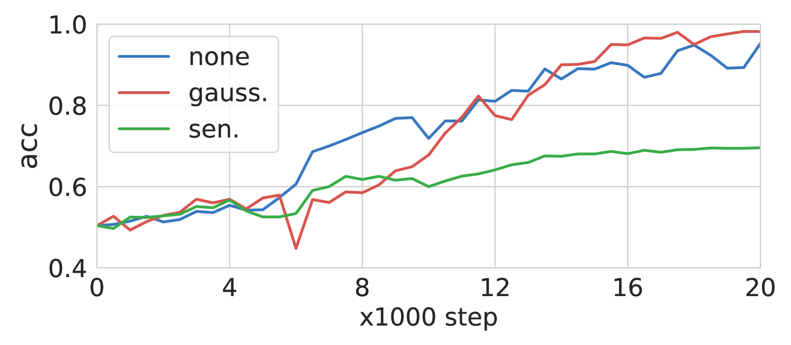

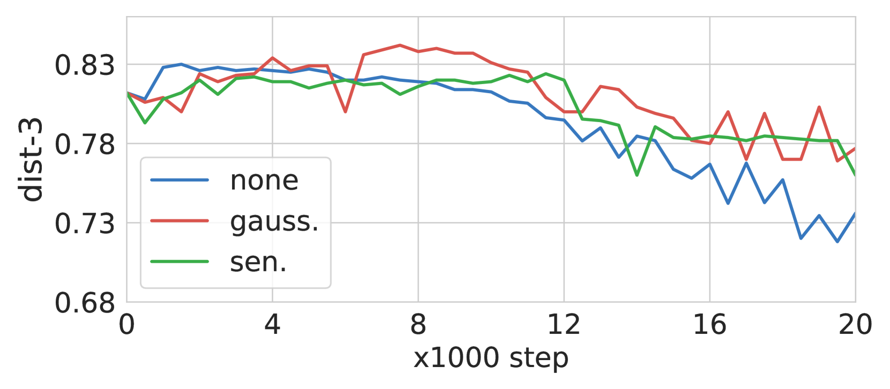

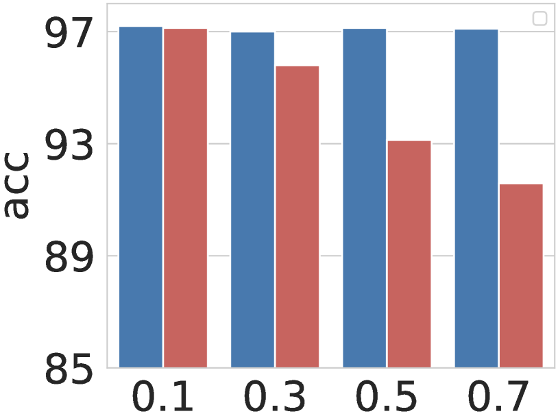

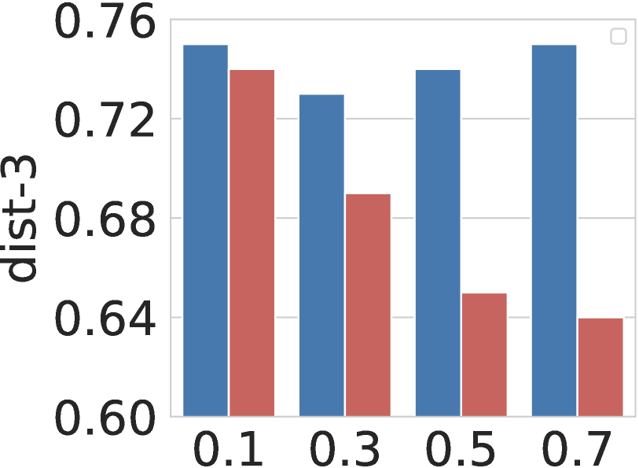

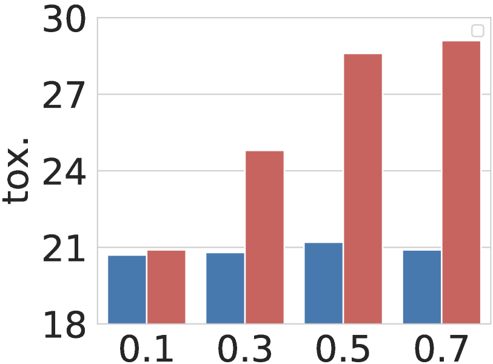

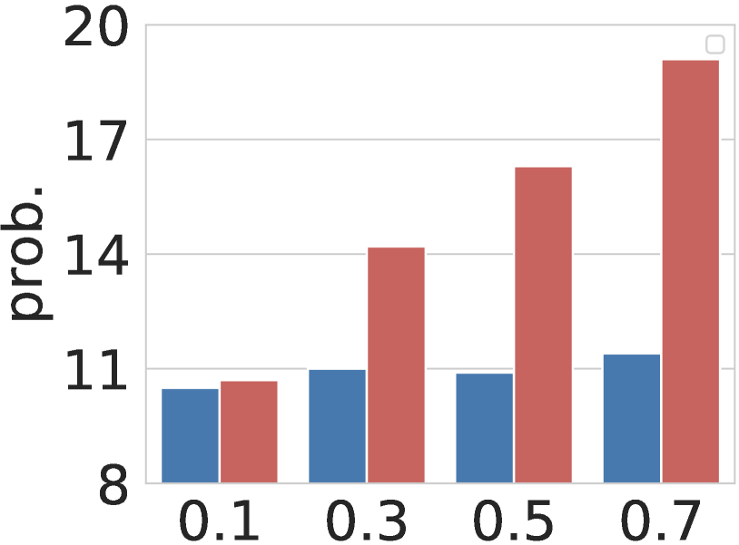

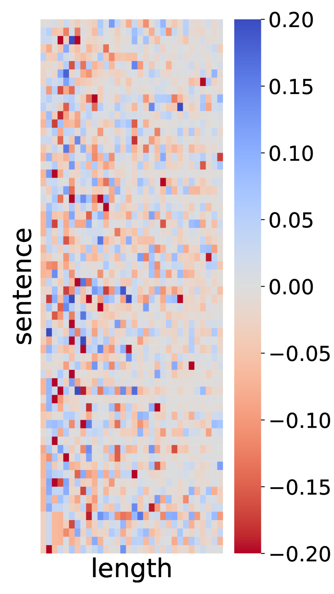

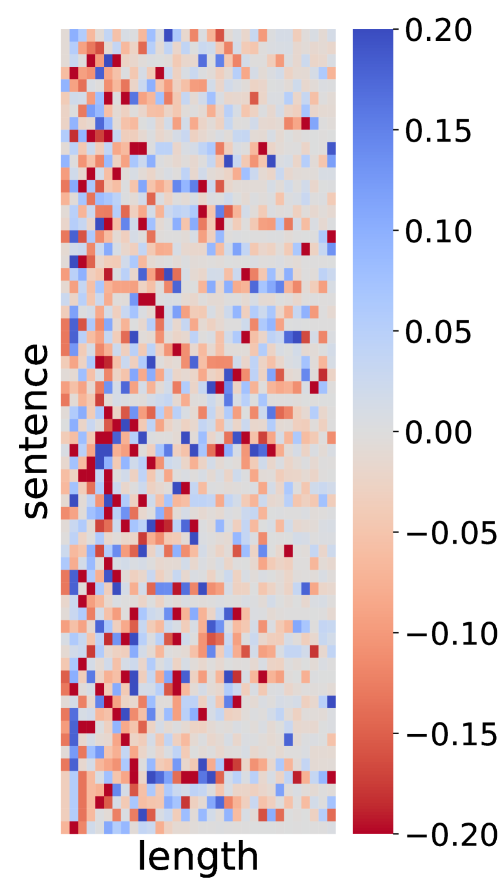

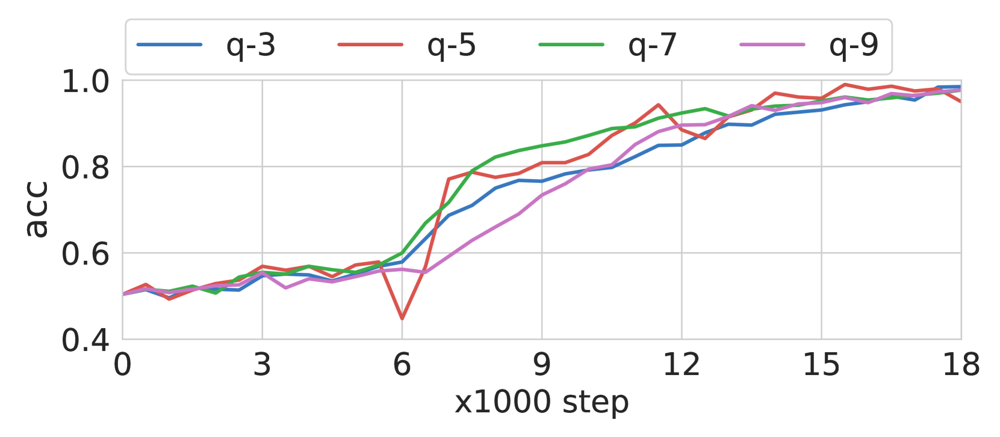

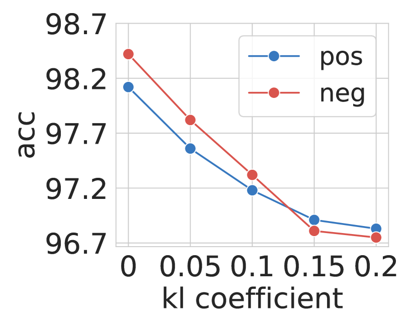

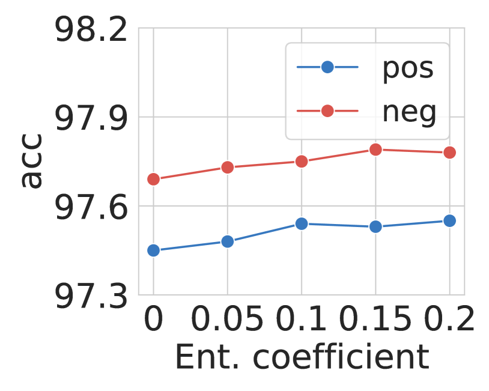

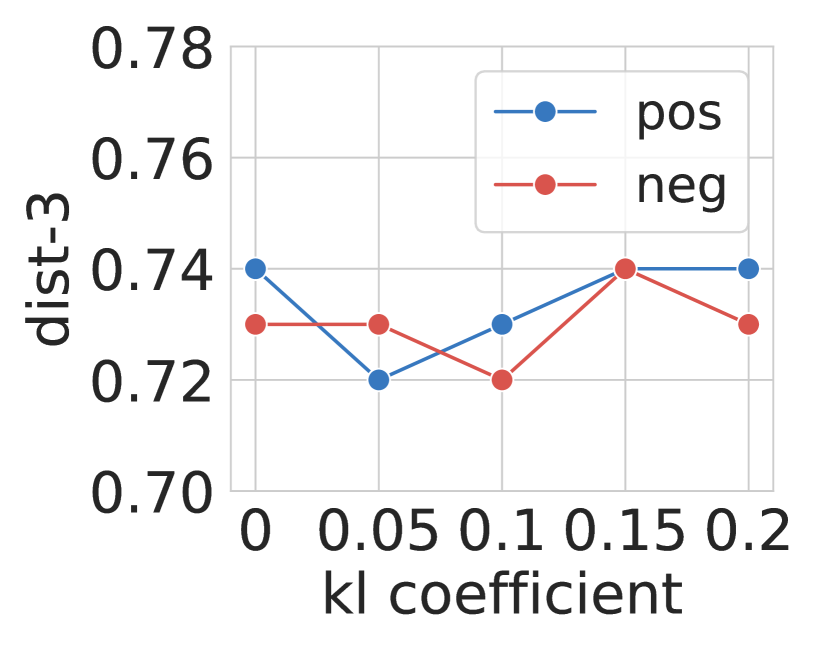

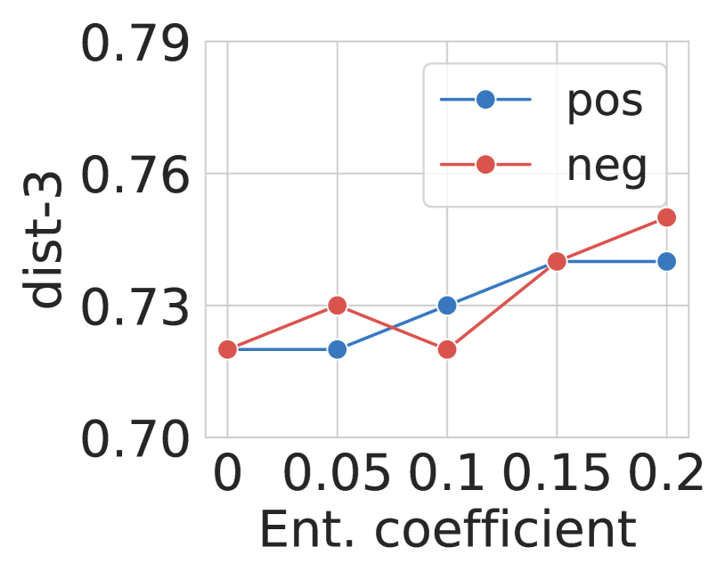

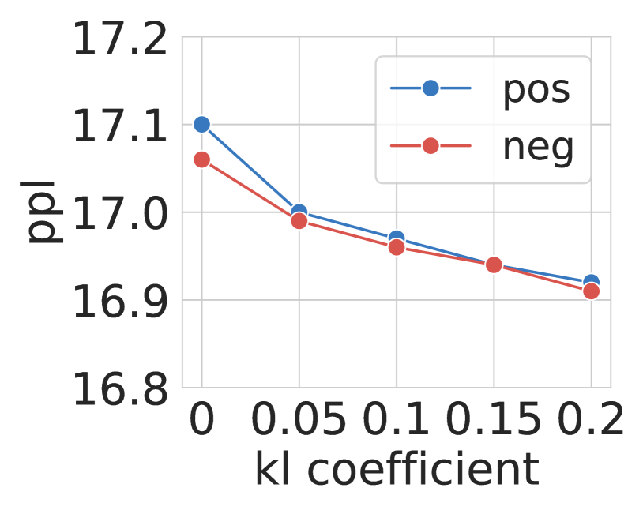

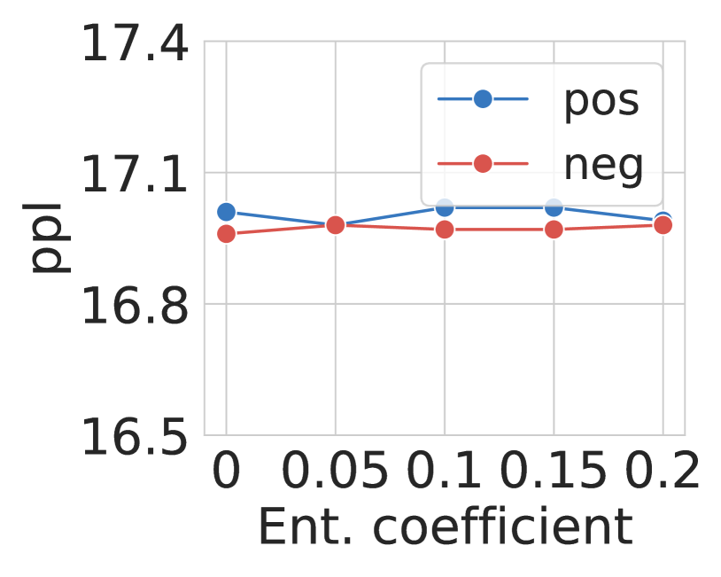

[Arxiv](https://arxiv.org/abs/2403.11558)