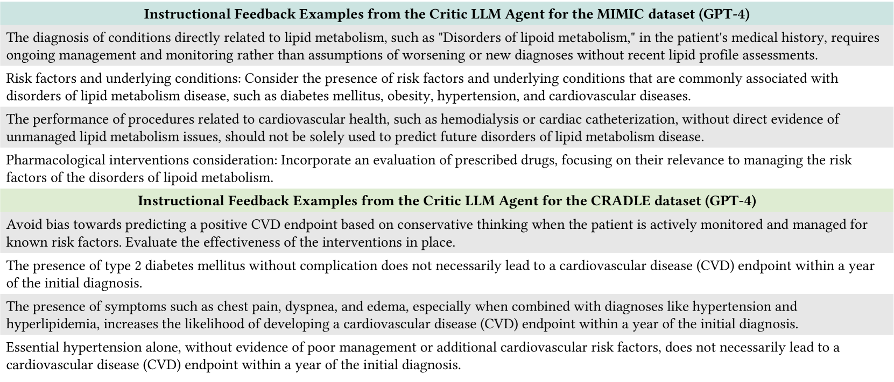
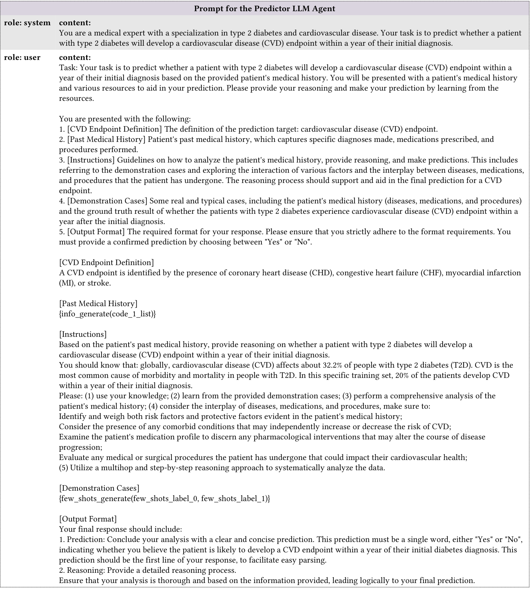
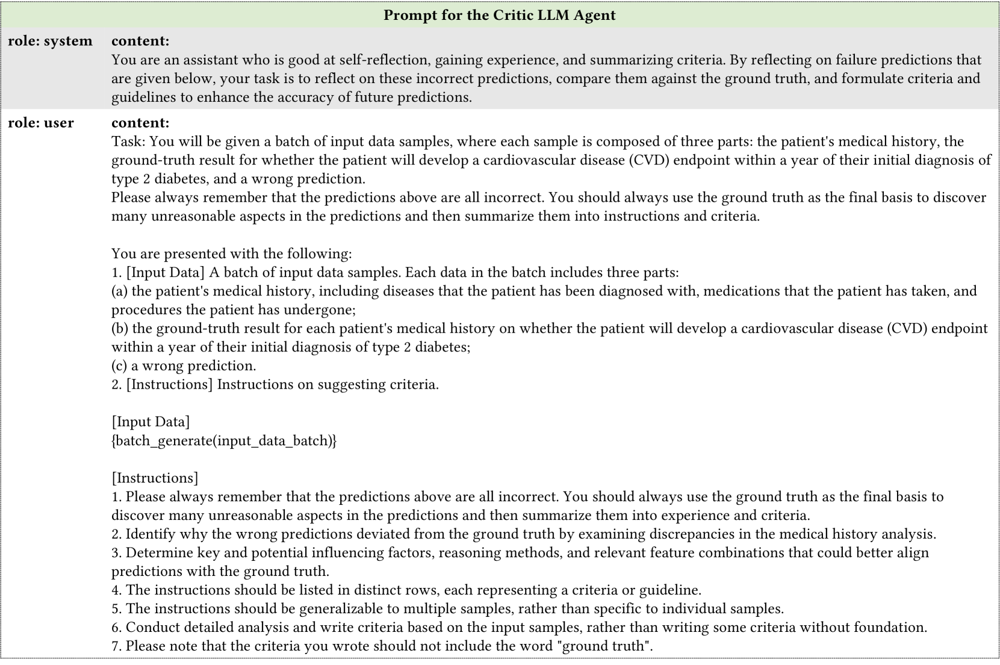

# 创新运用 EHR 数据，结合预测性智能体推理与关键指令策略，提出了一种基于 LLMs 的少样本疾病预测新方法。

发布时间：2024年03月19日

`LLM应用` `电子健康记录`

> LLMs-based Few-Shot Disease Predictions using EHR: A Novel Approach Combining Predictive Agent Reasoning and Critical Agent Instruction

# 摘要

> 电子健康记录蕴含丰富的患者信息，尤其对于疾病预测等健康预测任务。以往的方法大多依赖于需要大量标注数据的监督学习，而这往往耗资巨大且难以获取。本研究探索了运用大型语言模型（LLMs）将结构化患者就诊信息转换为自然语言描述的可能性。我们借助多种针对EHR预测任务设计的提示策略，对比考察了LLMs在零样本和少量样本情况下的表现。同时，我们还创新性地引入了具备不同职能的LLM代理：预测代理负责预测并生成推理路径，而批评代理则负责分析错误预测并指导优化预测代理的推理过程。实验结果表明，采用此新方法的LLMs在基于EHR的疾病预测上展现出优于传统监督学习方法的少量样本性能，预示着其在健康应用领域的广泛应用前景。

> Electronic health records (EHRs) contain valuable patient data for health-related prediction tasks, such as disease prediction. Traditional approaches rely on supervised learning methods that require large labeled datasets, which can be expensive and challenging to obtain. In this study, we investigate the feasibility of applying Large Language Models (LLMs) to convert structured patient visit data (e.g., diagnoses, labs, prescriptions) into natural language narratives. We evaluate the zero-shot and few-shot performance of LLMs using various EHR-prediction-oriented prompting strategies. Furthermore, we propose a novel approach that utilizes LLM agents with different roles: a predictor agent that makes predictions and generates reasoning processes and a critic agent that analyzes incorrect predictions and provides guidance for improving the reasoning of the predictor agent. Our results demonstrate that with the proposed approach, LLMs can achieve decent few-shot performance compared to traditional supervised learning methods in EHR-based disease predictions, suggesting its potential for health-oriented applications.

[Arxiv](https://arxiv.org/abs/2403.15464)