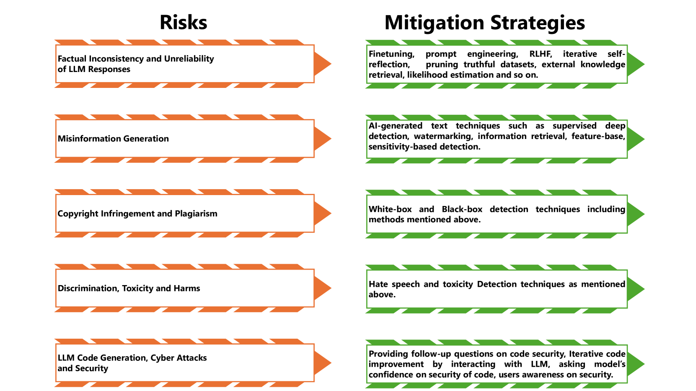

# 面对大型语言模型的安全挑战，本文将探讨其存在的威胁与潜在漏洞，并提出一系列负责任的防护实践。

发布时间：2024年03月19日

`LLM理论` `安全与隐私`

> Securing Large Language Models: Threats, Vulnerabilities and Responsible Practices

> LLMs在NLP领域引发了深刻变革，广泛渗透于各类任务中，革新了语言理解和生成的方法论。然而，LLMs在展现强大功能的同时，也带来了不容忽视的安全风险问题。为确保安全部署和防范隐患，有必要深入剖析这些挑战。该研究论文系统地从五个核心视角探讨了LLMs的安全与隐私顾虑，包括对抗攻击下的弱点、LLMs误用可能导致的危害，以及在揭示现有策略局限性的基础上提出的缓解策略。此外，本文还前瞻性地建议了未来的研究方向，以期提升LLMs的安全管理和风险防控能力。

> Large language models (LLMs) have significantly transformed the landscape of Natural Language Processing (NLP). Their impact extends across a diverse spectrum of tasks, revolutionizing how we approach language understanding and generations. Nevertheless, alongside their remarkable utility, LLMs introduce critical security and risk considerations. These challenges warrant careful examination to ensure responsible deployment and safeguard against potential vulnerabilities. This research paper thoroughly investigates security and privacy concerns related to LLMs from five thematic perspectives: security and privacy concerns, vulnerabilities against adversarial attacks, potential harms caused by misuses of LLMs, mitigation strategies to address these challenges while identifying limitations of current strategies. Lastly, the paper recommends promising avenues for future research to enhance the security and risk management of LLMs.

[Arxiv](https://arxiv.org/abs/2403.12503)