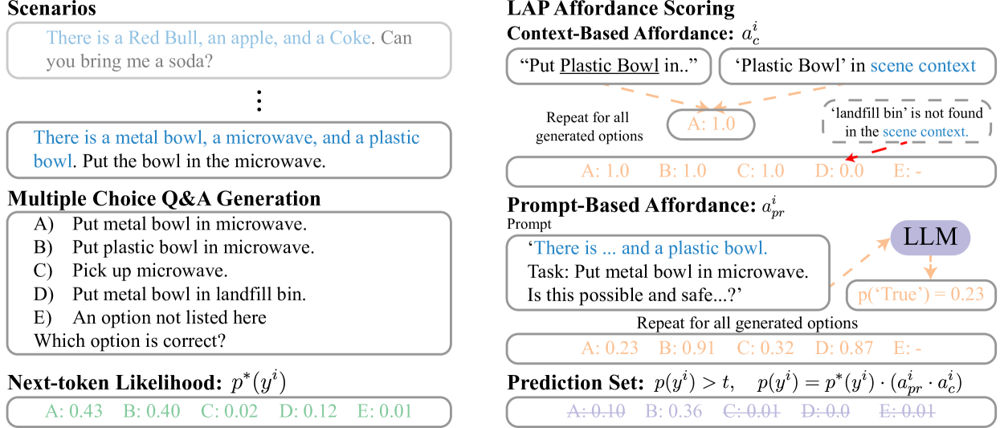
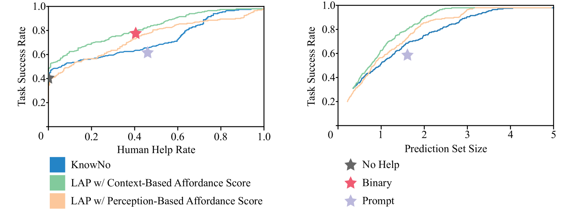
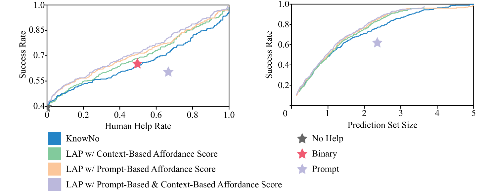
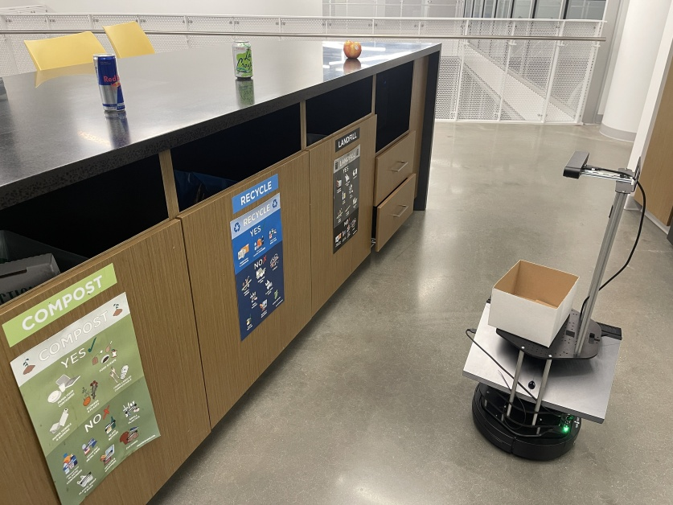
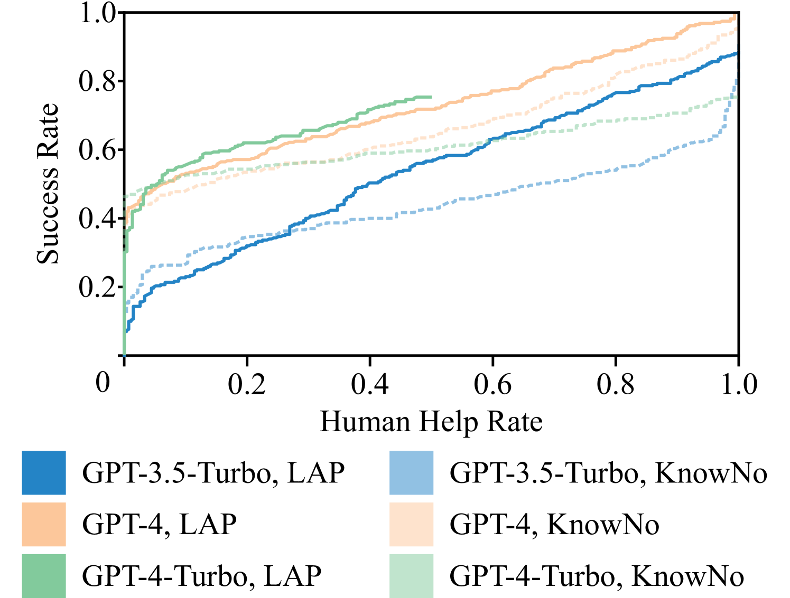
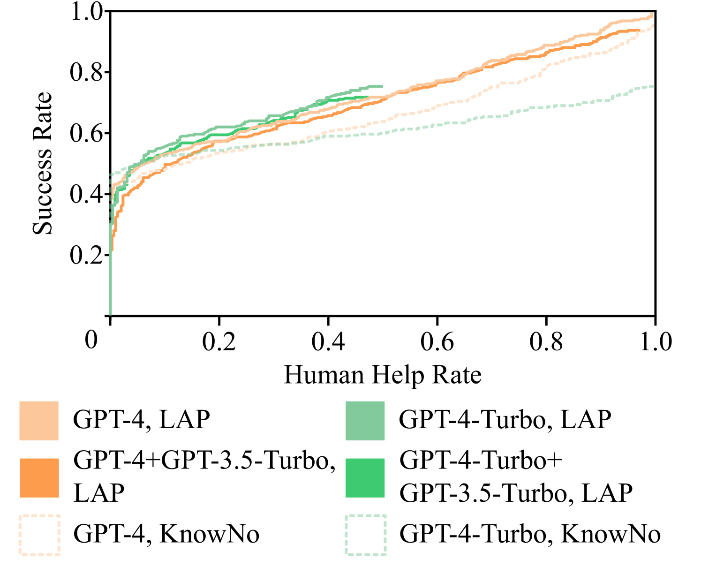

# 致力于研发能自我识别何时需要协助的机器人，我们提出了一种面向大型语言模型规划器的功能性不确定性方法。

发布时间：2024年03月19日

`Agent` `消费级机器人` `自动规划`

> Towards Robots That Know When They Need Help: Affordance-Based Uncertainty for Large Language Model Planners

> LLMs为智能机器人赋予了许多理想特性，但也存在臆想预测的风险。尤其在消费级机器人领域，LLM的臆想可能导致机器人误执行与用户期望相反的行动计划，过度依赖人工辅助，甚至无法自主求援。本研究提出了名为LAP的新颖方案，它巧妙运用现成LLMs及场景、物体功能性特征，融入机器人规划系统中，有效抑制有害臆想的发生，并能适时寻求帮助。核心发现在于，通过计算并运用“场景功能性得分”——衡量在特定场景下行动可行性的一个指标，能够有效减轻LLM预测中的臆想现象，并使其信心度更准确地反映行动成功的可能性。我们特别设计并验证了三种不同的功能性得分，这些得分可以根据实际情况单独或组合应用，提升各场景下的性能表现。其中最为成功的一种方法是让LLM判定场景内某一动作的可行性与安全性，并基于其回应计算得分。实验证明，在模拟和真实环境中处理多种含糊任务时，LAP显著提升了任务成功率，并相比以往技术大幅减少了人工介入需求。比如，在我们的实际测试情境下，当成功率高达70%时，LAP已将之前方法所需的人工帮助率降低了超过三分之一。

> Large language models (LLMs) showcase many desirable traits for intelligent and helpful robots. However, they are also known to hallucinate predictions. This issue is exacerbated in consumer robotics where LLM hallucinations may result in robots confidently executing plans that are contrary to user goals, relying more frequently on human assistance, or preventing the robot from asking for help at all. In this work, we present LAP, a novel approach for utilizing off-the-shelf LLM's, alongside scene and object Affordances, in robotic Planners that minimize harmful hallucinations and know when to ask for help. Our key finding is that calculating and leveraging a scene affordance score, a measure of whether a given action is possible in the provided scene, helps to mitigate hallucinations in LLM predictions and better align the LLM's confidence measure with the probability of success. We specifically propose and test three different affordance scores, which can be used independently or in tandem to improve performance across different use cases. The most successful of these individual scores involves prompting an LLM to determine if a given action is possible and safe in the given scene and uses the LLM's response to compute the score. Through experiments in both simulation and the real world, on tasks with a variety of ambiguities, we show that LAP significantly increases success rate and decreases the amount of human intervention required relative to prior art. For example, in our real-world testing paradigm, LAP decreases the human help rate of previous methods by over 33% at a success rate of 70%.

[Arxiv](https://arxiv.org/abs/2403.13198)