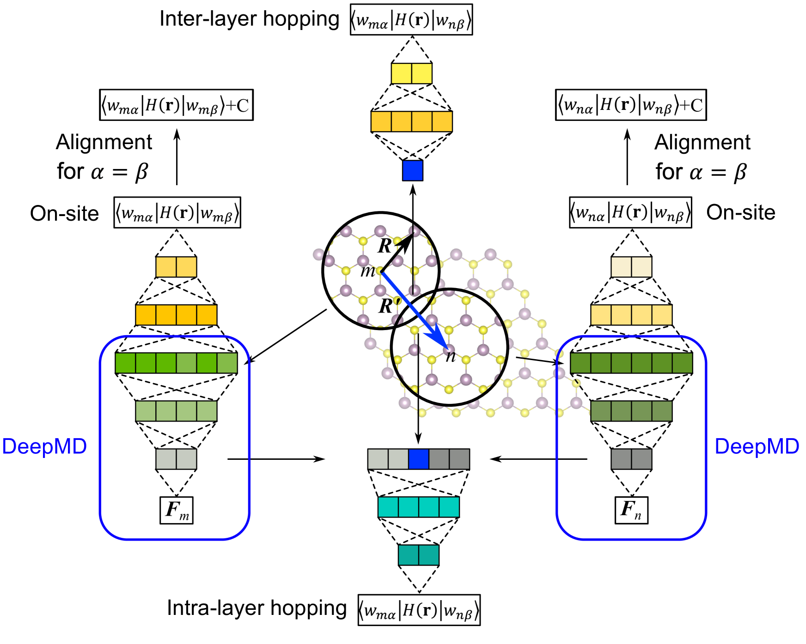
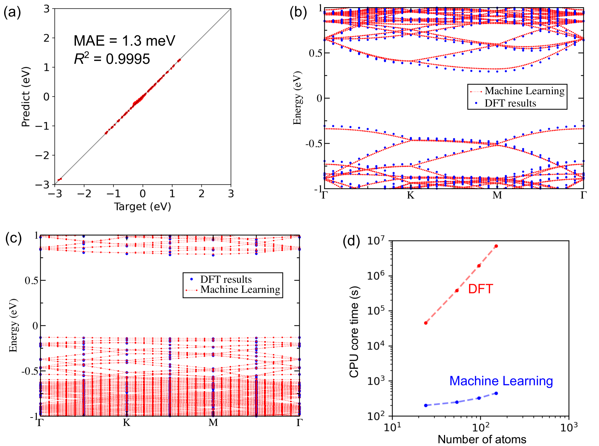
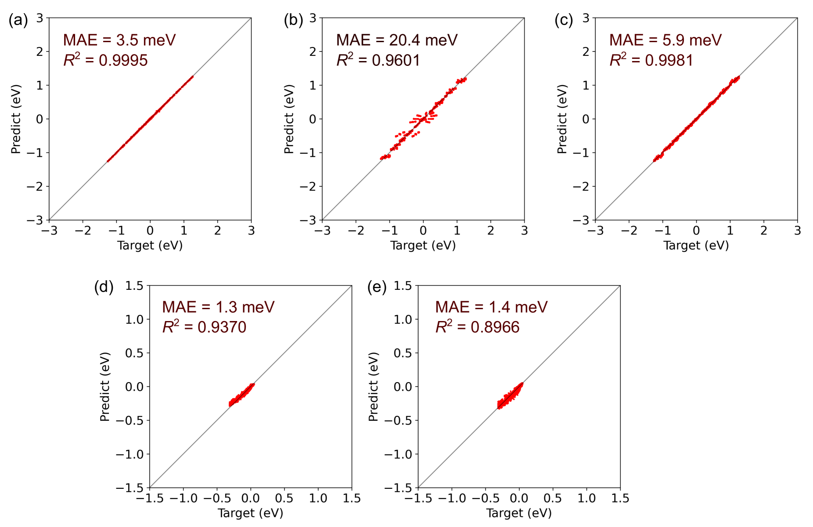

# 本研究采用物理信息导向的方法，巧妙联结深度学习力场与电子结构，实现两者之间的深度融合。

发布时间：2024年03月20日

`Agent` `材料科学` `电子结构模拟`

> Bridging deep learning force fields and electronic structures with a physics-informed approach

> 本研究提出了一种创新的方法，通过扭曲二维大规模材料系统实例展示了深度学习力场与电子结构模拟之间的桥梁作用。以深度势能分子动力学模型为核心，并将其与电子结构模拟深度融合。我们巧妙地借助 Wannier 函数作为构建块，依据物理原则对 Wannier 哈密顿量元素进行分类，使得模型能够汲取深度学习力场模型中的多样化信息，从而优化了多功能模型的结构，提升其效能。以 Wannier 函数为基础，为预测更多物理量提供了可能。这种方法有力地推动了对具有低周期性特征的大规模体系结构和电子特性的深入探索。通过赋予已有的高性能机器学习力场电子结构模拟能力，此项研究显著推进了多模态机器学习计算方法的发展，使其有望实现过去仅由第一性原理计算独占的多种功能。

> This work presents a physics-informed neural network approach bridging deep-learning force field and electronic structure simulations, illustrated through twisted two-dimensional large-scale material systems. The deep potential molecular dynamics model is adopted as the backbone, and electronic structure simulation is integrated. Using Wannier functions as the basis, we categorize Wannier Hamiltonian elements based on physical principles to incorporate diverse information from a deep-learning force field model. This information-sharing mechanism streamlines the architecture of our multifunctional model, enhancing its efficiency and effectiveness. Utilizing Wannier functions as the basis lays the groundwork for predicting more physical quantities. This approach serves as a powerful tool to explore both the structural and electronic properties of large-scale systems characterized by low periodicities. By endowing an existing well-developed machine-learning force field with electronic structure simulation capabilities, the study marks a significant advancement in developing multimodal machine-learning-based computational methods that can achieve multiple functionalities traditionally exclusive to first-principles calculations.

[Arxiv](https://arxiv.org/abs/2403.13675)