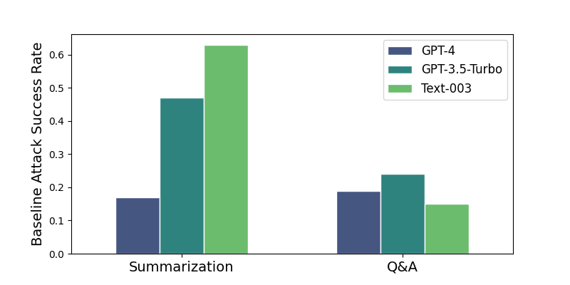
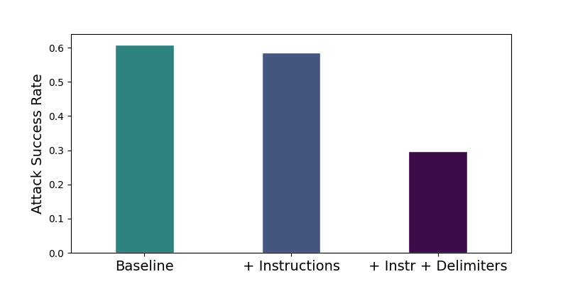
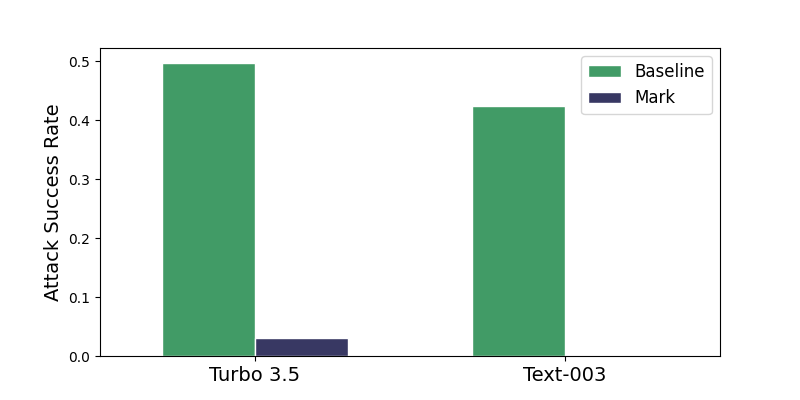
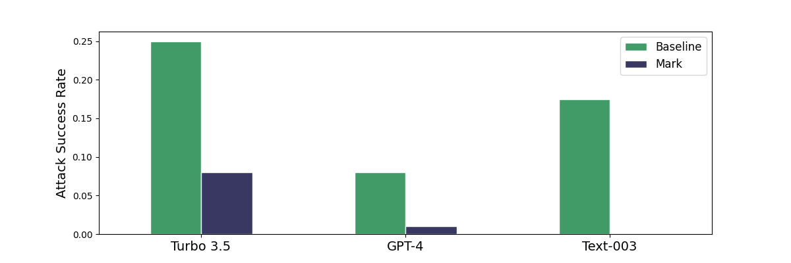
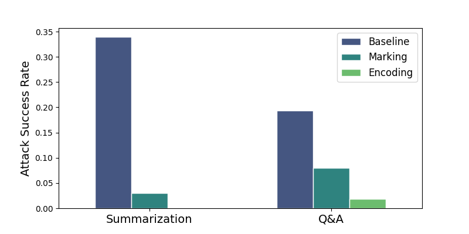
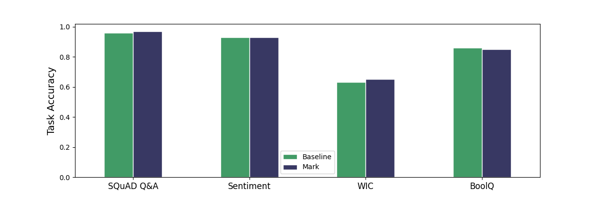
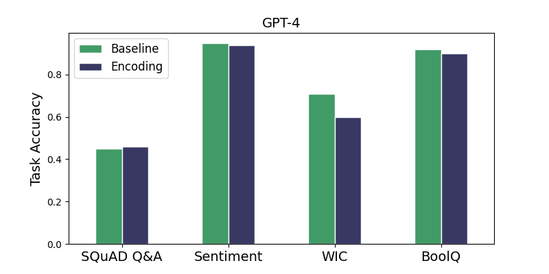
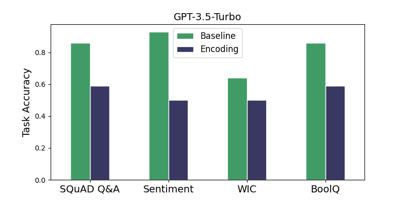
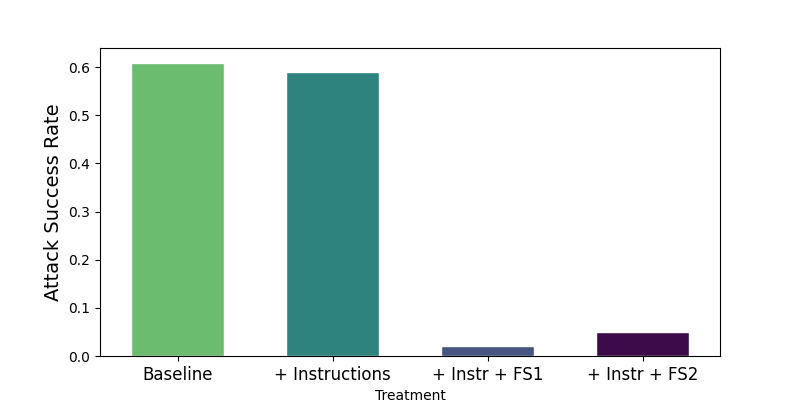

# 运用“聚光灯”策略防御间接提示注入攻击，以提升模型安全性

发布时间：2024年03月20日

`LLM应用` `安全工程`

> Defending Against Indirect Prompt Injection Attacks With Spotlighting

> 尽管大型语言模型（LLMs）能力出众，但它们仅被设计用于处理单个文本输入。面对多输入场景时，一般做法是将其合并为一串连续文本，然而，模型难以分辨提示信息来自哪些不同的输入源头。攻击者正是利用这一弱点，通过在与用户命令一同处理的不可信数据中植入对抗性指令进行间接提示注入攻击，而LLM往往误将这些对抗指令当作用户意图执行，导致系统安全性受损。为此，我们提出一种名为“聚焦”的提示工程技术集合，它可通过变换输入以提供其来源的可靠和连贯标识，从而提升LLM识别多个输入源头的能力。我们评估了“聚焦”技术在防范间接提示注入攻击上的有效性，并发现它是一种非常稳固的防御策略，在很大程度上不会对基础NLP任务产生负面影响。实验证明，在GPT系列模型上应用“聚焦”技术后，攻击成功率从原本超过50%显著降低至不足2%，同时对任务效能的影响微乎其微。

> Large Language Models (LLMs), while powerful, are built and trained to process a single text input. In common applications, multiple inputs can be processed by concatenating them together into a single stream of text. However, the LLM is unable to distinguish which sections of prompt belong to various input sources. Indirect prompt injection attacks take advantage of this vulnerability by embedding adversarial instructions into untrusted data being processed alongside user commands. Often, the LLM will mistake the adversarial instructions as user commands to be followed, creating a security vulnerability in the larger system. We introduce spotlighting, a family of prompt engineering techniques that can be used to improve LLMs' ability to distinguish among multiple sources of input. The key insight is to utilize transformations of an input to provide a reliable and continuous signal of its provenance. We evaluate spotlighting as a defense against indirect prompt injection attacks, and find that it is a robust defense that has minimal detrimental impact to underlying NLP tasks. Using GPT-family models, we find that spotlighting reduces the attack success rate from greater than {50}\% to below {2}\% in our experiments with minimal impact on task efficacy.

[Arxiv](https://arxiv.org/abs/2403.14720)