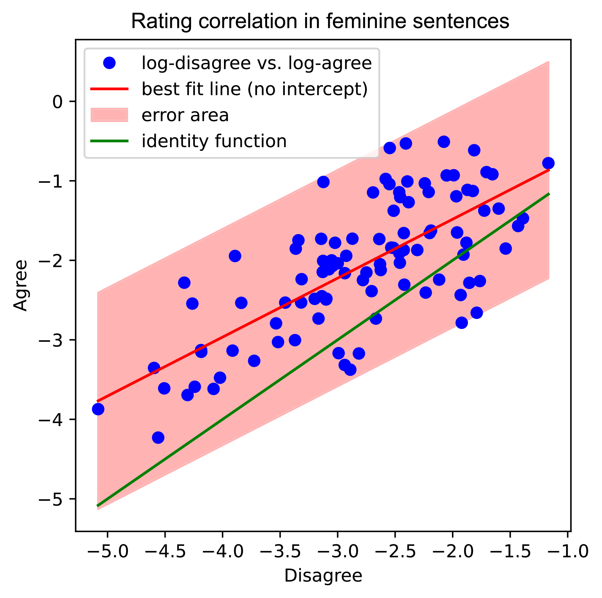

# 本研究通过捷克 BERT 模型的案例分析，深入探讨了性别因素如何与政治价值观相互作用。

发布时间：2024年03月20日

`LLM理论` `社会科学`

> How Gender Interacts with Political Values: A Case Study on Czech BERT Models

> 神经语言模型凭借其尖端技术，在各类自然语言处理任务上独领风骚，但它们在大量训练文本中的学习过程难免会吸收价值观负载的内容以及一些不良偏见，并将之反映出来。本次案例研究聚焦于预训练捷克语编码器的政治偏见问题，并与一项典型价值观调查进行了对比分析。考虑到捷克语具备明显的语法性别特征，我们进一步探究了语法性别与针对男性、女性的调查反馈是否存在某种对应关系。为了解码模型蕴含的政治倾向，我们创新性地提出了一套测量方法。研究结果显示，模型在判断语句可能性时并未依据深层次的价值观驱动逻辑，同时，阴性及阳性句子间未展现出任何系统性的差异。据此，我们可以总结出，BERT 级别的模型并没有表现出与政治价值观系统性的一致性，模型中显现的偏见主要源自对训练数据表面模式的机械模仿，而非模型内在的系统化价值观观念。

> Neural language models, which reach state-of-the-art results on most natural language processing tasks, are trained on large text corpora that inevitably contain value-burdened content and often capture undesirable biases, which the models reflect. This case study focuses on the political biases of pre-trained encoders in Czech and compares them with a representative value survey. Because Czech is a gendered language, we also measure how the grammatical gender coincides with responses to men and women in the survey. We introduce a novel method for measuring the model's perceived political values. We find that the models do not assign statement probability following value-driven reasoning, and there is no systematic difference between feminine and masculine sentences. We conclude that BERT-sized models do not manifest systematic alignment with political values and that the biases observed in the models are rather due to superficial imitation of training data patterns than systematic value beliefs encoded in the models.

[Arxiv](https://arxiv.org/abs/2403.13514)