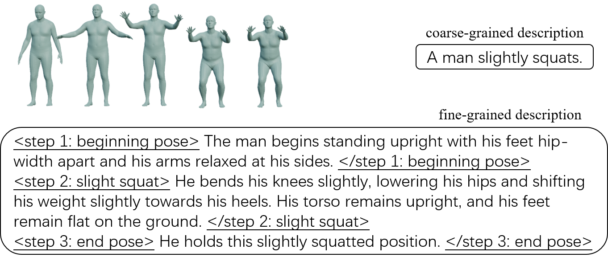
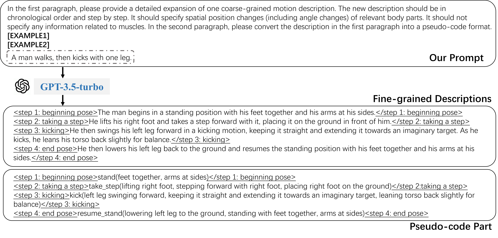
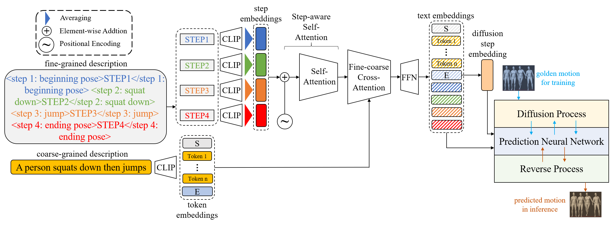
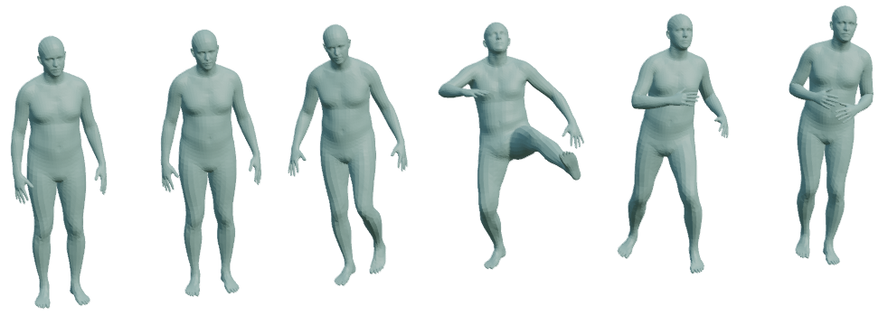
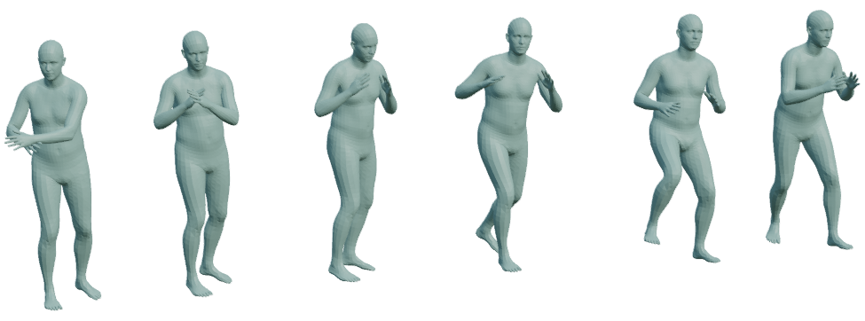
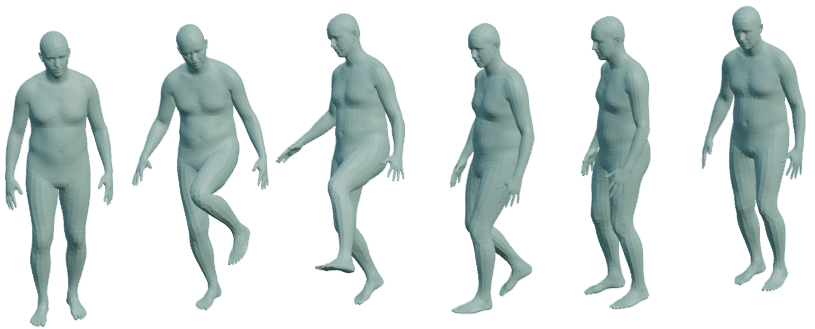

# 运动生成技术能够从详尽的文本描述中实现，本研究关注如何通过精细的文本指令精准地生成相应运动行为。

发布时间：2024年03月20日

`LLM应用` `动作识别`

> Motion Generation from Fine-grained Textual Descriptions

> Text2motion任务致力于依据详细的文本说明生成对应的动作序列，要求模型深入探究语言指令与人体动作间的互动关系。然而，目前大部分研究仅限于处理较粗略的动作描述，对于涉及具体身体部位的精细动作描述则涉猎甚少。基于粗糙文本训练的模型难以习得将细粒度动作相关词语映射至基础动作单元的能力，这使得它们面对未见过的描述时往往无法生成恰当的动作。本文创新性地利用GPT-3.5-turbo的强大能力，辅以巧妙设计的提示语，构建了一个包含丰富细粒度文字描述的大规模语言-动作数据集——FineHumanML3D。据此，我们进一步研发了一款名为FineMotionDiffuse的新颖text2motion模型，它能充分挖掘并运用这些精细化的文本信息。实验结果显示，当FineMotionDiffuse在FineHumanML3D数据集上进行训练后，在量化评估中的表现优异。同时，我们还发现这款模型能够通过学习从简洁描述到相应基础动作的内在映射关系，更出色地生成兼具空间及时间复杂性的动作序列。

> The task of text2motion is to generate motion sequences from given textual descriptions, where a model should explore the interactions between natural language instructions and human body movements. While most existing works are confined to coarse-grained motion descriptions (e.g., "A man squats."), fine-grained ones specifying movements of relevant body parts are barely explored. Models trained with coarse texts may not be able to learn mappings from fine-grained motion-related words to motion primitives, resulting in the failure in generating motions from unseen descriptions. In this paper, we build a large-scale language-motion dataset with fine-grained textual descriptions, FineHumanML3D, by feeding GPT-3.5-turbo with delicate prompts. Accordingly, we design a new text2motion model, FineMotionDiffuse, which makes full use of fine-grained textual information. Our experiments show that FineMotionDiffuse trained on FineHumanML3D acquires good results in quantitative evaluation. We also find this model can better generate spatially/chronologically composite motions by learning the implicit mappings from simple descriptions to the corresponding basic motions.

[Arxiv](https://arxiv.org/abs/2403.13518)