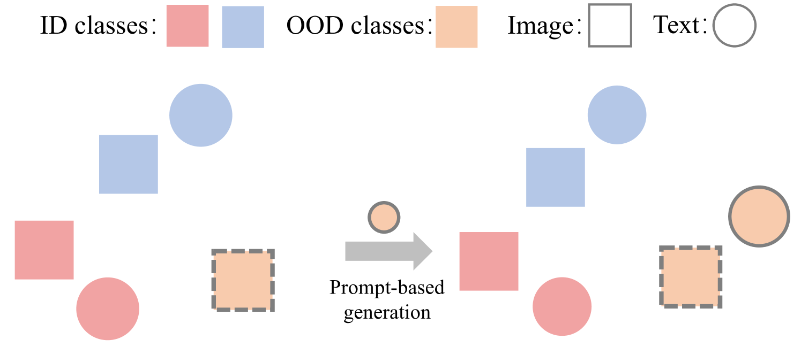
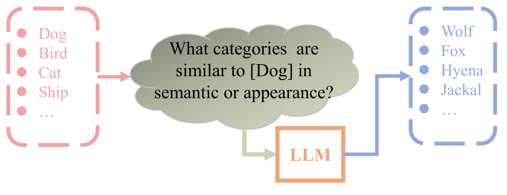
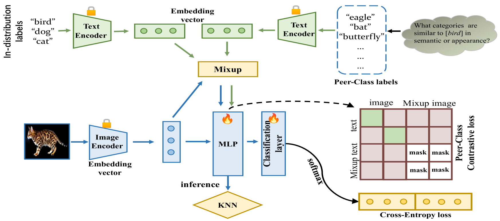
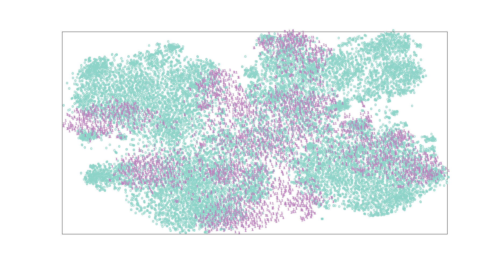
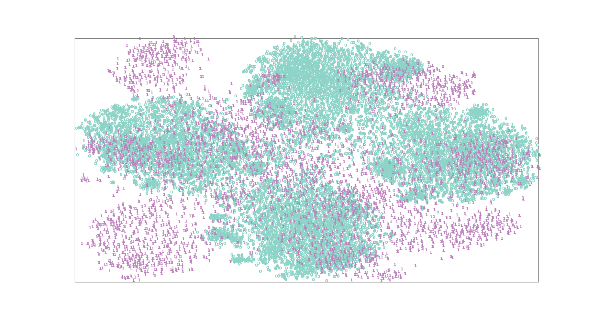

# 本研究探讨利用大型语言模型生成的同类类别进行分布外数据检测的方法，通过此类生成技术来提升模型对于未曾见过的数据类型的识别与判断能力。

发布时间：2024年03月20日

`LLM应用` `机器学习` `OOD检测`

> Out-of-Distribution Detection Using Peer-Class Generated by Large Language Model

> 为保障部署于真实场景下的机器学习模型的可靠性和安全性，OOD检测是一项至关重要的任务。传统单模态OOD检测技术在面对复杂多样的OOD样本时往往捉襟见肘。尤其是在遇到与ID数据集中某一类别相似度极高的输入图像（如狼与狗）时，模型易发生误判，但在语义层面区分这两类却相对轻松。因此，本文创新性地提出了名为ODPC的方法。该方法利用大型语言模型设计特定提示，生成与ID数据集语义相关的OOD同类类别作为辅助模态，有效提升了OOD检测能力。同时，基于OOD同类类别的对比损失被精心设计，旨在学习ID类别的紧凑表征，并增强各类别间的边界区分度。经过在五个权威数据集上的广泛实验验证，我们所提出的方案已达到当前最优水平。

> Out-of-distribution (OOD) detection is a critical task to ensure the reliability and security of machine learning models deployed in real-world applications. Conventional methods for OOD detection that rely on single-modal information, often struggle to capture the rich variety of OOD instances. The primary difficulty in OOD detection arises when an input image has numerous similarities to a particular class in the in-distribution (ID) dataset, e.g., wolf to dog, causing the model to misclassify it. Nevertheless, it may be easy to distinguish these classes in the semantic domain. To this end, in this paper, a novel method called ODPC is proposed, in which specific prompts to generate OOD peer classes of ID semantics are designed by a large language model as an auxiliary modality to facilitate detection. Moreover, a contrastive loss based on OOD peer classes is devised to learn compact representations of ID classes and improve the clarity of boundaries between different classes. The extensive experiments on five benchmark datasets show that the method we propose can yield state-of-the-art results.

[Arxiv](https://arxiv.org/abs/2403.13324)