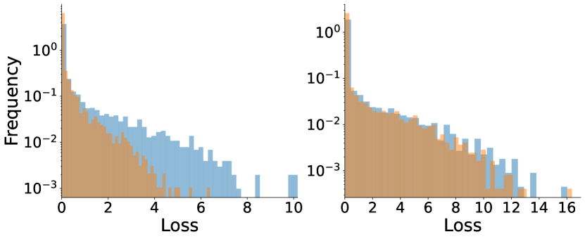
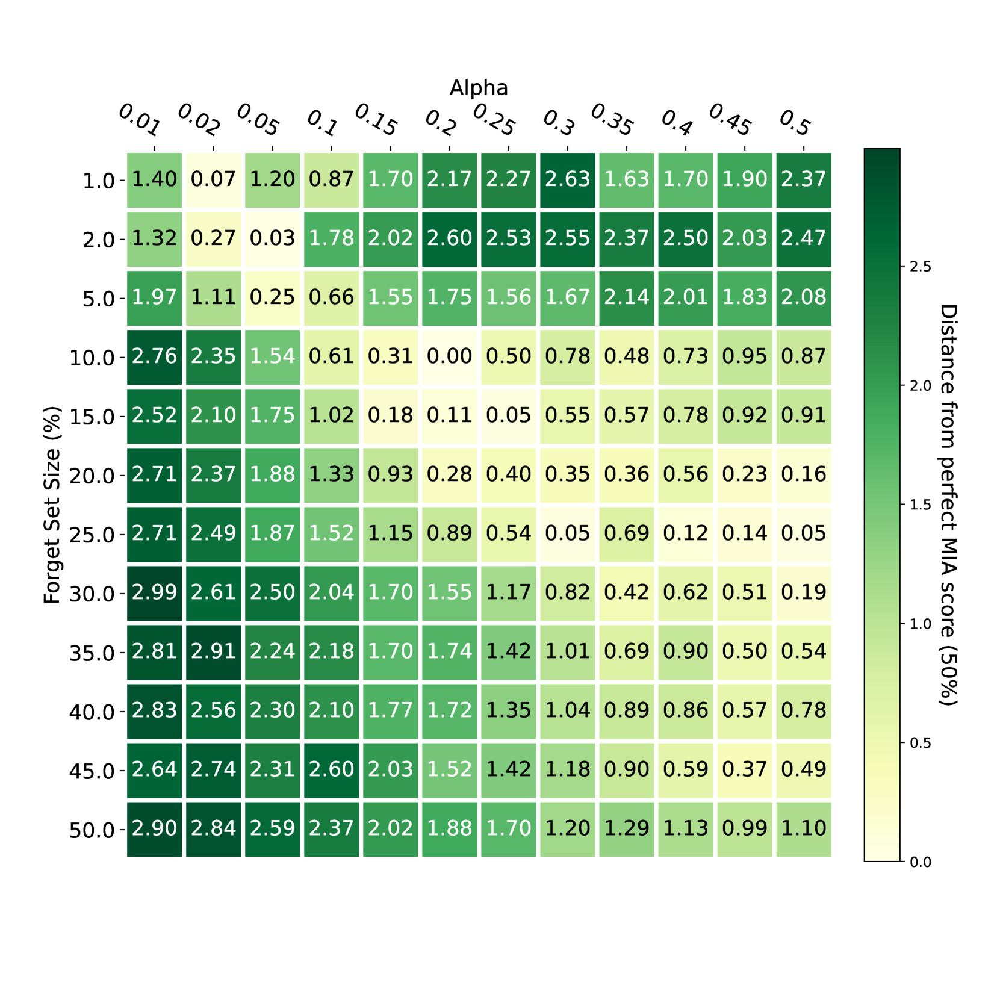
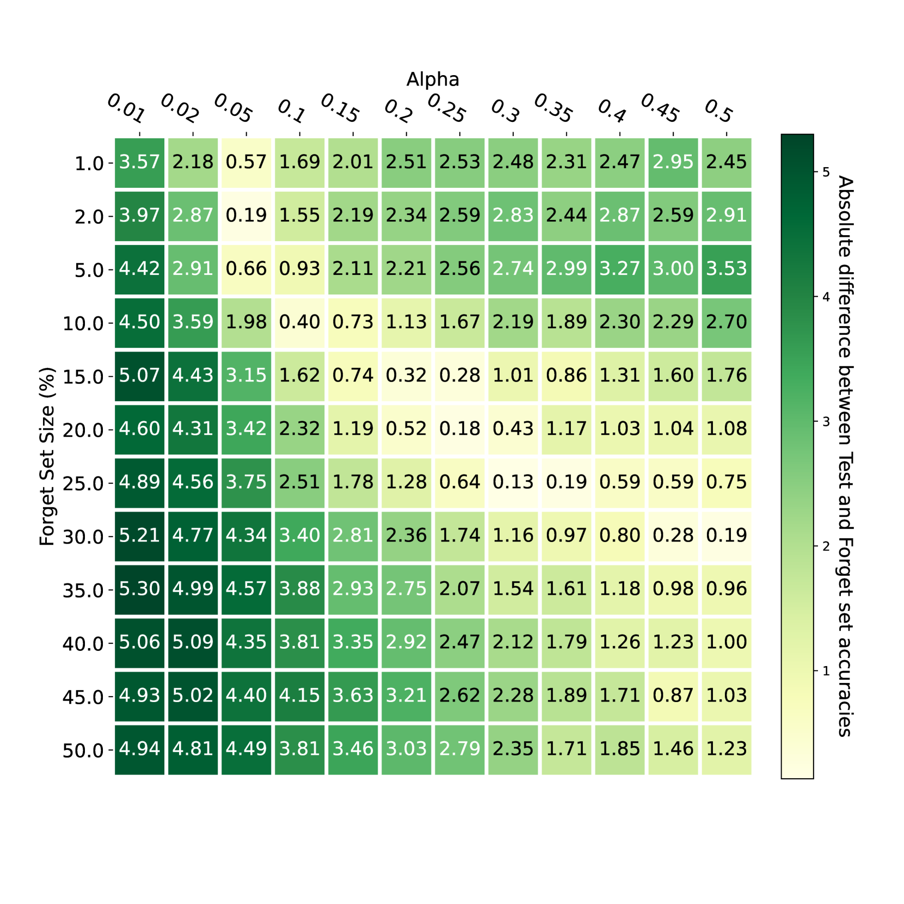

# $\nabla τ$ 代表一种基于梯度且与任务无关的机器遗忘方法，该技术旨在实现对机器学习模型中已学内容的有效擦除。

发布时间：2024年03月21日

`LLM应用` `数据保护` `模型训练`

> $\nabla τ$: Gradient-based and Task-Agnostic machine Unlearning

> 机器遗忘学习作为一种帮助从业者遵守最新数据保护规定的工具，因其能针对性地消除模型训练中特定数据示例的影响而备受瞩目。不过，现有方法存在显著短板，比如成本极高且常涉及大量超参数调整，同时只能有效遗忘相对较少的数据部分，以至于很多时候完全重新训练模型反而更为快捷有效。为此，本研究提出了一种名为“基于梯度和任务无关机器遗忘”（$\nabla τ$）的优化框架。此框架通过自适应梯度上升技术针对待遗忘数据进行操作，同时运用标准梯度下降法处理剩余数据，以实现高效移除训练数据子集的影响。相较于现有方法，$\nabla τ$表现出多重优点，不仅能够高效遗忘高达30%的训练数据部分，而且灵活适用多种遗忘场景（如子集遗忘、类别移除等），横跨图像、文本等多个领域。尤为值得一提的是，$\nabla τ$无需调整任何超参数，相比从零开始重训模型，它显然更具吸引力。我们借助一套公认的成员推断攻击评估指标验证了该框架的有效性，实验数据显示，在保持原始模型精度的前提下，$\nabla τ$较当前最先进方法可提升高达10%的性能表现。

> Machine Unlearning, the process of selectively eliminating the influence of certain data examples used during a model's training, has gained significant attention as a means for practitioners to comply with recent data protection regulations. However, existing unlearning methods face critical drawbacks, including their prohibitively high cost, often associated with a large number of hyperparameters, and the limitation of forgetting only relatively small data portions. This often makes retraining the model from scratch a quicker and more effective solution. In this study, we introduce Gradient-based and Task-Agnostic machine Unlearning ($\nabla τ$), an optimization framework designed to remove the influence of a subset of training data efficiently. It applies adaptive gradient ascent to the data to be forgotten while using standard gradient descent for the remaining data. $\nabla τ$ offers multiple benefits over existing approaches. It enables the unlearning of large sections of the training dataset (up to 30%). It is versatile, supporting various unlearning tasks (such as subset forgetting or class removal) and applicable across different domains (images, text, etc.). Importantly, $\nabla τ$ requires no hyperparameter adjustments, making it a more appealing option than retraining the model from scratch. We evaluate our framework's effectiveness using a set of well-established Membership Inference Attack metrics, demonstrating up to 10% enhancements in performance compared to state-of-the-art methods without compromising the original model's accuracy.

[Arxiv](https://arxiv.org/abs/2403.14339)