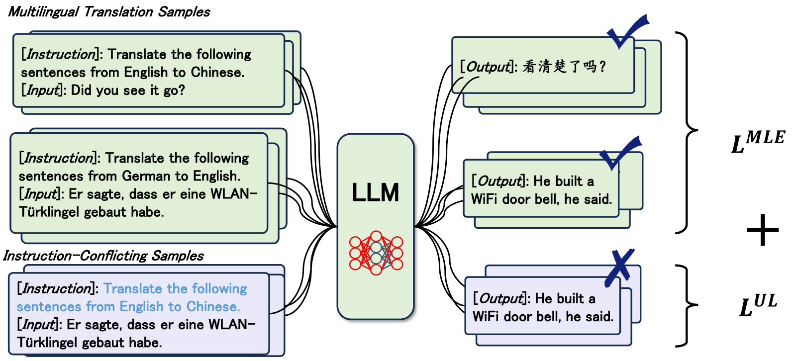
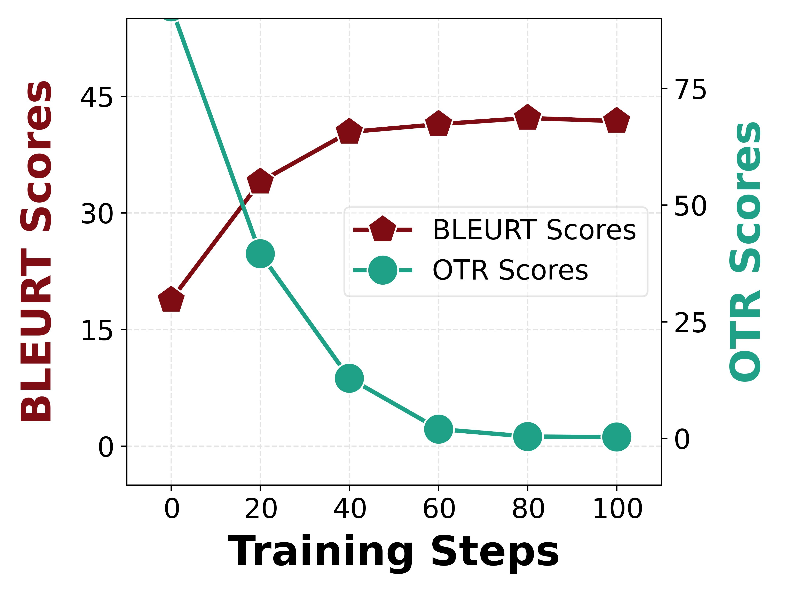
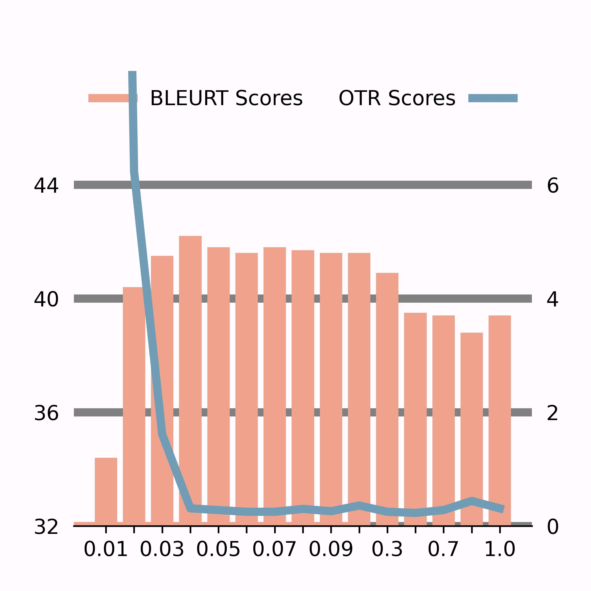
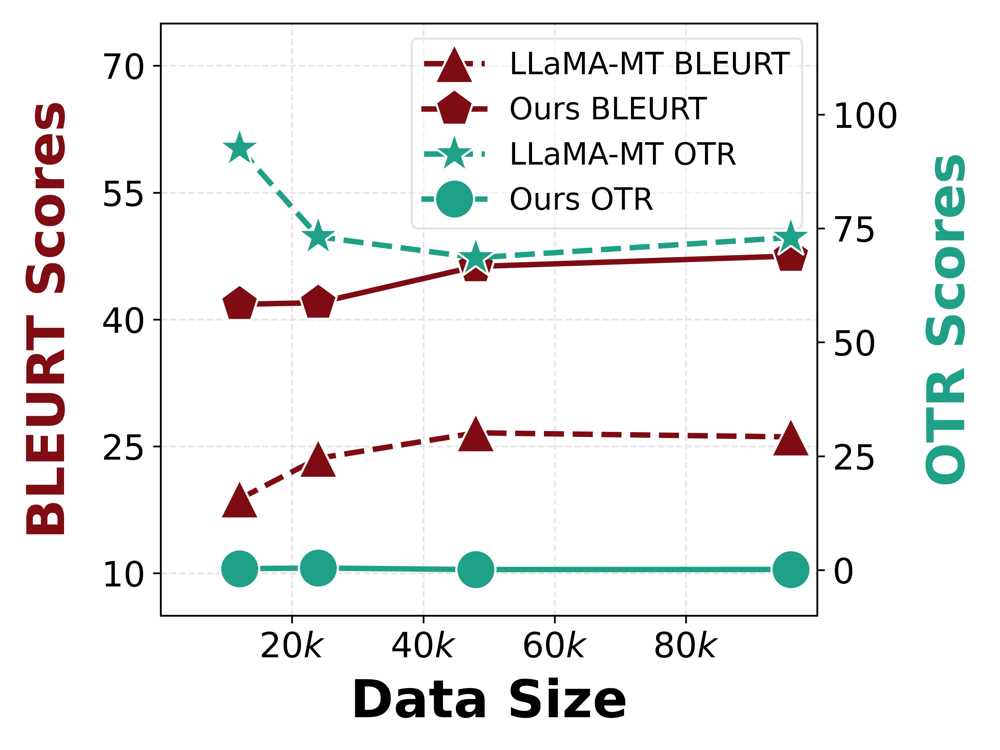

# 运用语言感知指令微调技术，我们致力于构建针对翻译任务特别优化、精度更高的LLMs。步骤2改进后：通过“语言感知指令调优”技术，我们专注于打造针对翻译任务精准定制、性能优越的大型语言模型（LLMs）。

发布时间：2024年03月21日

`LLM应用`

> Building Accurate Translation-Tailored LLMs with Language Aware Instruction Tuning

> 专为翻译定制的LLMs展现出了惊艳的翻译技能，堪比某些监督训练的商业翻译系统。然而，对于低资源语言，偏离目标的翻译顽疾仍然存在，阻碍了我们构建精准的LLMs翻译模型。最近的研究尝试通过创新提示策略凸显翻译指令功能或借助LLMs的上下文学习能力（利用少量样例）来改善这一问题，但实质上并未能有效提升模型遵循翻译指令的能力，尤其是识别语言方向信息方面。为此，本研究提出了一种两阶段精细化微调算法，旨在强化LLMs遵循翻译指令的方向感。首先，我们在翻译数据集上运用最大似然估计损失初步微调LLMs，激活其基础翻译能力。随后，在第二阶段，我们创造性地构造了包含误导性翻译方向的指令冲突样本，并引入额外的反向可能性损失函数学习这类样本。实验证明，在覆盖16个零样本方向的LLaMA模型上，相较于颇具竞争力的翻译微调版LLama基线，我们的方法显著降低了偏离目标翻译的发生率（平均下降53.3%），从而提高了翻译品质，平均提升SacredBLEU 5.7分、BLEURT 16.4分。进一步分析显示，这种方法在AlpacaEval评测中仍能保持模型在各类任务上的总体表现。相关代码和模型将在\url{https://github.com/alphadl/LanguageAware_Tuning}公开发布。

> Translation-tailored Large language models (LLMs) exhibit remarkable translation capabilities, even competing with supervised-trained commercial translation systems. However, off-target translation remains an unsolved problem, especially for low-resource languages, hindering us from developing accurate LLMs-based translation models. To mitigate the off-target translation problem and enhance the performance of LLMs on translation, recent works have either designed advanced prompting strategies to highlight the functionality of translation instructions or exploited the in-context learning ability of LLMs by feeding few-shot demonstrations. However, these methods essentially do not improve LLM's ability to follow translation instructions, especially the language direction information. In this work, we design a two-stage fine-tuning algorithm to improve the instruction-following ability (especially the translation direction) of LLMs. Specifically, we first tune LLMs with the maximum likelihood estimation loss on the translation dataset to elicit the basic translation capabilities. In the second stage, we construct instruction-conflicting samples by randomly replacing the translation directions with a wrong one within the instruction, and then introduce an extra unlikelihood loss to learn those samples. Experiments on IWSLT and WMT benchmarks upon the LLaMA model spanning 16 zero-shot directions show that, compared to the competitive baseline -- translation-finetuned LLama, our method could effectively reduce the off-target translation ratio (averagely -53.3\%), thus improving translation quality with average +5.7 SacreBLEU and +16.4 BLEURT. Analysis shows that our method could preserve the model's general task performance on AlpacaEval. Code and models will be released at \url{https://github.com/alphadl/LanguageAware_Tuning}.

[Arxiv](https://arxiv.org/abs/2403.14399)