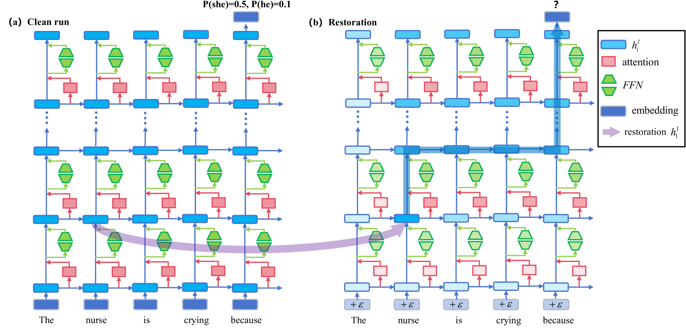
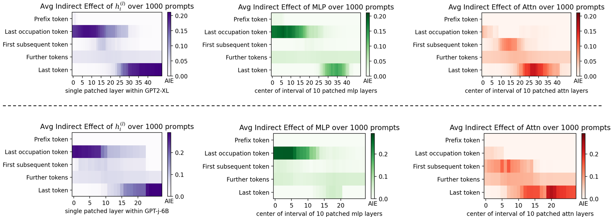
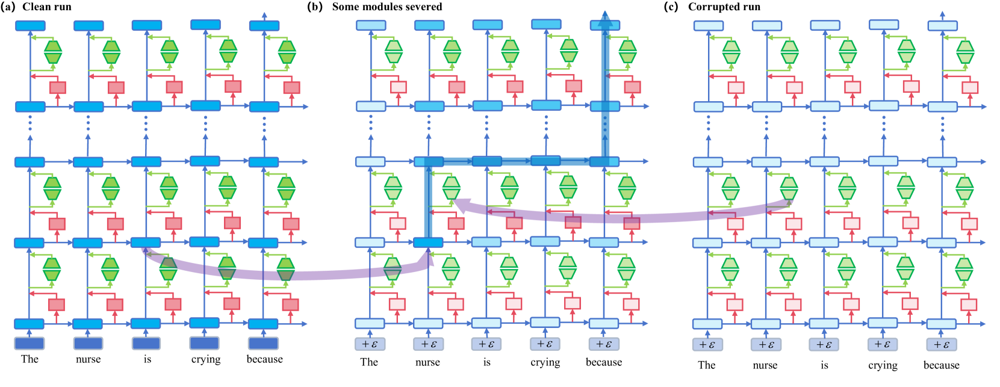
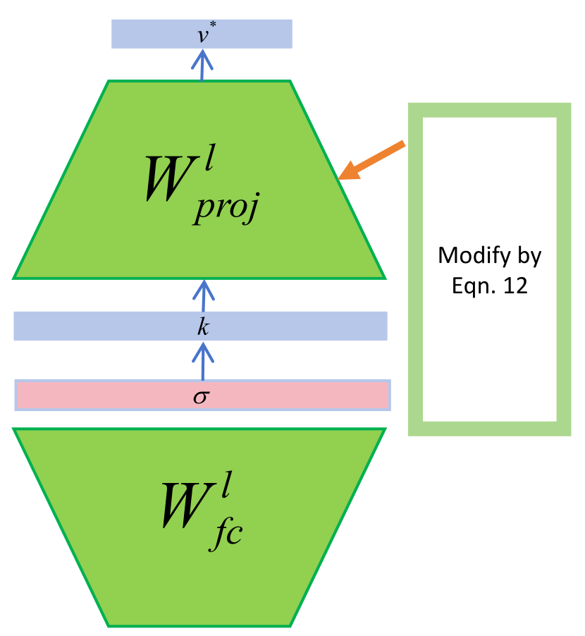

# 本研究致力于在大型语言模型内部定位并有效减轻性别偏见问题。

发布时间：2024年03月21日

`LLM理论` `社会偏见研究`

> Locating and Mitigating Gender Bias in Large Language Models

> 为掌握人类事实和认知偏好，大型语言模型LLM通过大规模语料库预训练，但这一过程中可能潜移默化地吸收了社会中存在的偏见和刻板印象。以往研究大多单维度处理偏见问题，或是着力定位，或是着重减轻，这种片面视角限制了对偏见研究的综合深化和相互促进。本次研究则将定位和减轻偏见两过程融入一个统一框架。起始阶段，我们运用因果中介分析技术揭示LLM内部各组件激活的因果效应。在此基础之上，我们创新提出LSDM（最小二乘去偏方法），作为针对职业代词中性别偏见的知识编辑型解决方案，并与两大基线方法在三大性别偏见数据集及七大知识能力测试数据集上进行了对比。实验结果揭示，职业代词末尾标记的底层MLP模块以及句尾词汇的顶层注意力模块是造成性别偏见的主要源头。更进一步，LSDM在高效减轻模型性别偏见的同时，确保模型在其他所有方面的表现得以完整保留。

> Large language models(LLM) are pre-trained on extensive corpora to learn facts and human cognition which contain human preferences. However, this process can inadvertently lead to these models acquiring biases and stereotypes prevalent in society. Prior research has typically tackled the issue of bias through a one-dimensional perspective, concentrating either on locating or mitigating it. This limited perspective has created obstacles in facilitating research on bias to synergistically complement and progressively build upon one another. In this study, we integrate the processes of locating and mitigating bias within a unified framework. Initially, we use causal mediation analysis to trace the causal effects of different components' activation within a large language model. Building on this, we propose the LSDM (Least Square Debias Method), a knowledge-editing based method for mitigating gender bias in occupational pronouns, and compare it against two baselines on three gender bias datasets and seven knowledge competency test datasets. The experimental results indicate that the primary contributors to gender bias are the bottom MLP modules acting on the last token of occupational pronouns and the top attention module acting on the final word in the sentence. Furthermore, LSDM mitigates gender bias in the model more effectively than the other baselines, while fully preserving the model's capabilities in all other aspects.

[Arxiv](https://arxiv.org/abs/2403.14409)